# Salience

> Find what people care about. Create what they can’t ignore.

**Salience is an operator-controlled, durable content-production foundation.**
It turns bounded public research into evidence-linked `ContentBrief@v1` records,
then creates a governed script, media-asset, distribution, and immutable
`ReadyToPublishPackage@v1` handoff without making an AI, creative tool, storage
service, or future publisher the system of record.

**Status: Phases 1–9 implemented and fixture verified.** The complete safe path
is source evidence → intelligence → immutable brief → creative production →
governed distribution → approved package → separately governed publication
fixture. A disabled-by-default YouTube adapter can start a private resumable
session, but this release deliberately stops before a configured live video
transfer or social post, analytics, experiments, and learning.

[Open the interactive Phase 1–9 Archify architecture map](docs/salience-phase-1-9.architecture.html)

## Architecture At A Glance

```mermaid
flowchart LR
    Operator[Operators, API clients, CLI, SDK] -->|scoped request| API[Control API]
    API -->|idempotent start| Temporal[Temporal adapter]
    Temporal -->|tasks and timers| Worker[Salience worker]
    Worker -->|checkpointed activities| Loop[Intelligence loop]
    Sources[RSS and HN sources] -.->|untrusted evidence| Loop
    Browser[Governed browser evidence] -.->|untrusted evidence| Loop
    Browser -.->|text, screenshot, trace receipts| Storage
    Loop -->|direct/delegated contract| Agents[Research and strategy agents]
    Agents -->|version-gated boundary| Providers[Model, MCP, A2A, plugin adapters]
    Loop -->|selected ContentBrief@v1| Creative[Creative workflow]
    Creative -->|versioned capability selection| Provider[Fixture or approved provider adapter]
    Provider -->|idempotent submit, reconcile, webhook| Asset[Verified asset]
    Creative --> Governance[Rights, policy, approval, budget reservation]
    Governance --> Distribution[Distribution package]
    Asset --> Distribution
    Distribution --> Ready[Approved ReadyToPublishPackage@v1]
    Ready -->|new account-bound governed request| Publish[Publication workflow]
    Publish -->|policy, approval, scope, reserve| Governance
    Publish -.->|selected adapter, reconcile, webhook| Publisher[Fixture / opt-in publisher adapter]
    Storage -.->|short-lived HTTPS delivery| Publisher
    Publish -->|immutable request, plan, attempt, receipt| PG
    Loop -->|source to immutable brief lineage| PG[(PostgreSQL)]
    API -->|identity, scope, policy, budget| PG
    Worker -.->|artifact references| Storage[Object-store contract]
    Creative -.->|hash-stable bytes| Storage
```



The Mermaid view is a quick GitHub-native overview. Browser evidence remains an
optional, read-only path: its text is untrusted and its text, screenshot, and
trace artifacts remain behind the object-store contract. The linked
[Archify viewer](docs/salience-phase-1-9.architecture.html) is the checked,
interactive source for the implemented Phase 1–9 architecture: it supports
theme switching, focus views, relationship tracing, source evidence, and local
SVG/PNG export. Its checked source is
[`docs/salience-phase-1-9.architecture.json`](docs/salience-phase-1-9.architecture.json).

## What You Can Rely On Today

### A Canonical Operational Core

- **Workspace and content-program identity** lives in PostgreSQL with immutable,
  migration-managed records.
- **Jobs, schedules, timers, checkpoints, retries, timeouts, and dead letters**
  are owned data and workflow contracts, not provider-specific application state.
- **Durable execution** runs through Temporal behind a project-owned adapter;
  a long-running dummy job resumes safely after worker or container interruption.
- **External effects are reconciled** through idempotency keys and durable effect
  records, so an accepted mocked request is not performed twice after recovery.
- **Object bytes stay replaceable** behind a memory/S3-compatible object-storage
  contract. Garage is the self-hostable S3 deployment option, not a hard-coded
  data dependency.

### Governance Before Effects

- Token authentication and explicit permission scopes protect control operations.
- Policy references, approvals, dry-run mode, and budget checks happen before an
  effect is attempted.
- Non-dry creative runs require an explicit canonical budget. Each bounded
  provider effect reserves estimated cost before submission and settles actual
  cost once before a ready package can be created; unknown or over-budget actuals
  fail closed.
- Secret references remain separate from secret values and are constrained by
  permission scopes.
- Each run records audit events, provenance, idempotency/reconciliation state,
  distributed run identities, and OpenTelemetry-compatible trace identifiers.

### An Evidence-Linked Intelligence Loop

- **Read-only source collection** supports deterministic fixtures plus opt-in,
  allowlisted RSS/Atom and Hacker News connectors. Browser research is an
  optional artifact-only adapter, not a default crawler.
- **Signals and opportunities** retain source support, raw feature availability,
  stable fingerprints, transparent ranking, and bounded model adjustment hooks.
- **Callable research and strategy agents** use versioned input/output contracts
  and can run directly or under the durable workflow without requiring a model
  vendor.
- **Strategic packages, claims, and briefs** use explicit evidence checks;
  contradictory or unsupported claims cannot enter an immutable `ContentBrief@v1`.

### Governed Creative Production And Distribution

- **Creative production** starts only from a selected immutable brief and stores
  versioned scripts, creative briefs, storyboards, shot plans, provider jobs,
  content-hash assets, captions, variants, and transformation lineage.
- **Fixture Writer, Creative Director, Production, and Verifier agents** use the
  same versioned agent boundary; no model vendor is required for the verified path.
- **Provider-neutral capability requests** select a versioned compatible provider
  deterministically, bound variants to one through three, and retain rejection
  reasons without persisting provider credentials in canonical data.
- **Distribution governance** checks rights/consent, platform profile, metadata,
  claim integrity, originality, localization, synthetic-media disclosure, budget,
  and approval before it creates an immutable `ReadyToPublishPackage@v1`. A
  changed approved decision creates a new distribution and ready-package version;
  it never rewrites an approved decision graph.
- **Recovery and callbacks** reconcile one accepted fixture effect after an
  interruption, record duplicate-safe verified webhook receipts, and keep
  cancellation/dead-letter lifecycle transitions canonical.
- **Governed publishing** creates a fresh publisher request, plan, attempt, and
  receipt from an approved package; it rechecks policy, approval, scope,
  account, capability, and budget rather than inheriting creative authority.
- **YouTube is opt-in and private-only.** Its official resumable-session boundary
  accepts an injected scoped lease but stores no bearer token or opaque session URI.

### Provider-Neutral Extensions

| Surface | Shipped foundation | Intentionally deferred |
| --- | --- | --- |
| Agents | Versioned manifests, direct/delegated fixture calls, and teams | Autonomous content agents and delegated production authority |
| Models | Structured static/OpenAI-compatible gateways and invocation lineage | A required model vendor |
| MCP | Official SDK adapter for `2026-07-28` plus legacy negotiation | Unneeded optional extensions |
| A2A | Official SDK adapter for A2A `1.0` plus explicit `0.3` behavior | Mandatory remote agents |
| Research and strategy | RSS/HN/browser contracts, source-linked signals, opportunities, packages, claims, and immutable briefs | General crawling and learning |
| Creative production | Script/creative/media/distribution contracts, deterministic fixture workflow, rights/profile/disclosure gates, immutable ready package | Enabled live media provider, FFmpeg execution, C2PA signing, analytics, and experiments |
| Publishing | Fixture-first governed request/plan/attempt/receipt workflow, scoped control API, schedule/cancel/reconcile/webhook contracts, and disabled private YouTube session adapter | Configured media handoff, live upload/post, TikTok/Instagram/LinkedIn adapters, and publishing analytics |
| Plugins | Versioned capability registry and provider-compatibility metadata | Large platform integrations |

The data model also keeps hooks for tenant isolation, agent/tool trust and
delegated authority, jurisdiction policy, privacy classification and retention,
content-origin/C2PA metadata, and future protocol-version compatibility.

## Run A Safe Demo

### Prerequisites

- Docker Engine with Docker Compose v2
- Python `3.13` only when running the local test suite

The default demo uses a fixture-only external-effect provider. It does **not**
publish content or call an AI provider.

```bash
git clone https://github.com/manojvermamv/Salience.git
cd Salience

cp .env.example .env
# Edit .env and set a long, unique CONTROL_PLANE_TOKEN.

docker compose --profile application build
docker compose up -d postgres temporal
docker compose --profile application run --rm migrate
docker compose --profile application up -d api worker mock-effect-provider
```

The Compose deployment keeps the control API inside the project network rather
than publishing a host port. Use the included CLI from the running API
container to start and inspect the safe default dry-run:

```bash
docker compose exec api content jobs start-dummy \
  --idempotency-key getting-started-001

# Copy job_id from the JSON response.
docker compose exec api content jobs inspect <job_id>
docker compose exec api content agents list
docker compose logs -f worker
```

`content jobs start-dummy` defaults to `--dry-run`. The configured Temporal
control plane rejects non-dry-run calls until an operator supplies the required
policy adapter; direct production effects are not a default Phase 1–9 feature.

To run the implemented intelligence loop, create a workspace and program with
the control API, then pass their returned IDs to the same HTTP-only CLI:

```bash
docker compose exec api content intelligence start \
  --workspace-id <workspace_id> --program-id <content_program_id> \
  --niche 'Personal Finance' --idempotency-key getting-started-intelligence-001
```

Inspect the returned job with `content intelligence inspect <job_id>`. Its final
output includes the selected brief ID when the dry-run reaches the immutable
brief stage.

Start a Phase 7–8 fixture creative run from that selected brief:

```bash
docker compose exec api content creative start \
  --workspace-id <workspace_id> --program-id <content_program_id> \
  --brief-id <content_brief_id> --profile-key <profile_key> \
  --idempotency-key creative-demo-001
```

`content creative start` defaults to `--dry-run`. Inspect its returned job with
`content creative inspect <job_id>`. A dry run deliberately stops before a
provider request, asset import, distribution, and ready package; use
`bash scripts/verify-phases-7-8.sh` for the explicitly configured deterministic
fixture path that proves a ready-package lineage. A ready package is not a
publishing command: it contains no publisher account, credential, destination,
or remote-post receipt. See [`docs/phase-9-handoff.md`](docs/phase-9-handoff.md).

Stop the local stack when finished:

```bash
docker compose --profile application down --remove-orphans
```

## Public Control Surface

All control endpoints require `Authorization: Bearer <CONTROL_PLANE_TOKEN>` and
the appropriate comma-separated `X-Salience-Scopes` header. `control:write`
creates identities and starts jobs; `control:read` retrieves state and records.

| Endpoint | Purpose |
| --- | --- |
| `POST /v1/workspaces` | Create a canonical workspace identity |
| `POST /v1/workspaces/{workspace_id}/programs` | Create a content program in that workspace |
| `POST /v1/jobs/dummy` | Start an idempotent, dry-run-by-default durable job |
| `GET /v1/jobs/{job_id}/inspection` | Retrieve trace, audit, provenance, and cost records together |
| `GET /v1/jobs/{job_id}/audit` | Retrieve the job audit trail |
| `GET /v1/jobs/{job_id}/provenance` | Retrieve provenance records |
| `GET /v1/jobs/{job_id}/costs` | Retrieve reserved/actual cost records |
| `GET /v1/jobs/{job_id}/trace` | Retrieve the distributed trace identity |
| `GET /v1/agents` | List versioned fixture agent capabilities |
| `POST /v1/agents/{agent_id}/runs` | Invoke a validated direct or delegated fixture agent run |
| `POST /v1/intelligence/runs` | Start an idempotent dry-run intelligence workflow |
| `GET /v1/intelligence/runs/{job_id}` | Inspect its state, trace, and output IDs |
| `POST /v1/intelligence/schedules` | Store a read-only research cadence |
| `POST /v1/intelligence/opportunities/{opportunity_id}/briefs` | Start a selected-opportunity brief workflow |
| `GET /v1/intelligence/briefs/{brief_id}` | Retrieve immutable ContentBrief content and lineage |
| `GET /v1/intelligence/briefs/{brief_id}/lineage` | Retrieve source-to-brief canonical lineage |
| `POST /v1/creative/runs` | Start an idempotent `CreativeProductionRequest@v1` from a selected brief |
| `GET /v1/creative/runs/{job_id}` | Inspect creative state, trace, and output IDs |
| `GET /v1/creative/runs/{job_id}/script`, `/asset`, `/package` | Retrieve canonical creative output identities |
| `GET /v1/creative/packages/{ready_package_id}/lineage` | Retrieve immutable ready-package lineage |
| `POST /v1/publications/requests` | Start a governed publisher request from canonical IDs |
| `POST /v1/publications/schedules` | Store an immutable request/plan-backed publication cadence |
| `GET /v1/publications/runs/{job_id}` | Inspect safe publication state and trace output |
| `POST /v1/publications/runs/{job_id}/cancel` | Signal cooperative cancellation before a terminal effect |
| `POST /v1/publishers/{provider_id}/webhooks` | Accept only a provider-verified callback projection |

The command-line client and Python SDK both use these public schemas; neither
reaches into the database.

## Verify The Intelligence Loop

Create the local development environment, then run the isolated Phase 1–4
verification stack:

```bash
python3.13 -m venv .venv
. .venv/bin/activate
pip install -e '.[dev]'

bash scripts/verify-phases-1-4.sh
```

The Foundation verifier provisions a disposable PostgreSQL and Temporal project,
applies all migrations, and exercises Phase 1 recovery/control, Phase 2
callable agents, Phase 3 protocol contracts, and Phase 4 bootstrap behavior.
The recovery case deliberately hard-exits a worker after the fixture accepts an
effect, then proves safe reconciliation after restart.

Then run the Phase 5–6 intelligence verifier against active local services. It
proves that a restarted worker resumes a source-linked run and produces an
immutable brief with canonical lineage. See [`docs/verification.md`](docs/verification.md)
for the focused command and constrained-host guidance.

Run the project-owned Phase 7–8 verifier after the same environment is ready:

```bash
bash scripts/verify-phases-7-8.sh
```

It starts/reuses PostgreSQL and Temporal fixtures, applies migrations through
the creative release-gate schema, and drives the API, CLI, SDK, full fixture
workflow, interruption/recovery, reservation/actual-cost settlement, webhook
deduplication, registry selection, rights/policy/budget/approval gates, immutable
ready-package lineage, and evaluation contracts. Optional FFmpeg/C2PA and
live-provider/publishing checks are explicitly reported as `NOT RUN` when they
are not executed by the configured fixture path.

Run the Phase 9 governed-publishing verifier after the same environment is ready:

```bash
bash scripts/verify-phase-9.sh
```

It applies migrations through `0009_governed_publication`, checks the canonical
publisher request/plan/schedule/attempt/receipt tables, API/CLI/SDK controls,
fixture restart/reconciliation, cost/policy/approval gates, signed webhook
deduplication, and the private-only YouTube session contract. Without explicit
operator configuration it reports the live YouTube status as `NOT RUN`; it does
not publish a video.

## Verify Browser Evidence

Browser evidence remains optional to the dry-run control plane, but the current
Linux operator workflow is project-owned and reproducible:

```bash
bash scripts/verify-browser-evidence.sh --install
```

The command creates or reuses `.venv`, installs the pinned `playwright==1.62.0`
package and only Playwright Chromium with its documented Linux dependencies,
then runs the governed browser integration/security suite. It requires no
credential or paid provider, makes no Docker cleanup, and writes retained local
proof under `artifacts/browser-evidence/`. It verifies JavaScript rendering,
artifact hashes/metadata, private-network and redirect denial, download denial,
timeout traces, and hostile-text isolation. See [`docs/research.md`](docs/research.md)
for execution limits and [`docs/verification.md`](docs/verification.md) for the
test coverage.

## What Is Deliberately Not Here

Salience is not presented as a finished autonomous content system. This phase
does not include:

- AI content or media generation providers
- Live publishing automation, media transfer, or broad platform integrations
- Unbounded browser-driven production research
- Learning, analytics, or optimization loops
- A required model credential or production publishing provider
- A production secret-manager deployment or Garage cluster configuration

Keeping these capabilities out of the foundation is intentional: later systems
must attach through the governed, versioned contracts above rather than bypass
identity, budget, policy, audit, or provenance controls.

For the focused Phase 5–6 verifier and optional real-feed configuration, see
[`docs/verification.md`](docs/verification.md) and [`docs/research.md`](docs/research.md).

## Repository Guide

| Start here | Contents |
| --- | --- |
| [`docs/core/README.md`](docs/core/README.md) | Product direction, target architecture, acceptance criteria, and phased plan |
| [`docs/architecture.md`](docs/architecture.md) | Canonical architecture decisions and adapter boundaries |
| [`docs/deployment.md`](docs/deployment.md) | Deployment topology and operator responsibilities |
| [`docs/verification.md`](docs/verification.md) | Phase verification approach and evidence |
| [`docs/limitations.md`](docs/limitations.md) | Explicit current constraints and deferred production work |
| [`docs/research.md`](docs/research.md) | Source order, RSS/HN/browser constraints, and live-smoke setup |
| [`docs/trust-model.md`](docs/trust-model.md) | Untrusted-input and memory-write rules |
| [`docs/model-execution.md`](docs/model-execution.md) | Structured model gateway and lineage behavior |
| [`docs/phase-7-handoff.md`](docs/phase-7-handoff.md) | Consumed Phase 6 → Phase 7 contract |
| [`docs/phase-9-handoff.md`](docs/phase-9-handoff.md) | Governed publishing boundary and remaining live-enable work |
| [`docs/implementation-progress.md`](docs/implementation-progress.md) | Persistent build checkpoints and resume context |
| [`docs/adr/`](docs/adr/) | Build-vs-adopt decisions for durable runtime, storage, API persistence, and governance |
| [`docs/contracts/adapter-contracts.md`](docs/contracts/adapter-contracts.md) | Project-owned adapter and compatibility contracts |
| [`prompts/Build Phases 1–4 End-to-End.md`](prompts/Build%20Phases%201%E2%80%934%20End-to-End.md) | Executed foundation checklist |
| [`prompts/Build Real Intelligence Loop — Pre-Phase 5 + Phases 5–6 End-to-End.md`](prompts/Build%20Real%20Intelligence%20Loop%20%E2%80%94%20Pre-Phase%205%20%2B%20Phases%205%E2%80%936%20End-to-End.md) | Executed intelligence-loop direction |
| [`prompts/Build Creative Production Loop — Phases 7–8 End-to-End.md`](prompts/Build%20Creative%20Production%20Loop%20%E2%80%94%20Phases%207%E2%80%938%20End-to-End.md) | Executed creative-production direction |

## Design Principle

**PostgreSQL is the record of truth; providers are replaceable execution
adapters.** Every later agent, model, tool, protocol, storage service, or
publishing destination must cross a versioned Salience contract and leave a
governed, inspectable record behind.
