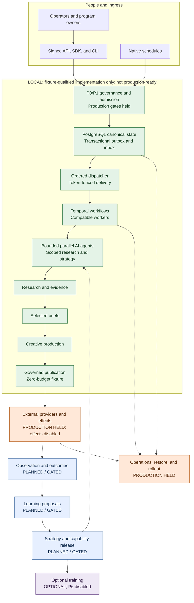
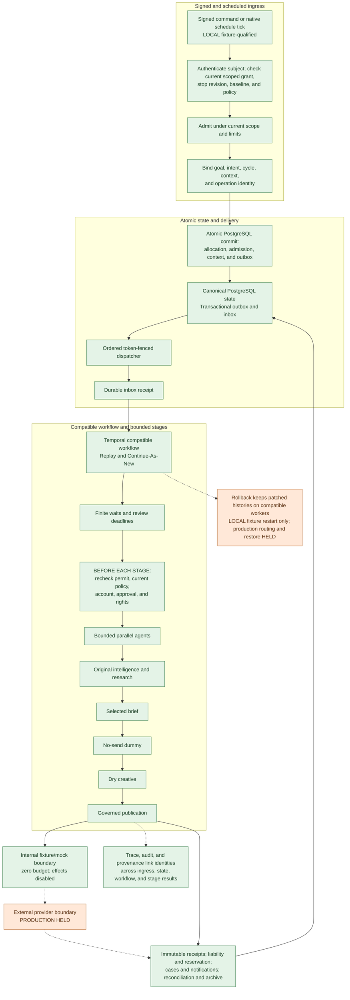

# Salience V4

Salience is a self-hostable, provider-neutral content operating system built around PostgreSQL, Temporal workflows, typed agents, governed artifacts, and replaceable adapters. The V4 blueprint describes the full target architecture. The current application is locally qualified within no-effects fixture boundaries; production is not fully integrated or released.

## Current status and evidence

Three evidence anchors describe different things:

- **Application qualification:** `a4b2368cdb463939d093020224a5b5667392aee6` passed **21 focused / 604 full non-live tests**, with **352 source hashes**. This locally qualifies the original legacy intelligence, selected-brief, no-send dummy, dry-creative, governed-publication stages, and both original native schedule conversions with resumed ingress. Qualification uses isolated fixtures, a zero publication budget, and disabled effects. See the [application evidence](docs/v4/legacy-publication-evidence.json).
- **Published feature/documentation checkpoint:** `a2e73c7242d67388e8cd3be4361283cd8e6c081a`.
- **CI readback for that exact checkpoint:** [run 37346137016](https://github.com/manojvermamv/Salience/actions/runs/37346137016) passed both `verify` and `p0-regression`; `p0-regression` reported **604 passed** and **three warnings**. This readback is bound to the checkpoint above. A later documentation commit needs its own exact-head readback after publication.

P0 and P1 items 1–7 are locally qualified inside no-effects fixture boundaries. The accepted P1/P3 corrections are included in the fresh application qualification; exact corrected-head publication rereview remains pending. A CI pass or local fixture result does not complete that rereview or authorize production.

| Area | Current evidence | Production status |
| --- | --- | --- |
| P0 foundation and P1 items 1–7 | Locally qualified within no-effects fixture boundaries; the current application anchor is `a4b2368cdb463939d093020224a5b5667392aee6` | Effects disabled; RG0 and RG1 are **HELD** |
| Original legacy stages and native schedules | Original intelligence, selected brief, no-send dummy, dry creative, governed publication, and both original native schedule conversions locally qualified | Fixture-only; no live provider or production schedule routing qualification |
| Later phases | P2–P7 gated/planned; optional P6 disabled | Not released |
| Main branch | `8e50d68efbf2bec2aabfb2fe3226e01635de2adb` | Unmerged; formal independent PR approval remains NOT RUN |

Local green status below means implemented and qualified in a fixture scope. It does not mean production-ready. Production effects remain disabled, RG0/RG1 remain held, and production is not fully integrated or released.

## V4 target architecture

This overview shows the complete target and the status of each area. The arrows into held or planned areas show intended architecture; they do not assert that external effects or later phases are enabled.


```mermaid
flowchart TB
  subgraph ingress["People and ingress"]
    direction LR
    PEOPLE["Operators and program owners"]
    SIGNED["Signed API, SDK, and CLI"]
    SCHEDULES["Native schedules"]
    PEOPLE --> SIGNED
  end

  subgraph localPath["LOCAL: fixture-qualified implementation only; not production-ready"]
    GOVERN["P0/P1 governance and admission<br/>Production gates held"]
    STATE["PostgreSQL canonical state<br/>Transactional outbox and inbox"]
    DISPATCH["Ordered dispatcher<br/>Token-fenced delivery"]
    TEMPORAL["Temporal workflows<br/>Compatible workers"]
    AGENTS["Bounded parallel AI agents<br/>Scoped research and strategy"]
    RESEARCH["Research and evidence"]
    BRIEFS["Selected briefs"]
    CREATIVE["Creative production"]
    PUBLICATION["Governed publication<br/>Zero-budget fixture"]
  end
  EFFECTS["External providers and effects<br/>PRODUCTION HELD; effects disabled"]
  OBSERVATION["Observation and outcomes<br/>PLANNED / GATED"]
  LEARNING["Learning proposals<br/>PLANNED / GATED"]
  RELEASE["Strategy and capability release<br/>PLANNED / GATED"]
  TRAINING["Optional training<br/>OPTIONAL; P6 disabled"]
  OPS["Operations, restore, and rollout<br/>PRODUCTION HELD"]

  SIGNED --> GOVERN
  SCHEDULES --> GOVERN
  GOVERN --> STATE
  STATE --> DISPATCH
  DISPATCH --> TEMPORAL
  TEMPORAL --> AGENTS
  AGENTS --> RESEARCH
  RESEARCH --> BRIEFS
  BRIEFS --> CREATIVE
  CREATIVE --> PUBLICATION
  PUBLICATION -.-> EFFECTS
  EFFECTS -.-> OBSERVATION
  OBSERVATION -.-> LEARNING
  LEARNING -.-> RELEASE
  RELEASE -.-> AGENTS
  RELEASE -.-> TRAINING
  STATE -.-> OPS
  TEMPORAL -.-> OPS
  EFFECTS -.-> OPS

  classDef local fill:#e4f3e7,stroke:#347a46,color:#173b20
  classDef held fill:#ffe8d8,stroke:#b45b18,color:#572b0c
  classDef planned fill:#e6efff,stroke:#3b67a0,color:#193354
  classDef optional fill:#eee8f5,stroke:#71518f,color:#362247
  class GOVERN,STATE,DISPATCH,TEMPORAL,AGENTS,RESEARCH,BRIEFS,CREATIVE,PUBLICATION local
  class EFFECTS,OPS held
  class OBSERVATION,LEARNING,RELEASE planned
  class TRAINING optional
```

P0/P1 controls govern signed commands and schedule ticks before work is admitted. PostgreSQL commits canonical identities, context, allocation, admission, and outbox records together. The dispatcher delivers work to compatible Temporal workflows, which coordinate bounded agent and content stages. In the target system, provider outcomes feed observation, learning proposals, and controlled strategy or capability release. Those later phases, real provider effects, and production operations remain gated.

## Locally qualified governed execution path

The following path describes the local implementation boundary. Stage checks run against current authority each time; the internal fixture adapters cannot send externally.


```mermaid
flowchart TB
  subgraph ingress["Signed and scheduled ingress"]
    direction LR
    CMD["Signed command or native schedule tick<br/>LOCAL fixture-qualified"]
    AUTH["Authenticate subject; check current scoped grant,<br/>stop revision, baseline, and policy"]
    ADMIT["Admit under current scope and limits"]
    ID["Bind goal, intent, cycle, context,<br/>and operation identity"]
    CMD --> AUTH --> ADMIT --> ID
  end

  subgraph durable["Atomic state and delivery"]
    direction LR
    COMMIT["Atomic PostgreSQL commit:<br/>allocation, admission, context, and outbox"]
    DB["Canonical PostgreSQL state<br/>Transactional outbox and inbox"]
    DISPATCH["Ordered token-fenced dispatcher"]
    RECEIPT["Durable inbox receipt"]
    COMMIT --> DB --> DISPATCH --> RECEIPT
  end

  subgraph runtime["Compatible workflow and bounded stages"]
    WF["Temporal compatible workflow<br/>Replay and Continue-As-New"]
    WAIT["Finite waits and review deadlines"]
    STAGECHECK["BEFORE EACH STAGE:<br/>recheck permit, current policy,<br/>account, approval, and rights"]
    FANOUT["Bounded parallel agents"]
    INTEL["Original intelligence and research"]
    BRIEF["Selected brief"]
    DUMMY["No-send dummy"]
    CREATIVE["Dry creative"]
    PUB["Governed publication"]
    WF --> WAIT --> STAGECHECK --> FANOUT --> INTEL --> BRIEF --> DUMMY --> CREATIVE --> PUB
  end

  FIXTURE["Internal fixture/mock boundary<br/>zero budget; effects disabled"]
  EXTERNAL["External provider boundary<br/>PRODUCTION HELD"]
  RECORDS["Immutable receipts; liability and reservation;<br/>cases and notifications; reconciliation and archive"]
  TRACE["Trace, audit, and provenance link identities<br/>across ingress, state, workflow, and stage results"]
  OPS["Rollback keeps patched histories on compatible workers<br/>LOCAL fixture restart only; production routing and restore HELD"]

  RECEIPT --> WF
  ID --> COMMIT
  PUB --> FIXTURE
  FIXTURE -.-> EXTERNAL
  EXTERNAL -.-> RECORDS
  PUB --> RECORDS
  RECORDS --> DB
  PUB -.-> TRACE
  WF -.-> OPS

  classDef local fill:#e4f3e7,stroke:#347a46,color:#173b20
  classDef held fill:#ffe8d8,stroke:#b45b18,color:#572b0c
  classDef planned fill:#e6efff,stroke:#3b67a0,color:#193354
  classDef optional fill:#eee8f5,stroke:#71518f,color:#362247
  class CMD,AUTH,ADMIT,ID,COMMIT,DB,DISPATCH,RECEIPT,WF,WAIT,STAGECHECK,FANOUT,INTEL,BRIEF,DUMMY,CREATIVE,PUB,FIXTURE,RECORDS,TRACE local
  class EXTERNAL,OPS held
```

The original legacy stages and both original native schedule conversions run through this governed path in isolated fixtures. Transactional admission preserves goal, intent, cycle, context, and operation identity with the outbox. Ordered token-fenced delivery records a durable inbox receipt before compatible Temporal workers execute. Workflow replay, continuation, finite waits, and review deadlines retain those identities. Receipts, liabilities, reservations, cases, notifications, reconciliation, archive, trace, audit, and provenance remain tied to the canonical records.

Patched workflow histories require compatible workers through rollback. Local fixture rollback and restart evidence does not qualify production worker routing, coordinated restore, or external-effect recovery. The held provider boundary remains closed until the required production gates pass.

## What is and is not production-ready

The local results qualify specific no-effects fixtures. They do not qualify live providers, real production accounts, nonzero publication budgets, production schedule inventory or routing, production-wide recovery and alert delivery, later-phase records, or a full RG1 release. The application and CI evidence above answer separate questions: `a4b2368…` is the source-bound local application qualification; `a2e73c7…` is the published feature/documentation checkpoint; run `37346137016` is the exact-head GitHub CI readback for that checkpoint. None of these claims that the pending exact corrected-head publication rereview is complete.

Production effects remain disabled. RG0 and RG1 are **HELD**. P2–P7 remain gated/planned, optional P6 remains disabled, and `main` remains at `8e50d68efbf2bec2aabfb2fe3226e01635de2adb` without this feature merged. Production is not fully integrated or released.

## Authoritative V4 documents

- [V4 production implementation blueprint](docs/v4/IMPLEMENTATION-BLUEPRINT.md) — target architecture, implementation state, phases, requirement mappings, rollback, and release gates.
- [Execution progress and checkpoints](docs/v4/progress.md)
- [P0 release ledger](docs/v4/p0-release.json)
- [P1 qualification matrix](docs/v4/p1-qualification-matrix.json)
- [Legacy dispatch contract](docs/v4/legacy-dispatch-contract.md)
- [Application qualification evidence](docs/v4/legacy-publication-evidence.json)
- [Inventory and preservation record](docs/v4/inventory.json)

## Verification and navigation

Run the documentation validator and its built-in tests:

```bash
python3 docs/v4/check.py --self-test
python3 docs/v4/check.py
```

Existing fixture verification commands remain available:

```bash
bash scripts/verify-phase-9.sh
bash scripts/verify-phases-7-8.sh
bash scripts/verify-browser-evidence.sh
```

The pinned Playwright headless runtime is provisioned locally for tests; a fresh checkout still needs browser installation. Default Compose is for private fixtures; `compose.p0.yaml` is an effects-disabled, isolated qualification profile, not production enablement. Use the blueprint's release gates before exposing ingress or real accounts.

- [Historical archive and restoration instructions](docs/archive/2026-09-22/README.md)
- [Original V4 design sources](docs-new-arch/README.md)
- [Historical Phase 1–9 interactive architecture](docs/salience-phase-1-9.architecture.html)

Historical diagrams describe prior implementation boundaries; the blueprint contains the complete V4 target overview and focused workflows.

<!-- Historical heading anchors retained for incoming links. -->
<a id="salience"></a>
<a id="architecture-at-a-glance"></a>
<a id="what-you-can-rely-on-today"></a>
<a id="a-canonical-operational-core"></a>
<a id="governance-before-effects"></a>
<a id="an-evidence-linked-intelligence-loop"></a>
<a id="governed-creative-production-and-distribution"></a>
<a id="provider-neutral-extensions"></a>
<a id="run-a-safe-demo"></a>
<a id="prerequisites"></a>
<a id="public-control-surface"></a>
<a id="verify-the-intelligence-loop"></a>
<a id="verify-browser-evidence"></a>
<a id="what-is-deliberately-not-here"></a>
<a id="repository-guide"></a>
<a id="design-principle"></a>
