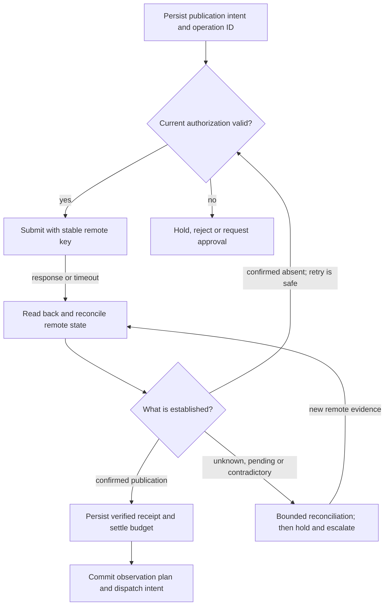
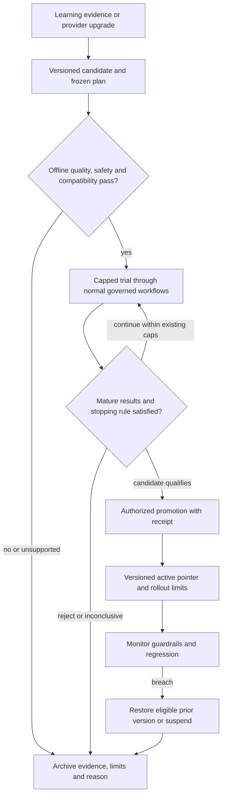

# Salience V3 — architecture and migration notes

**Recommendation:** extend the implemented `ArchCurrent.mermaid` using V2 as the base. Retain V1's explicit provenance, reasoning and control responsibilities. Add durable goal control, reliable state handoffs, measurement quality, reversible releases and governed model adaptation.

The accompanying `ArchV3.mermaid` is the consolidated system chart; `ArchV3.svg` is its zoomable rendered copy. Its boxes describe logical responsibilities; most can be modules and activities in the existing application and Salience worker. This proposal is based on the three supplied diagrams and your stated implementation status. It is not a repository audit or confirmation that every behavior drawn in ArchCurrent is implemented.

## What changes from the supplied designs

| Area | What the supplied diagrams show | V3 requirement |
| --- | --- | --- |
| Existing foundation | ArchCurrent has the Control API, Temporal adapter, worker, intelligence loop, creation, publication, PostgreSQL and object-store contract. | Preserve these boundaries and evolve their contracts. |
| Business goal | Requests and schedules, but no explicit goal lifecycle. | Persist measurable objectives, scope, autonomy, cadence, stop conditions and resource limits. |
| Knowledge | V1/V2 add retrieval and history. | Canonical records remain independent; memory and search indexes are derived, scoped and rebuildable. |
| Decisions | V1/V2 add candidates, allocation and reasoning records. | Record rejected alternatives, evidence available at decision time, uncertainty, costs and selection probabilities where randomized. Include abstention. |
| Creation | V2 adds pre-creation governance and content evaluation. | Reserve before spending; check claims, assets, rights and brand; cap revisions and account for failed generation costs. |
| Publication | ArchCurrent already labels idempotency, reconciliation and webhooks. | Make unknown outcomes, verified receipts, revocation and budget settlement explicit. Preserve existing implementations where they already satisfy these requirements. |
| Observation | V2 adds an observation plan, Temporal scheduling and read-only analytics adapter. | Add completeness, delayed outcomes, revisions, metric definitions and collection failure states. |
| Learning | V1/V2 connect outcomes, attribution and hypotheses. | Distinguish lineage from causality; retain counterevidence and failed experiments; qualify evidence before reuse. |
| Strategy releases | V2 has offline eligibility, trials and promotion. | Freeze assignments and versions, enforce stopping rules, monitor after promotion and support rollback. |
| AI upgrades | V2 evaluates models before the provider registry. | Separate evaluation, trial and active eligibility; require governed promotion and rollback for provider/model changes. |
| Operations | Cross-cutting controls are listed, especially in V1. | Define executable enforcement, durable failure dispositions and recovery ownership. |

## Runtime and deployment shape

Keep the Control API, existing Temporal deployment, Salience workers, PostgreSQL, object store and approved external adapters. Add application modules, database tables and Temporal workflow/activity types first. The gateway and registries can be in-process modules; separate deployments should follow actual scaling or isolation needs.

PostgreSQL holds canonical business records, operation identities, policy and budget ledgers, release pointers and workflow intent records. The object store holds immutable-versioned evidence, media, evaluation snapshots and model artifacts where applicable. Temporal holds orchestration state. Search, embeddings, graph projections or a memory engine can be introduced behind the retrieval contract when useful; none replaces the canonical records.

All diagram domains run through the same durable runtime, including observation, trials, learning, reconciliation and optional training coordination. The chart's direct domain arrows describe logical handoffs, not synchronous calls that bypass Temporal. The goal-to-runtime edge uses a committed start intent and the outbox handoff described below. The main chart combines the Temporal adapter and Salience worker in one runtime box and shows shared dependencies once; their separate responsibilities remain intact.

Use deterministic workflow code to coordinate work. Execute LLM calls, remote tools, database access and other external operations in activities. Pin the workflow code and release context for a run; evolve running workflows with the SDK's supported versioning approach. [Temporal workflow definition](https://docs.temporal.io/workflow-definition)

Run bounded cycles under the long-lived goal. Use schedules or durable timers with an explicit overlap policy; use bounded child workflows or Continue-As-New where appropriate to keep history manageable. A cadence can initiate another cycle without waiting for every publication's final measurement window. [Temporal workflow execution](https://docs.temporal.io/workflow-execution)

## 1. Turn the business goal into a controlled operating loop

`GoalSpec@v1` should include the objective and metric definitions, audience, approved accounts/channels, brand and content scope, business horizon, source rules, spending limits, cadence, exploration limits and approval thresholds. Separate hard constraints from weighted preferences. Define the initial safe baseline strategy explicitly, including what to do with little historical evidence.

Persist a goal state such as `draft`, `active`, `paused`, `completed` or `cancelled`, with revision and authority records. Every cycle receives a `RunContext` containing the goal revision, tenant/account scope, strategy version, eligible capability versions, evidence cutoff and optional experiment assignment. Completion, cancellation and budget exhaustion must prevent new work; pause preserves progress for an authorized resume.

Before starting another cycle, check goal state, capacity, novelty/cooldown rules, schedule overlap, evidence freshness and remaining budget. The allowed decision outcomes are **create**, **collect more evidence**, **defer** and **abstain**. Research depth, tool calls, recursive delegation, retries and creative revisions all consume explicit quotas. An inconclusive cycle can finish successfully without publishing.

## 2. Evidence and memory remain explainable

Treat pages, feeds, browser captures, tool output and retrieved text as data with an untrusted origin. Source text cannot grant tool authority or replace control instructions. Store the source identity, capture and event times, content hash, retrieval receipt, allowed uses, scope and quality assessment. Normalize and deduplicate before selecting an evidence snapshot. Rejected evidence receives a quarantine/disposition record.

Retrieval returns citations, record versions, freshness and uncertainty. It respects tenant, account, access and purpose restrictions, including revocations. Keep content and assets, decisions, publication attempts, outcomes, experiments, strategy releases and failure knowledge queryable. Summaries and embeddings point back to those records; an LLM summary is not independent evidence that its claims are true.

Distinguish observations, hypotheses and supported lessons. Store contradictory findings and expiry/review dates. When evidence is corrected or revoked, invalidate affected projections and mark dependent decisions, lessons and datasets for review. Keep permitted audit metadata under the retention policy; deletion or rights restrictions can require removing underlying material.

## 3. Record a decision before creating content

Filter candidates by hard constraints, then allocate exploration and exploitation within the goal's budget and risk envelope. Score goal relevance, evidence strength, expected value, novelty, uncertainty, cost and channel fit using a versioned scoring policy. Avoid hardcoding an arbitrary exploration percentage into the architecture; configure it per goal and stage of maturity.

The decision record includes the candidate set, eligibility reasons, scores, selected action, rejected alternatives, references to the evidence snapshot, estimated costs, policy/strategy versions and a concise rationale. Store structured decision reasons and verifiable evidence, rather than depending on a model's hidden reasoning. For randomized decisions, record the actual assignment method, probability and context. Log why deterministic choices lack support for evaluating unseen alternatives.

Historical comparisons alone do not establish what unchosen content would have achieved. Offline policy evaluation needs suitable logged data and assumptions; unsupported regions remain unknown. Start with frozen quality/regression evaluations and bounded trials when historical data cannot support stronger claims. [Vowpal Wabbit offline policy evaluation](https://vowpalwabbit.org/docs/vowpal_wabbit/python/latest/tutorials/off_policy_evaluation.html)

## 4. Governance executes throughout the workflow

Use one policy and authority model with enforcement at each relevant boundary. It can be application code with versioned policy definitions; a new policy server is not mandatory. Each evaluation returns `allow`, `deny` or `require_approval`, records its reasons, and binds authorization to the exact operation, artifact version, account, scope and expiry.

| Boundary | Required checks and records |
| --- | --- |
| Goal acceptance and every cycle | Identity, goal authority, enabled accounts, quotas, current pause/stop state and policy. |
| Intake and retrieval | Source access, allowed uses, scope, provenance, restricted data handling and freshness. |
| Every capability invocation | Typed input/output contract, permitted provider/tool, scoped credentials, allowed destinations, budget reservation, time/delegation limits and current revocations. |
| Pre-creation | Approved brief version, rights prerequisites, brand scope, generation limits and spend reservation. |
| Build/distribution | Asset integrity and format, claim support, required disclosures, rights/brand checks, approvals and immutable manifest. |
| Final publication | Current account authority, package hash, approval expiry, rights validity, platform constraints, budget and global/goal stop state. |
| Observation and learning | Read scope, data quality, permitted reuse, metric versions and evidence lineage. |
| Trial, promotion and training | Experiment authority, eligibility, caps, dataset rights, independent evaluation, release limits and rollback target. |

An AI evaluator can supply an assessment, but cannot issue its own permissions or alter the enforcement rules. Preauthorized routine operations proceed automatically; only defined exceptions require human action. A policy outage blocks new externally effective work unless a still-valid, explicitly permitted cached authorization applies.

Keep secrets outside model context and canonical content records. Supply short-lived/scoped credentials at the adapter boundary. MCP adapters must validate audience and authorization boundaries rather than pass arbitrary caller tokens downstream. [MCP security best practices](https://modelcontextprotocol.io/docs/tutorials/security/security_best_practices)

## 5. Creation and publication are recoverable operations

The built-in creative workflow owns planning, generation, editing and bounded revision. Approved text, image, video and audio backends implement typed capabilities through the shared gateway. Persist actual provider/model/version, prompt/template version, parameters, costs and artifact hashes. Capability selection must respect semantic features, rights, modalities and cancellation/reconciliation support; a common interface does not make every provider interchangeable.

Preserve the existing fixture and explicitly enabled publisher modes during migration. For asynchronous creative jobs, retain provider job IDs and the current submit/reconcile/webhook contract. Reconcile an uncertain generation result before submitting another chargeable job or switching providers. If a provider cannot expose an immutable model version, record the returned identity/fingerprint, detect behavioral change and requalify or suspend the route when required.

A verified asset is byte/format/lineage verified; claim accuracy and publishing suitability are separate build evaluations. `ReadyToPublishPackage@v1` contains the final manifest, asset hashes, metadata and channel requirements. It is input to an account-bound publication request, not a standing grant to publish anywhere. Recheck authorization at the actual send time.

Use one stable logical operation ID across attempts and recoveries. A Temporal retry can execute an activity more than once; the remote effect requires adapter-specific idempotency and reconciliation. Do not claim universal exactly-once external publication. [Temporal activity idempotency](https://docs.temporal.io/activity-definition)

Authenticating a callback is necessary but does not prove the post exists in the intended published state. Match callbacks to tenant/account, operation ID, remote ID and expected artifact; deduplicate events and reconcile conflicting or out-of-order status. Mark scheduled, submitted, published, failed and unknown states separately. A failed API response is not proof that no side effect happened.

Reserve estimated costs atomically before chargeable work. Settle actual charges and release only unused reservation amounts when the outcome permits it. Reconciliation owns unresolved costs; a timeout alone must not erase a possibly consumed reservation. Account separately for generation, research, publishing and training costs, including failed attempts.

Persist a business transition and its next-work intent in the same PostgreSQL transaction where a DB-to-runtime handoff is required. A dispatcher forwards committed outbox entries to idempotent workflow starts/signals. Consumers deduplicate via an inbox or equivalent unique operation constraints. This avoids a database commit succeeding while the start notification is lost; it does not make the external platform part of the database transaction. [Transactional outbox pattern](https://docs.aws.amazon.com/prescriptive-guidance/latest/cloud-design-patterns/transactional-outbox.html)

For object uploads, write immutable bytes first, verify the hash, then commit their canonical references and readiness. Reconcile orphan uploads and missing objects. Never expose an uncommitted artifact as ready. Use expiring authorized delivery URLs; persist object identities, not expiring URLs, as canonical references.

## 6. Observe reality before learning from it

A verified publication receipt creates an observation plan with configurable windows appropriate to the channel and business metric. Analytics adapters are read-only and handle pagination, rate limits, checkpointing, deduplication and eventual consistency. Conversion/revenue outcomes may require separately authorized business analytics sources rather than the publishing platform alone.

Persist raw snapshots and versioned normalized observations with event time, collection time, publication age, source, metric definition, dimensions, units, completeness, access coverage and revision status. A missing metric is not zero. Cumulative counters and incremental counts must not be summed interchangeably. Keep preliminary windows separate from mature outcomes; late corrections create new versions and invalidate dependent summaries where needed.

Compute deterministic metrics against the goal's declared objective and costs. Retain channel/audience/time context instead of combining incompatible engagement metrics into an unexplained score. Attribution first links the outcome to publication, content, decision, strategy, model and experiment. Causal claims require an appropriate experiment or justified causal method; traceability alone is not causal evidence.

## 7. Promote strategies and AI capabilities through evidence gates

Learning proposes a versioned change; it never edits an active strategy, prompt, adapter or model in place. Use a shared release mechanism with distinct evaluation suites for strategies and capabilities. A candidate may enter an evaluation-only registry before testing; this gives it no production routing authority.

The experiment plan specifies the target change, baseline, eligible population, assignment unit, exposure probability, metrics, maturity windows, safety/cost limits, minimum evidence and stopping rule. Respect spillovers such as several posts competing for the same audience. Randomize where feasible. If randomization is unavailable, label the design's limits and avoid presenting observational differences as proven uplift.

Freeze strategy/model/prompt/metric versions for each trial arm. Do not silently alter an arm through provider fallback. A fallback either has a predeclared equivalent role or creates a separately logged exposure that the evaluator handles. Define multiple-testing or sequential-monitoring behavior before repeatedly checking results. Low volume can yield `inconclusive`; it does not justify automatic promotion.

Promotion writes an immutable receipt and atomically updates a scoped active pointer using a concurrency/version check. Preserve the baseline and previous eligible version. Use capped rollout and post-promotion monitoring; on regression, roll back or suspend. A revoked prior version is not an eligible rollback target. Stop new use immediately when required; reconcile in-flight side effects. Rollback changes future behavior and cannot undo an already published post. Retraction or correction is a separate governed action if supported and authorized.

## 8. Keep model adaptation optional but structurally supported

Support two distinct upgrade sources: newly available provider/model versions and models trained or fine-tuned using your eligible history. Both produce candidates that enter the same evaluation/trial/promotion path. The production loop must remain usable with adaptation disabled.

Dataset curation has its own authorization. Publication rights do not automatically grant training rights. Version the dataset manifest, artifact hashes, allowed purpose, labels, provenance and exclusions. Include well-supported successes, representative failures, human corrections and counterexamples where useful; selecting only promoted successes creates a biased learning signal. Do not treat all failures as correct supervised targets.

Separate train, validation and protected holdout data by time and related content/campaign where needed. Exclude secrets, restricted personal data and revoked material. Keep synthetic data distinguishable and require independent validation of labels. Avoid using the same model's self-assessment as the only evidence that its training examples or outputs are correct.

Run approved training jobs with compute budgets, isolated permissions and reproducible configuration. The result is a candidate model artifact or provider-managed fine-tune ID with lineage, not an active production model. Own-model training applies only where weights, licenses, compute and operational support permit it; an adapter cannot make an arbitrary closed model trainable. Preserve the extension point now and activate it when curated data and a measured benefit justify the cost.

## Contract families and compatibility

Retain the existing `ContentBrief@v1` and `ReadyToPublishPackage@v1` contracts when their existing meanings suffice. Add optional compatible fields or linked sidecar records; use an explicit new schema version for breaking changes. New names below are proposed contracts, not claims about existing code.

| Contract family | Minimum responsibility |
| --- | --- |
| `GoalSpec`, `RunContext`, `CycleRecord` | Objective, scope, state, limits, pinned versions, trigger and terminal disposition. |
| `EvidenceRecord`, `ContextSnapshot` | Provenance, capture/event times, permitted use, quality, hashes and cited context. |
| `DecisionRecord`, `ContentBrief` | Alternatives, eligibility, scores, selected action/probability, rationale and creative specification. |
| `CapabilityManifest`, `CapabilityInvocation` | Contract/version, provider identity, modalities, limits, authority, routing, output validation and costs. |
| `GovernanceDecision`, `ApprovalRecord`, `BudgetLedger` | Policy revision, bound operation/artifact/account, expiry, reservation and settlement. |
| `AssetManifest`, `ContentEvaluation`, `ReadyToPublishPackage` | Byte and content checks, lineage, final package hash and distribution metadata. |
| `PublicationRequest`, `PublicationAttempt`, `PublicationReceipt` | Stable operation identity, attempts, remote state/ID, evidence, verification and cost state. |
| `ObservationPlan`, `ObservationRecord` | Collection schedule, snapshots, metric definitions, completeness, revisions and errors. |
| `OutcomeRecord`, `AttributionRecord` | Deterministic calculations, mature window, uncertainty, lineage and causal-method label. |
| `LearningEvidence`, `Hypothesis`, `FailureRecord` | Supporting/contrary evidence, confidence, applicability, disposition and review date. |
| `ChangeCandidate`, `ExperimentPlan`, `AssignmentRecord` | Immutable change, baseline, experiment scope, exposures, metrics, stopping rules and caps. |
| `EvaluationReport`, `ExperimentOutcome`, `PromotionReceipt`, `RollbackReceipt` | Offline/trial evidence, decision authority, release versions and rollback reason. |
| `DatasetManifest`, `TrainingRun`, `ModelCandidate` | Training eligibility, splits, configuration, artifacts, evaluation references and provenance. |

Use a common envelope with schema version, immutable record ID, tenant/account scope as applicable, goal/run identifiers, event and recorded timestamps, correlation/causation IDs and lineage references. Include policy, strategy, model/prompt and metric versions wherever they affect interpretation. Corrections append a superseding record; they do not silently rewrite historical evidence. Mutable current-state projections and active pointers are allowed but remain auditable.

## Recovery and observability

| Condition | Required behavior |
| --- | --- |
| Worker crashes or activity times out | Resume durable work; use bounded retries only for operations that are safe to repeat or reconcile. |
| Provider output is invalid | Record failure and spend; use an approved compatible fallback or abstain. |
| Platform accepts a post but response is lost | Reconcile under the same logical operation ID; hold when remote state cannot be established. |
| Approval expires or rights are revoked | Block the next side effect; re-evaluate the exact current package and account. |
| Analytics are unavailable or delayed | Record collection failure/missingness, reschedule within limits, and prevent unsupported learning/promotion. |
| Experiment lacks sufficient evidence | Continue only inside its existing limits, or archive as inconclusive. |
| Promoted strategy/model regresses | Roll back to an eligible known version or suspend; keep the release and failure evidence. |
| Budget, security or global stop triggers | Deny new side effects at adapter boundaries; cancel where supported and reconcile in-flight work. |

Trace each operation across goal, cycle, decision, asset, publication, observation, experiment and release IDs. Monitor workflow age/backlog, repeated failures, unknown remote states, source freshness, observation coverage, data drift, spend/reservations, outcome guardrails and adapter quality. A recovery case records owner, next action, deadline and disposition; only exceptions needing authority reach a human.

Protect durable state with backups, recovery procedures and restore exercises. Define retention and recovery objectives for PostgreSQL, object storage and Temporal state. Reconcile restored business records with remote publications before resuming effects. Avoid rebuilding an append-only audit archive from an LLM's memory.

## Build from ArchCurrent in increments

| Step | Work | Completion evidence |
| --- | --- | --- |
| 1. Harden the current path | Audit existing idempotency/reconciliation; add goal lifecycle, stable operation IDs, budget settlement, outbox/inbox where needed, and pause/stop enforcement. | A crash after a remote effect, a repeated start and a revoked approval each produce a safe, explainable state. |
| 2. Add observation and outcomes | Verified receipts, observation plans, read-only adapters, versioned snapshots, deterministic metrics and lineage. | A publication can be traced through late/missing/corrected analytics without duplicate counts or invented zeros. |
| 3. Add internal intelligence | Scoped retrieval, context snapshots, candidate history, constrained allocation, decision rationale and abstention. | A selected brief and its alternatives are explainable from the evidence available at decision time. |
| 4. Close strategy learning | Evidence/hypotheses, offline suites, bounded trials, promotion and rollback. | A candidate follows the normal governed production path and cannot become active without the required evidence and authority. |
| 5. Harden capability upgrades | Typed shared gateway, compatible provider routing, evaluation/trial/active eligibility and upgrade regression suites. | An adapter/model upgrade can be evaluated, introduced gradually and rolled back with lineage intact. |
| 6. Enable model adaptation when justified | Rights-aware dataset versions, isolated training, protected holdouts and the existing release path. | A supported trained candidate demonstrates measured benefit and passes the same production authorization process. |

These are focused implementation acceptance scenarios, not tests performed against your application in this task. The immediate next increment is **reliable verified publication → observation → measured outcome**, backed by goal and recovery controls. That produces the evidence needed for later autonomous learning.
