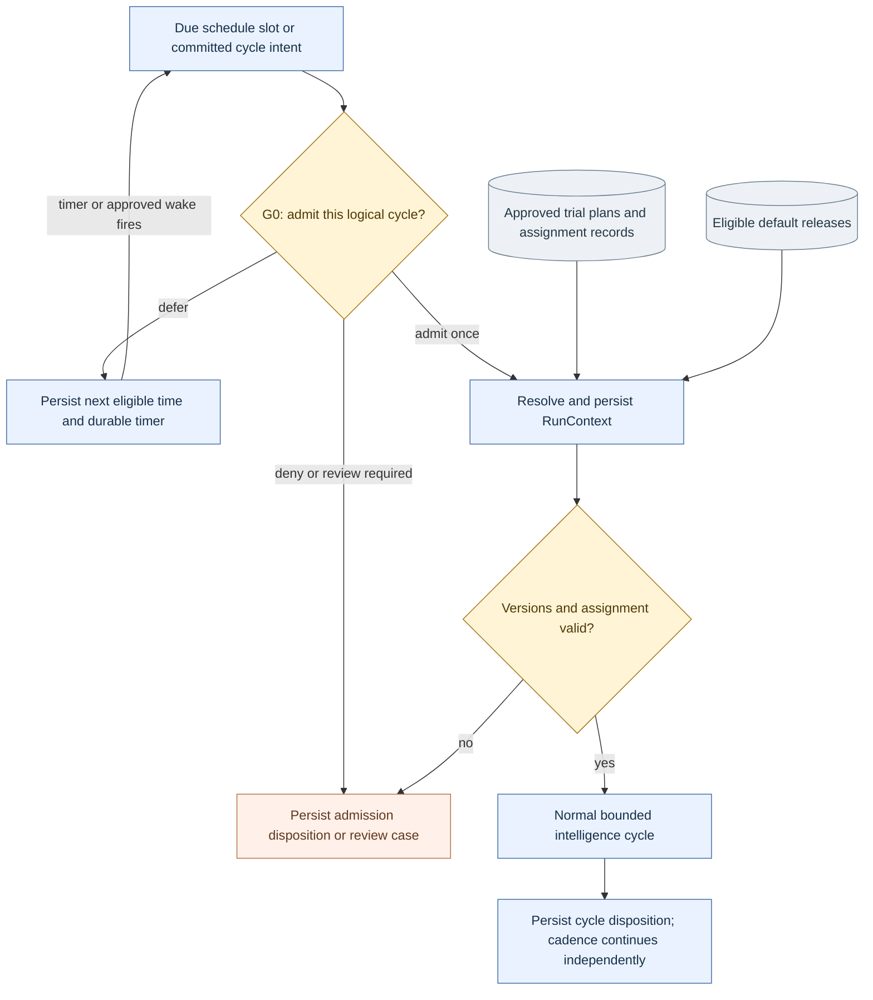
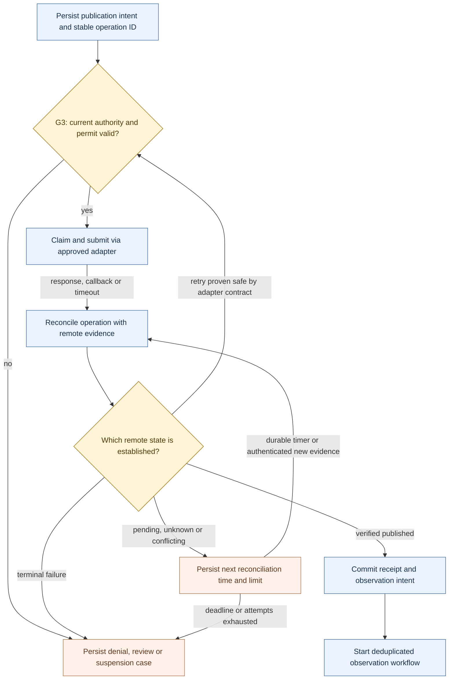
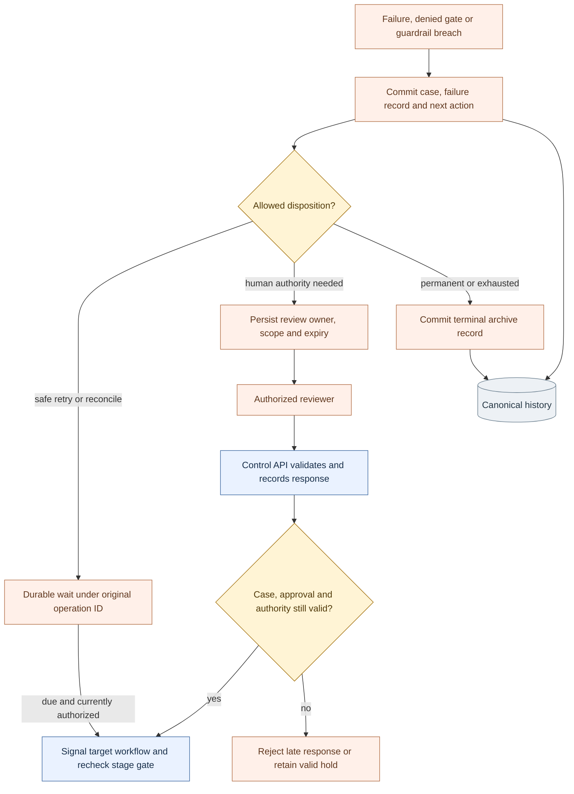
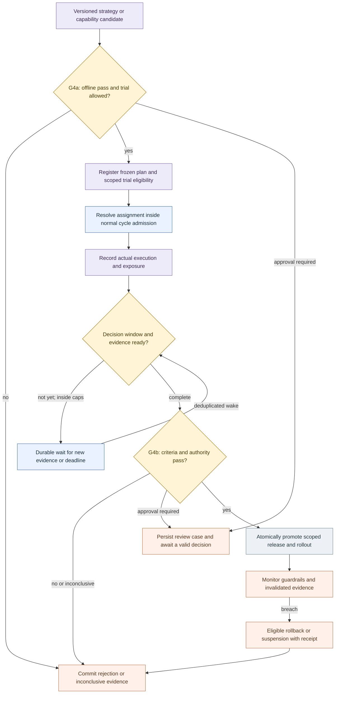
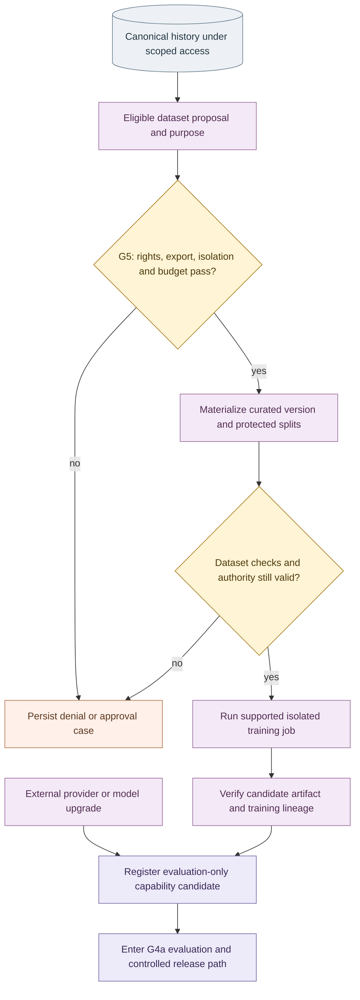

# Salience V4 — architecture and execution contracts

**Status:** V4 supersedes the V3 design and incorporates the audit corrections. It is an implementation blueprint. Production approval requires the evidence in the release checklist below; this document does not certify the deployed application.

`ArchV4.mermaid` is the system overview. `ArchV4.svg` is its zoomable rendering. The focused diagrams and contracts in this document define the behavior behind the overview's module boxes. Solid arrows carry work or records; dotted arrows supply context or dependencies. Gate identifiers G0–G5 bind visible workflow boundaries to the enforcement matrix. Colors identify responsibilities, not implementation status.

The baseline is the V3 deliverables supplied in this conversation and the stated implementation of ArchCurrent. No server repository or deployment was inspected. Preserve the Control API, Temporal adapter, Salience workers, PostgreSQL, object-store contract, existing creative/publication workflows, and fixture/explicitly enabled adapters. The new responsibilities can be modules, database records and workflow/activity types in that stack.

## V3 audit resolution

| Finding | V4 correction |
| --- | --- |
| Trial arrow could imply an extra execution path | The trial controller registers plans and supplies assignments to `RunContext` resolution. It has no direct edge to cycle dispatch. |
| Active defaults could overwrite a trial candidate | Experiment-aware resolution validates and freezes assignment-specific versions before research or generation. |
| Several paths could create uncontrolled cycles | New cycles enter G0 with a stable intent/cycle identity. Resume commands target existing workflows and operation IDs. |
| Wait could resemble a tight loop | Cycle waits and experiment-evaluation waits are explicit durable timers or bounded event waits. |
| Learning appeared to drive the production clock | Cadence is independently scheduled. Learning persists context and evidence; it does not directly start another cycle. |
| Archive did not visibly persist | `Archive → History` is explicit; archived status requires a committed disposition record. |
| Human escalation and response were implicit | Recovery creates a durable review case; an authorized reviewer responds through the Control API into the same case. |
| One recovery box hid incompatible actions | Typed case states and permitted commands separate retry, reconciliation, revision, review, suspension and terminal disposition. |
| Shared arrows obscured governance | G0–G5 show critical gates; the enforcement matrix also covers every retrieval, adapter and data-processing boundary. |
| Failure learning could include only published work | Recovery writes failure records; eligible failures and corrections explicitly enter learning from canonical history. |
| Training appeared authorized only after it ran | G5 precedes data export and training spend. Provider upgrades have an independent candidate path. |
| Late evidence corrections could leave releases unexamined | Corrections invalidate dependent evidence and enqueue bounded release re-evaluation; material guardrail failures can suspend or roll back a release. |
| Layout and styling were incomplete | The overview uses module boundaries, all nodes have explicit classes, and five focused views carry execution detail. |

## 1. Runtime, state ownership and minimal deployment

Temporal and the Salience workers execute cycles, publication, observation, learning, experiments, reconciliation and optional training coordination. Main-chart domain arrows are durable logical handoffs, not a requirement to call every next stage synchronously. A workflow can finish its cycle disposition while observation continues independently.

| Owner | Authoritative responsibility |
| --- | --- |
| Control API | Authenticated commands, goal revisions, scoped authority, review responses and administrative stop/resume actions. |
| PostgreSQL | Business records, operation identities, trial assignments, authorization/budget ledgers, release pointers, review cases and dispatch intents. |
| Object store | Versioned evidence bytes, browser receipts, assets, evaluation snapshots and eligible model/data artifacts. |
| Temporal | Durable orchestration, timers, execution history, child-workflow coordination and delivery of workflow signals. |
| Retrieval projections | Rebuildable indexes, embeddings, graph views and summaries referencing canonical records. |
| Adapters | Scoped access, typed validation, provider-specific idempotency, reconciliation, invocation receipts and actual-cost reporting. |

Use deterministic workflow coordination. Place model calls, remote requests, database access and other external interactions in activities. Pin compatible workflow code for existing executions and use the SDK's supported versioning/patching approach. Bound workflow histories with finite child workflows or Continue-As-New where appropriate. [Temporal workflow definition](https://docs.temporal.io/workflow-definition)

### Durable handoff and commit rules

When a PostgreSQL transition requires a runtime start or signal, commit the business transition and outbox intent in the same transaction. Dispatch committed entries with retry, acknowledgement tracking, stable destination identities and deduplicated consumption. Maintain ordering where an aggregate's state transitions require it. An outbox row is not proof that the remote effect completed. [Transactional outbox pattern](https://docs.aws.amazon.com/prescriptive-guidance/latest/cloud-design-patterns/transactional-outbox.html)

Upload immutable object bytes and verify their hash before committing ready references. Reconcile abandoned uploads and missing objects. PostgreSQL, Temporal and object storage do not share one atomic transaction. Define recovery for each boundary. Asset readiness, publication verification, archival completion and release promotion each require their own committed record.

## 2. Goal lifecycle, cycle admission and durable waits

`GoalSpec@v1` defines objectives and metric versions, audience, approved accounts/channels, brand/content scope, horizon, source policy, cadence, budgets, research/generation limits, exploration allocation, approval thresholds and stop criteria. Persist a goal revision and state: `draft`, `active`, `paused`, `completed` or `cancelled`. Start from an explicitly approved baseline strategy when history is limited.

Every new cycle has a stable `CycleIntent` and logical `cycle_id`, independent of Temporal retry attempts or a new Temporal Run ID. A scheduled slot has a unique identity under its goal/schedule revision. Manual/event requests use an explicit idempotency key and coalescing policy. A revision must not accidentally create a second operation for already committed work.

G0 is the single admission contract for new cycles. It checks authenticated scope, current goal state/revision, event freshness, due time, overlap/capacity, quotas, prospective budget and permitted trial participation. Persist one of `admitted`, `deferred`, `denied` or `review_required`, plus the reason. Concurrent admission attempts must be serialized or protected by unique constraints and atomic resource updates; duplicate requests return the existing disposition.

This contract is an application module executed through the existing runtime. It does not require an additional scheduling service.

Persist and configure overlap, catch-up, stale-slot and backfill policies explicitly. Apply admission checks to manual triggers as well as schedules. Select an appropriate bounded policy for each goal; do not rely on an unlimited backlog. The cadence can admit the next cycle while an earlier publication's outcomes are still maturing. [Temporal schedules](https://docs.temporal.io/schedule)

`defer` or `abstain` closes the current cycle with a disposition. Any later work receives a new valid intent when its durable wake condition occurs. Coalesce a deferred wake with an equivalent scheduled slot. Avoid both a self-rearming workflow timer and an independent schedule producing duplicate intents for the same slot.

Research may request more evidence inside the current cycle, using the same scope and explicit call/depth/cost/deadline limits. Exhausting those limits leads to defer/abstain or a recorded failure. It does not start recursive cycles. Source ingestion and observation may have their own admitted maintenance workflows; not every source or analytics event creates content work.

## 3. Immutable run context and experiment assignment

Resolve context after admission and before research, selection, or generation. Use one authoritative resolver with these rules:

1. Validate the current goal, authority, scope and any revocations. These always constrain execution.
2. Determine eligible approved experiment plans and resolve conflicts according to an explicit priority/exclusion policy. A run cannot silently enter multiple incompatible experiments.
3. Obtain the stable assignment for the plan's declared unit: for example, a cycle, content opportunity, account/cohort or time block. Atomically enforce assignment/exposure limits. Record the method and probability when randomized.
4. For assigned work, resolve the plan's frozen strategy, model, prompt and evaluation/metric versions. For unassigned work, resolve the eligible default release bundle.
5. Validate contract compatibility and scope-specific evaluation/trial/active eligibility. Persist the context before affected execution. If it fails, hold, reject or follow a preapproved experiment rule; never silently replace the candidate with the baseline.

`RunContext` includes context/cycle/goal IDs, goal revision, tenant/account scope, authority references, strategy and capability bundle versions, prompt/template versions, evidence cutoff/snapshot references, optional plan/arm/assignment ID and routing/fallback policy. Later stage records link any additional context snapshots. Record invocation identity and actual executed versions separately from planned versions.

A version change in the active registry does not mutate an existing context. Revocations and stop controls are rechecked before effects and can prohibit a pinned version. A material revision creates a new linked context/artifact version and invalidates approvals bound to the old one. Recovery does not reset experiment assignment or generate a fresh logical operation ID.

The registry distinguishes `candidate`, `evaluation_only`, `trial_eligible`, `active`, `suspended` and `retired` eligibility. Candidate registration and a scoped trial lease do not update the default active pointer. Every gateway request carries an authenticated execution mode; model output cannot assert that a request is a trial or grant permission to use a candidate.

## 4. Governance and capability enforcement

One versioned policy/authority model drives all gates. Each result is `allow`, `deny` or `require_approval` with a recorded reason. Bind permissions and approvals to the exact operation, artifact hash/version, account, purpose, allowed effects and expiry. An LLM assessment supplies evidence; trusted application code determines authority.

| Boundary | Enforced contract |
| --- | --- |
| **G0 — cycle admission** | Current goal/authority, due time, deduplication, capacity/overlap, quotas and available budget. |
| **G1 — pre-creation** | Selected brief version, creation rights, brand/content scope, approval state and atomic generation reservation. |
| **G2 — build** | Byte integrity, supported formats, provenance, claim support, brand/rights/disclosure checks and immutable distribution manifest. |
| **G3 — publication dispatch** | Account-bound request, current package approval, rights, authority/stop revision, budget, channel constraints and stable operation identity. |
| **G4a — trial eligibility** | Offline quality/safety/compatibility results, approved frozen plan, exposure/spend limits and trial authority. |
| **G4b — promotion** | Mature valid evidence, predefined decision criteria, current authority, scoped rollout caps and an eligible rollback/suspension plan. |
| **G5 — training** | Dataset/purpose rights, export destination, protected data/holdouts, supported training method, isolated credentials, compute budget and explicit enablement. |
| Every retrieval/intake boundary | Authenticated scope, permitted source/use, provenance, privacy/retention restrictions, quality and freshness. |
| Every model/tool/agent/creative invocation | Typed contract, registry eligibility, execution mode, allowed tool/destination, credential scope, resource reservation and time/delegation limits. |
| Every observation/learning/evaluation activity | Read/data-use scope, quality rules, metric versions, rate limits and allowed effects. Offline evaluation cannot publish or gain production write permissions. |
| Every recovery/review action | Current case state/revision, reviewer/operator authority, expiry, original operation identity and renewed stage checks. |

### Dispatch and revocation contract

Before an external effect, create or recover its operation record, reserve bounded resources and validate the current policy/goal/authority revision. Atomically claim the operation and record a short-lived dispatch permit for its exact request fingerprint. A duplicate worker must recover the existing claim/outcome rather than independently send another effect. A permit may be resumed/reconciled; it is not a new operation identity.

Choose and document the authority point: stop/revocation and permit issuance must be ordered consistently within the affected scope. A stop committed first prevents a new permit. A permit issued first may already be in flight; cancellation and reconciliation apply. Expired permits require current revalidation. A lease alone cannot make an external API exactly-once; the adapter's idempotency/reconciliation contract remains necessary.

Secrets remain outside model context and content records. Credential issuance and network destinations are restricted at adapter boundaries. Restrict fallback providers to approved compatible contracts and scopes; log actual routing. MCP adapters must preserve audience and authorization boundaries. [MCP security guidance](https://modelcontextprotocol.io/docs/tutorials/security/security_best_practices)

An emergency stop persists its scope/revision before follow-up actions, blocks new permits and cancels pending work where supported. Pausing a Temporal schedule alone does not stop workflows already started and is insufficient as the application stop control. Already dispatched remote actions may still complete. Corrections/retractions are separately governed operations. [Temporal schedule pause behavior](https://docs.temporal.io/schedule)

If current policy or goal-state access is unavailable, hold new external effects. Read-only reconciliation can continue only under a separately valid scoped authorization. A previously approved package alone cannot substitute for the current dispatch check.

## 5. Production, idempotency and publication evidence

The creative workflow owns generation, editing and bounded revision through approved text/image/video/audio capabilities. Preserve fixture and explicitly enabled production modes. Record provider job IDs, model identity/fingerprint, invocation parameters, prompt versions, costs and output hashes. Reconcile uncertain generation jobs before resubmitting or switching providers. Detect and requalify material behavior changes when a provider cannot expose an immutable model version.

Filter candidate opportunities by hard constraints, then use a versioned exploration/exploitation policy within the goal's limits. `DecisionRecord` captures alternatives, evidence available at decision time, eligibility, scores, uncertainty, estimated cost, selected action, assignment probability where relevant, and a concise evidence-linked rationale. A valid decision may abstain. Historical ranking does not establish unobserved counterfactual outcomes.

An asset can pass byte/format verification and still fail claim or brand evaluation. G2 produces an immutable package manifest. `ReadyToPublishPackage@v1` is input to a new account-bound publication request; it is not reusable authority for any account or future time. Recheck G3 at scheduled dispatch.

Keep logical operation identity stable across activity retries, Continue-As-New, recovery, duplicated callbacks and dispatcher retries. A new content revision or separately authorized correction has a new linked operation; do not repurpose an existing remote key with a different payload. Temporal activities can execute more than once, so remote effect safety must be implemented by the application/adapter. [Temporal activity idempotency](https://docs.temporal.io/activity-definition)

Each external adapter must declare its operation identity mapping, idempotency scope/retention, status/readback capability, expected consistency delay, authenticated callback correlation, terminal-state semantics, cancellation support, safe retry predicate and cost-settlement behavior. A temporarily missing post in an eventually consistent read is not sufficient proof of failure. If a retry cannot be established as safe, keep the operation unknown and escalate within its defined limit.

Track `planned`, `authorized`, `submitted`, `remote_pending`, `published_verified`, `failed_terminal`, `unknown`, `cancel_requested` and appropriate resolved/cancelled states as supported by that adapter. Reject impossible/out-of-order regressions or record conflicting evidence for reconciliation. A callback signature authenticates origin; it does not alone verify the expected account, artifact and published state.

Budget reservations are atomic per applicable goal/account/period and counted across concurrent operations, trials and retries. Settle known actual costs and release only unused amounts justified by the result. Unknown jobs retain unresolved liabilities until reconciled. Reserve a defensible bound and enforce provider/tool usage limits where available; estimates alone are not a hard spending guarantee. Keep generation, research, publication, evaluation and optional training costs attributable.

Where the goal requires a strict spend cap, disallow operations whose maximum charge cannot be bounded within the available reservation under the adapter contract.

## 6. Typed recovery and human review

A `RecoveryCase` binds case/version, failure code, retryability, goal/cycle/context, existing workflow and operation IDs, next action/due time, owner, attempt limits, authority requirements and resolution evidence. An admission failure without an admitted workflow targets its intent/case rather than inventing a workflow to resume.

| Case state | Permitted next action |
| --- | --- |
| `retry_due` | A bounded retry with the same logical operation after the stage gate passes. |
| `reconciling` | Query/wait for remote evidence; do not blindly submit again. |
| `rework_due` | Create a bounded linked artifact revision and obtain approvals for that revision. |
| `awaiting_review` | Await a current authorized decision or deadline; no affected external effect. |
| `suspended` | Await changed, authorized conditions; resumption revalidates current controls. |
| `terminal` | Commit reason, relevant evidence and disposition; no automatic resume. |
| `resolved` | Record the exact resolution/command and deduplicate further responses. |

Resume signals include target workflow, operation, expected case/context revision, action type and an idempotent command ID. The target handler verifies state and current permissions before continuing at the saved stage. `resume_existing` cannot be interpreted as `start_cycle`. A reviewer cannot override an immutable safety rule or grant a different account/artifact permission through free text.

Notifications and review delivery are deduplicated, with acknowledgement, escalation deadlines and an assigned owner. Approval/rejection records are bound to the case and proposed operation. Reject expired, duplicate, stale or unauthorized responses. Cancellation/closure invalidates outstanding review requests. Normal preauthorized work remains automatic; the review queue handles defined exceptions.

Archival is an idempotent commit of disposition, reason, lineage, evidence references and retention classification. Rejected/inconclusive/superseded records remain discoverable where retention and rights permit. Archival does not automatically authorize training use or reactivate a rejected candidate.

## 7. Observation, attribution, learning and correction propagation

Treat RSS/HN feeds, governed browser captures, approved platform/trend signals, tool results and retrieved text as untrusted data. Normalize, deduplicate and assess freshness/quality; quarantine unsuitable evidence with its reason. Record source identity, event/capture times, byte hashes, browser/trace receipts and permitted uses. Source instructions cannot grant authority or alter control policy. Retrieval returns scoped citations, record versions, confidence and freshness; generated summaries remain derived material, not independent confirmation of their claims.

A verified publication receipt commits an observation plan and its dispatch intent. Read-only analytics adapters use durable windows, pagination/checkpoints, rate limits and deduplication. Approved business analytics may provide conversions or revenue separately from the publishing platform. Never infer those business outcomes merely from engagement.

Observation records contain event/collection times, publication age, source, metric definitions/units, dimensions, completeness, access coverage and revision status. Missing is not zero; cumulative totals and increments require different aggregation. Persist raw snapshots and append corrected normalized versions. Define preliminary and mature windows per metric and channel.

Compute deterministic outcomes against versioned goal metrics and attributable costs. Attribution links publication, content, decision, strategy, actual capability versions and experiment assignment. It does not by itself establish causality. Offline comparisons and controlled trials must state their assumptions, uncertainty, support and limits. [Offline policy evaluation reference](https://vowpalwabbit.org/docs/vowpal_wabbit/python/latest/tutorials/off_policy_evaluation.html)

Learning consumes eligible new outcome, failure and correction events, including work that never published. Keep policy denials, technical failures, content-quality failures and audience outcomes distinguishable. Maintain source citations, context, supporting and contrary evidence, applicability, confidence and review/expiry dates. Store hypotheses separately from supported lessons.

Use typed event subscriptions, immutable event IDs, watermarks and a consumer ledger. Learning's own newly written summaries must not re-trigger the same analysis indefinitely. Candidate rework requires new evidence or an approved plan revision, with novelty/depth/resource limits. A rejected candidate cannot repeatedly recreate itself from its archival event.

For a corrected/revoked source or observation, record dependency invalidation for derived metrics, lessons, evaluations, dataset versions and relevant promotion evidence. Recompute/re-evaluate within bounded workflows. Hold new promotion on invalid evidence. If a release's evidence no longer meets its policy, persist the prescribed suspension or rollback and its receipt. The response depends on materiality and the approved policy; a harmless metadata correction need not trigger a rollback.

## 8. Experiment and release lifecycle

G4a requires a versioned candidate, frozen evaluation suite and an approved experiment plan. The plan defines hypothesis, target change, baseline, eligibility population, assignment unit, exposure probabilities where randomized, exclusions, metrics, outcome maturity, minimum evidence, cost/risk caps, maximum horizon and stopping/multiple-testing rules. Respect audience/post interference; label nonrandomized comparisons appropriately.

Resolve assignment before the behavior under test. Record assignment separately from actual exposure; generation, publication and audience exposure may each happen later or fail. The evaluator handles missing exposure, attrition and protocol deviations using the declared analysis policy. It must not silently discard unfavourable failures or compare contaminated arms as though assignment had been preserved.

`TrialEval` runs only on due windows or deduplicated eligible evidence events. Continuing an experiment does not extend caps, change a frozen plan, or issue an extra cycle. It leaves the approved plan eligible until the next allowed assignment. At a maximum horizon or evidence limit, terminate as decided or inconclusive. Any extension is a separately authorized plan revision.

G4b atomically records the decision and changes a scoped active pointer with a version/concurrency check. Store candidate/baseline IDs, evaluation versions, evidence validity, rollout limits, authority and rollback target. Keep strategy and capability registries logically distinct even if they share tables and release code. Use evaluation-only access before trial and restrict normal routing to active eligible versions.

Monitor after promotion. Rollback selects a still-eligible version or suspends the route; a revoked or incompatible predecessor is not automatically safe. Record the affected scope and current executions. Preserve pinned context and reconcile in-flight operations. Rolling back a release changes future execution; published content needs a separate authorized correction/retraction.

## 9. Optional training and independent provider upgrades

The production loop functions with training disabled. Provider/model upgrades can independently enter the candidate registry without curating a dataset or training a model.

Dataset proposals use already authorized, purpose-scoped reads and metadata; they do not grant access to restricted content. G5 authorizes materialization/export and chargeable work for the specific purpose/destination. Validate permissions again at dispatch. Publication rights do not imply training rights.

Version manifests, hashes, allowed uses, provenance, labels, exclusions and train/validation/protected-holdout splits. Include validated successes, representative failures, counterexamples and human corrections where useful. Do not make failed outputs correct supervised targets by default. Separate synthetic labels and prevent the model's self-assessment from being the only truth signal.

Protect holdouts from training, prompt tuning and evaluation-time retrieval leakage. Split related content/campaigns and time periods appropriately. Handle revoked material and dataset lineage when eligibility changes. Permit only supported training methods with suitable weights/licenses or provider fine-tuning support; a common adapter does not make every closed model trainable.

Training outputs remain candidates with reproducible configuration, compute/cost records and source lineage. Neither training completion nor an offline score changes an active pointer. Capability-specific regression suites, trial eligibility, controlled exposure and G4b release apply.

## 10. Contracts and schema invariants

Preserve `ContentBrief@v1` and `ReadyToPublishPackage@v1` where their existing semantics suffice. Add compatible sidecar records or optional fields; use an explicit new schema version for breaking changes. Names below are proposed contracts, not assertions that these tables already exist.

| Contract family | Required information or invariant |
| --- | --- |
| `GoalSpec`, `CycleIntent`, `AdmissionRecord`, `CycleRecord` | Goal/schedule revisions, stable identities, due/expiry times, unique admission/disposition and resource commitments. |
| `RunContext`, `ContextSnapshot` | Frozen version bundle, scoped authority references, evidence cutoff and immutable experiment assignment. |
| `EvidenceRecord`, `DecisionRecord`, `ContentBrief` | Source permissions/provenance, alternatives, scores, uncertainty, selected action/probability and cited rationale. |
| `CapabilityManifest`, `CapabilityInvocation`, `ExposureRecord` | Registry eligibility, typed contract, execution mode, planned/actual version, routing, effect class and cost. |
| `GovernanceDecision`, `DispatchPermit`, `BudgetLedger` | Exact operation/request binding, current revisions/expiry, serialized claims/reservations and idempotent settlement. |
| `AssetManifest`, `ContentEvaluation`, `ReadyToPublishPackage` | Hash-verified bytes, content assessments, rights/approval references and immutable distribution manifest. |
| `PublicationRequest`, `PublicationAttempt`, `PublicationReceipt` | Stable operation identity, remote IDs/evidence, state transitions and adapter-specific retry proof. |
| `ObservationPlan`, `ObservationRecord`, `OutcomeRecord`, `AttributionRecord` | Definitions/units, quality/maturity, source revisions, deterministic results, lineage and causal-method limits. |
| `LearningEvidence`, `Hypothesis`, `FailureRecord`, `EvidenceInvalidation` | Supporting/contrary evidence, applicability, failure category, dependency invalidation and review decisions. |
| `ChangeCandidate`, `ExperimentPlan`, `AssignmentRecord` | Immutable change/plan, declared assignment unit, versioned eligibility, probability and atomic exposure limits. |
| `EvaluationReport`, `ExperimentOutcome`, `PromotionReceipt`, `RollbackReceipt` | Evidence versions/validity, decision policy, scope/authority, compare-and-set release change and disposition. |
| `RecoveryCase`, `ReviewRequest`, `ReviewDecision`, `ResumeCommand`, `ArchiveRecord` | Typed state/action, case/version binding, existing workflow/operation, authorized response and committed closure. |
| `DatasetManifest`, `TrainingRun`, `ModelCandidate` | Training purpose/rights, protected splits, configuration, artifacts, costs and candidate-only eligibility. |

Every record envelope carries a schema version, immutable ID, tenant/account scope as applicable, goal/cycle/context IDs, event and recorded times, correlation/causation and lineage. Use unique constraints for business identities and processed events. Corrections append superseding records; audited current-state projections and active pointers may be mutable.

## 11. Configuration and operational evidence required before release

Choose concrete values per workload; architecture diagrams cannot supply universal thresholds. Required configuration includes cycle cadence/overlap/catch-up, maximum concurrent work, source freshness and evidence limits, retry/reconciliation deadlines, adapter idempotency horizons, request/approval expiry, reservations and period budgets, observation windows, trial exposure/sample/horizon limits, promotion guardrails and rollback targets.

Define health/SLO targets, alert owners, review deadlines, data retention, recovery-time and recovery-point objectives. Monitor queue/workflow age, unknown operations, expiring cases, observation coverage, evidence invalidation, actual spend/unsettled liabilities and released-capability quality. Persist correlation IDs through all domains. Restore PostgreSQL, object storage and Temporal according to a documented reconciliation procedure before resuming external effects.

| Release scenario | Required demonstrated result |
| --- | --- |
| Duplicate or concurrent cycle intents | One admitted logical cycle under the configured overlap/coalescing policy; no duplicate reservation. |
| Defer/abstain and evaluation wait | No busy loop; a durable wake rechecks due time, authority, caps and current state. |
| Trial versus active-version race | The assigned eligible bundle is actually executed; defaults cannot silently overwrite it. |
| Missing trial exposure or fallback | Deviation/attrition is recorded and evaluated according to the frozen plan. |
| Worker crash after a remote effect | Stable identity and reconciliation prevent unsafe duplicate submission. |
| Eventual-consistency absence or expired remote key | No retry without the adapter's declared safe predicate; unresolved work reaches its hold/escalation limit. |
| Concurrent reservations and delayed charges | Atomic allocation and idempotent settlement preserve budget accounting and unresolved liabilities. |
| Approval/revocation/stop racing with dispatch | Behavior follows the declared authority point; stale approvals cannot authorize a new effect. |
| Expired or duplicate human response | It cannot revive cancelled work or generate a second resume command. |
| DB commit followed by lost runtime notification | Outbox recovery delivers the intent without duplicating the business operation. |
| Missing or duplicate analytics and late corrections | No invented zeros/double counts; relevant dependent evidence and releases are re-evaluated. |
| Pre-publication failure or rejected experiment | Canonical reason/evidence exists and eligible failure learning occurs without self-trigger loops. |
| Regressed/revoked release | An eligible rollback or suspension is committed; in-flight effects are reconciled. |
| Workflow upgrade and backup restoration | Compatible replay/recovery, intact artifact references and reconciliation before external dispatch. |
| Training disabled | Normal production remains operational. When enabled, data-use, isolation, holdout and release tests pass first. |

These are acceptance criteria to run against the application and its actual adapters. Mermaid parsing/rendering validates the diagram artifacts only.

## 12. Incremental implementation from ArchCurrent

| Increment | Deliverable |
| --- | --- |
| 1. Admission and control | Versioned goals, intent/cycle identity, G0, immutable context, typed resume, review cases and stop/dispatch semantics. |
| 2. Reliable production records | Gate bindings, reservations/settlement, provider-specific reconciliation, verified publication receipts and archival/outbox invariants. |
| 3. Observation and internal experience | Durable observation, versioned metrics, scoped retrieval, failure learning and correction propagation. |
| 4. Explainable decisions and strategy trials | Candidate history, bounded exploration, G4a plans, immutable assignments, actual-exposure evaluation and G4b release/rollback. |
| 5. Capability evolution | Typed provider/tool contracts, scoped candidate/trial/active routing and upgrade regression suites. |
| 6. Optional model adaptation | G5, eligible dataset versions, protected evaluation, isolated training and the existing controlled release path. |

Infrastructure stays centered on the existing Control API, Temporal/Salience runtime, PostgreSQL, object storage and approved adapters. Implement these contracts there first, and split services only when measured isolation or capacity requirements justify it.
