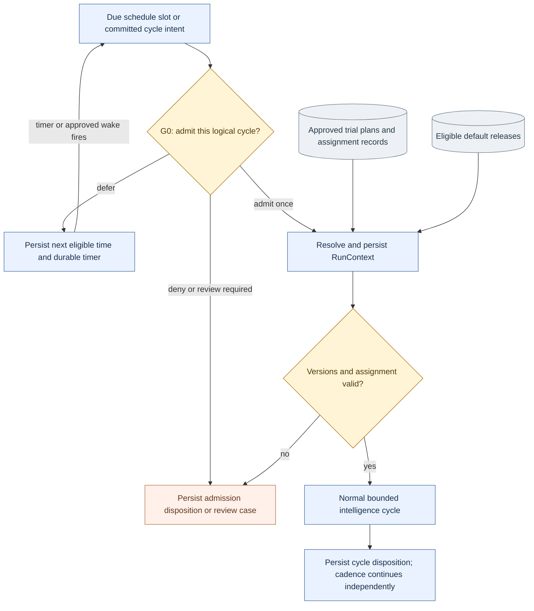
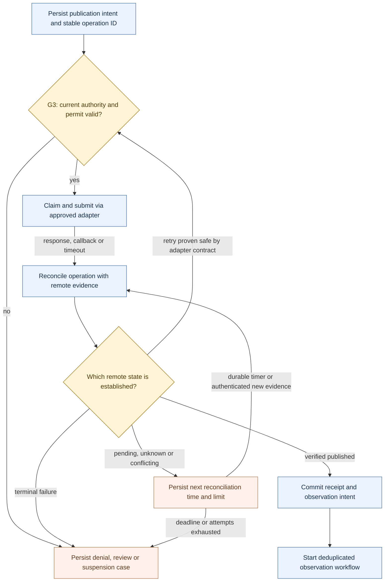
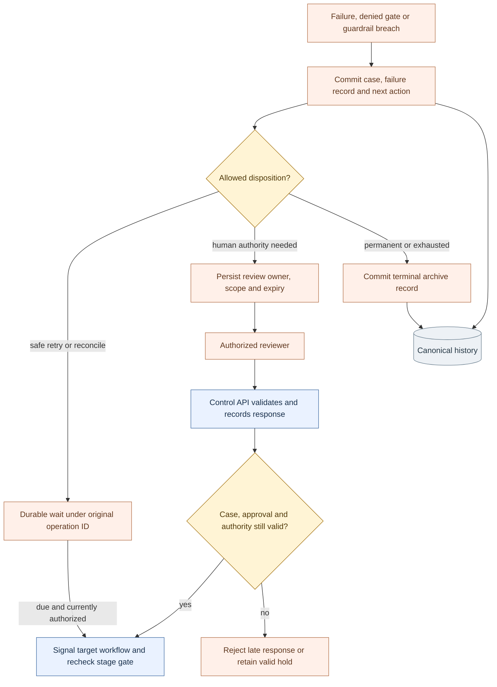
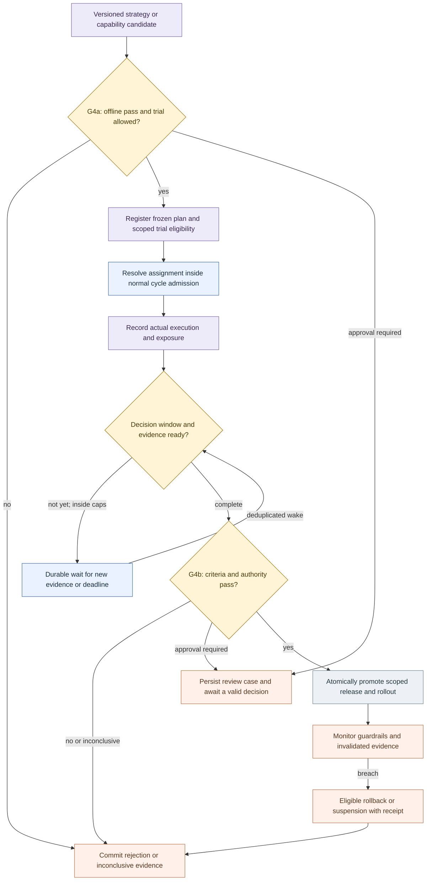
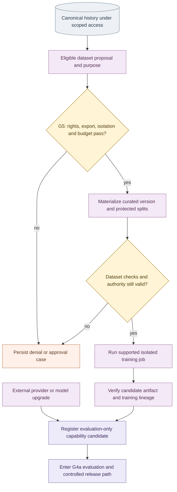

# Salience V4 production implementation blueprint

**Status: V4 implementation incomplete; isolated P0 foundation exists, with no production certification.** Documentation baseline: `8e50d68efbf2bec2aabfb2fe3226e01635de2adb`, inspected 2026-09-22; P0 delta verified separately below. The numbered P0–P7 phases below are new V4 delivery phases, not the old Phase 1–9 labels.

This is the single execution authority for future architecture, product behavior, implementation sequencing, acceptance, and operations. The complete ArchV4 contracts and overview are incorporated below. Current code is the authority for what exists; a design box, schema field, fixture pass, historical screenshot, or completed plan checkbox does not establish production readiness. Historical documentation is evidence, not a competing plan. Repository-owned AGENTS.md/SKILL.md instructions retain their instruction scope.

Read this document in order, then execute P0 and its dependent phases using **Understand → Spec → Verifier → Environment → Implement → Verify → Inspect → Repair → Re-verify → Checkpoint → Repeat**. For each slice, first write the named failing acceptance test, demonstrate the failure, implement only that slice, run focused and applicable regression tests, review migration/rollback and evidence, then checkpoint. The original documentation transition changed no application behavior; the subsequent authorized P0 implementation is distinguished below. Future implementation needs no historical plan to interpret the requirements below.

## Navigation

- [Verified starting point](#starting-point)
- [Target architecture and retained product intent](#target)
- [Contracts and transactional boundaries](#contracts)
- [Implementation phases and rollback](#phases)
- [Requirement traceability matrix](#requirements)
- [Release gates, configuration, and runbooks](#release)
- [Conflicts and open decisions](#open-items)
- [Drift checks and documentation preservation](#drift)
- [Complete incorporated ArchV4 contracts](#v4-contracts)
- [Complete incorporated ArchV4 overview](#v4-overview)

## 1. Verified starting point

The following E01–E17 observations are the pre-P0 baseline at the commit above, not claims about a remote deployment or the subsequently changed working tree. The P0 delta follows the table. Evidence paths are relative to repository root. Tests listed here are inspected tests; execution results and environmental limitations are recorded in [validation evidence](validation.md). An absent subsystem means no implementation was found in the tracked `src/salience`, `migrations`, `tests`, or deployment configuration at that revision; it does not assert that an external service could not exist.

| Evidence ID | Current fact and limits | Code/configuration | Verifier and V4 disposition |
| --- | --- | --- | --- |
| E01 | PostgreSQL canonical identities, static Alembic migrations through `0012_publication_profile_scope`, workspace/program roots, jobs/checkpoints/effects, audit/provenance, budgets, creative and publication lineage exist. These are reusable; V4 record families are additional work. | `src/salience/db/base.py`, `src/salience/db/models.py`, `migrations/versions/0001_canonical_foundation.py`, `migrations/versions/0012_publication_profile_scope.py` | `tests/integration/test_migrations.py`, `tests/integration/test_publication_migrations.py`; retain and extend. |
| E02 | The deployable worker registers dummy, intelligence, creative, and publication workflows. External I/O is organized into activities. Existing recovery tests exercise fixture effects; V4 orchestration, replay upgrade qualification, and bounded long-lived histories are additional requirements. | `src/salience/workflows/worker.py:97`, `src/salience/workflows/intelligence.py`, `src/salience/workflows/creative.py`, `src/salience/workflows/publication.py` | `tests/e2e/test_compose_worker_restart.py`, `tests/e2e/test_phase9_publication_recovery.py`; retain workflow contracts. |
| E03 | Control routes authenticate one shared bearer token and accept `X-Salience-Scopes` from that bearer holder. `RequestContext` has scopes but no authenticated subject/account binding. This is an administrative fixture boundary, not tenant identity or server-assigned authorization. | `src/salience/api/dependencies.py:1078`, `src/salience/api/routes/control.py`, `src/salience/api/routes/publication.py` | `tests/integration/test_control_api.py`, `tests/integration/test_publication_control_api.py` test supplied headers; add hostile scope escalation and cross-workspace tests in P0. |
| E04 | Publication creation validates canonical inputs, creates a job, then calls Temporal separately. No transactional outbox or consumed-message ledger was found. A committed job can outlive a lost start notification. | `src/salience/api/dependencies.py:750`, `src/salience/workflows/persistence.py`; inspection of `src/salience/db/models.py` and migrations | P1 must replace all start/signal dual writes with commit-plus-outbox; test crash at every boundary. |
| E05 | Creative variants have canonical effect/reservation links; reservations lock budget rows and settlement persists cost lineage. This does not prove a multi-goal/account/period cap or bounded real-provider liability. | `src/salience/governance/cost_repository.py`, `src/salience/creative/repository.py`, `migrations/versions/0008_creative_release_gate.py` | `tests/integration/test_creative_cost_lifecycle.py`, `tests/e2e/test_phase7_creative_recovery.py`; extend accounting, preserve settled history. |
| E06 | Creative script, rights/consent, distribution, disclosure and immutable approved-package checks exist; one-to-three variants are bounded. Real media processing and signing cannot be inferred from these fixtures. | `src/salience/creative/service.py`, `src/salience/creative/governance.py`, `src/salience/creative/media.py`, `src/salience/creative/capabilities.py` | `tests/integration/test_creative_rights_provenance.py`, `tests/integration/test_distribution_package_repository.py`, `tests/evals/test_phase8_ready_package_eval.py`; G1/G2 reuse plus actual byte/content qualification. |
| E07 | Distinct scoped publication approval, account/profile matching, immutable publication records, schedule hydration, cancellation, and reconciliation exist. There is no serialized V4 goal-stop/dispatch-permit authority point. | `src/salience/publication/repository.py`, `src/salience/publication/governance.py`, `src/salience/workflows/publication.py`, migrations `0010`–`0012` | `tests/integration/test_publication_repository.py`, `tests/e2e/test_phase9_governed_publishing.py`; retain and extend G3. |
| E08 | Publisher registry selects enabled compatible profiles, and fixtures exercise substitution. The configured API supplies no publisher adapter mapping; the worker constructs publication state without a production adapter. | `src/salience/publication/registry.py`, `src/salience/api/app.py:52`, `src/salience/workflows/worker.py:61` | `tests/contracts/test_publisher_registry.py`, `tests/integration/test_fixture_publisher.py`; runtime wiring and qualification required before real effects. |
| E09 | YouTube supports a private resumable-session initiation boundary with injected durable edge storage. Generic submit raises without explicit handoff, status returns `None`, and `run_live_smoke()` always returns a NOT RUN reason. It neither uploads media nor verifies a published video. | `src/salience/publication/youtube.py:265`, `src/salience/publication/youtube.py:331` | `tests/integration/test_youtube_publisher_contract.py`, `tests/live/test_youtube_publisher_smoke.py`; mocked transport/status-contract tests are not live upload evidence. |
| E10 | Object-store protocol, memory/S3 adapters, hash receipts and media import checks exist. S3 tests use `FakeS3Client`; Compose's optional Garage configuration points to an absent `infra/garage/garage.toml`. Immutable remote writes, recovery, and backup restoration are unqualified. | `src/salience/storage/s3.py`, `src/salience/creative/media.py`, `compose.yaml` | `tests/contracts/test_object_store.py`, `tests/integration/test_creative_object_storage.py`; retain abstraction, qualify real storage P0/P2. |
| E11 | Typed callable agents, delegation/teams, model gateway, scoped memory, RSS/HN research and optional read-only browser adapters exist. Deployed intelligence defaults to fixtures or configured RSS; an installed model adapter is not proof that every production workflow uses it. | `src/salience/agents/`, `src/salience/models/`, `src/salience/memory/repository.py`, `src/salience/workflows/worker.py:171`, `src/salience/browser/playwright.py` | `tests/integration/test_direct_delegated_intelligence_agents.py`, `tests/integration/test_scoped_memory.py`, `tests/integration/test_runtime_swap.py`; use pinned context and authenticated per-call enforcement. |
| E12 | MCP/A2A owned DTO gateways and SDK compatibility tests exist. Versions are configured/pinned in source and `pyproject.toml`; no claim of future protocol compatibility or production audience authentication follows. | `src/salience/mcp/contracts.py`, `src/salience/mcp/sdk_adapter.py`, `src/salience/a2a/contracts.py`, `src/salience/a2a/sdk_adapter.py`, `pyproject.toml` | `tests/integration/test_mcp_sdk_compatibility.py`, `tests/integration/test_a2a_sdk_compatibility.py`; P5 contract/version/auth regression gates. |
| E13 | Trace IDs/carriers and an OTel emitter exist; tests export spans to memory. Compose has no telemetry collector/export configuration, alert routing, SLO or restore machinery. | `src/salience/observability/tracing.py`, `compose.yaml` | `tests/unit/test_tracing.py`; P0/P7 must prove cross-domain export and operational response. |
| E14 | Nullable tenant metadata exists, but no RLS policy was found. Memory reads filter by supplied program/scope; that alone is not authenticated tenant isolation. Retention/jurisdiction fields are metadata, not a complete deletion or policy enforcement service. | `src/salience/db/base.py`, `src/salience/memory/repository.py`, migrations and `src/salience/config.py` | `tests/integration/test_memory_trust.py`; restrict first production to an isolated deployment, gate shared tenancy on P0 isolation tests. |
| E15 | No GoalSpec/CycleIntent/AdmissionRecord/immutable RunContext, typed review/recovery/archive system, observation/attribution/learning/experiment/release-pointer/training implementation was found in the schema/module/workflow inventory. Current schedules are stage-job schedules, not G0 cycle admission. | `src/salience/db/models.py`, `src/salience/workflows/worker.py`, `src/salience/workflows/schedules.py`, `src/salience/api/dependencies.py:954` | New P1/P3/P4/P5/P6 suites are specified below, not claimed to exist. |
| E16 | Python 3.13 and exact libraries are declared. Compose pins images by digest, uses development credentials, no public DB port, and a development control token fallback. It is a local fixture topology, not a hardened deployment. | `pyproject.toml`, `compose.yaml`, `Dockerfile`, `.env.example` | `tests/test_config.py`, existing Compose E2E tests; P0 must produce a separate reviewed production profile and dependency/license evidence. |
| E17 | Browser verification is externally provisioned: the script checks an existing Playwright environment, reports NOT RUN if absent, and does not install browsers or dependencies. | `scripts/verify-browser-evidence.sh`, `tests/integration/test_browser_evidence.py` | Retain this later repository decision; do not resurrect historical auto-install instructions. |

## 2. Alignment, changes and additions

### P0 implementation delta and remaining release obligations (2026-09-23)

The isolated P0 profile is intentionally smaller than the legacy fixture API: it admits authenticated identity inspection, scoped program creation and own-workspace job inspection only. All generation, publishing, agent/tool dispatch, schedules, callbacks and worker starts are denied, even with a forged scope or an explicit database grant for a disabled operation. There is no enabled provider/fallback route or external credential in this profile. Existing Phase 1–9 fixture paths remain available only under the private development fixture mode; they are not upgraded to production security by association. P1 must carry subject/permission revision and pinned baseline capabilities through durable context/permits before enabling any affected workflow.

| Delta | Implementation and evidence | Limitation / next gate |
| --- | --- | --- |
| E18 identity isolation | `api/p0.py`, migrations `0013_identity_boundary`, fixed RS256 verification with issuer/audience/required expiry, database subject/grants and append-only access audit; `test_v4_identity_isolation.py` exercises forged scopes, wrong issuer/key/audience, expiry, revocation, foreign workspace, authorized writes, size limits and denied effect paths | Single configured workspace only; account operations are entirely disabled, not broadly authorized. Public issuer onboarding/key rotation/TLS and operator approval remain deployment prerequisites. |
| E19 safe profile | `compose.p0.yaml`, configured API profile and worker refusal; private loopback ingress, nonroot/read-only service, bounded CPU/memory/pids/concurrency; `test_v4_deployment_boundary.py` rejects production/shared tenancy/live effects | No production profile is enabled. The private legacy fixture mode retains its original shared-token semantics and must never become public ingress. |
| E20 object integrity | Conditional create/readback/digest checks in `storage/s3.py`, exact-retry memory compatibility, first-write capability probe; `test_v4_storage_integrity.py` and `test_v4_s3_service.py` | Pinned Garage 2.3.0 ignores conditional PUT and is rejected. SeaweedFS 4.47 passes disposable real-service conditional/concurrent write and bucket-scope tests; this is not a multi-node, encrypted production durability certificate. |
| E21 lifecycle primitives | Migration `0014_object_inventory` and `storage/lifecycle.py` persist immutable byte identity, verification/quarantine, references, retention/holds and tombstones; `test_v4_object_retention.py` | No background collector is enabled. P2 must route all ready-package references through these locks and the transactional outbox; legacy direct object consumers are not silently migrated. |
| E22 tracing/readiness | Strict W3C identifier validation, actual exported active-span identity, bounded OTel console exporter, database-backed P0 readiness; `test_v4_observability.py` and API audit/secret-canary tests | Existing API and fixture activity/adapter carriers qualified locally. Transactional outbox trace integration is RG1. Remote collector, alerts and production SLO response are NOT RUN. |
| E23 migration/baseline | `test_v4_migrations.py` exercises clean upgrade, empty downgrade/re-upgrade and refusal to erase populated inventory. `capture_runtime.py` exports read-only local schema/route/dependency/job/effect/reservation inventory | Local fixture inventory only; active production Temporal histories, edge-store external IDs and financial liabilities require a separately authorized cutover inventory. Configuration rollback preserves identity/audit/object rows. |
| E24 edge credential baseline | Existing `governance/secrets.py` now optionally uses server-owned workspace/destination/audience/provider-version policies and exact least-privilege lease scopes; `test_v4_secret_boundary.py` verifies expiry at reveal, revocation, denied substitution and serialization/redaction | Unscoped legacy fixture resolver stays compatible, but a policy-enabled resolver cannot use that bypass. No production credential or provider is enabled; P1/P2 must inject canonical current authority into each edge invocation. |

**Build versus adopt:** keep PostgreSQL/Temporal, boto3/S3 and the OTel SDK. Adopt the already installed [PyJWT 2.14.0 verifier](https://pyjwt.readthedocs.io/en/stable/api.html) (MIT) with cryptography 50.0.1 (Apache-2.0 OR BSD-3-Clause), explicitly pinned; no token issuer, OAuth server, queue or storage engine is invented. Allowed algorithm and trust key are server configuration, not token-supplied routing. Retain raw S3 compatibility only where [conditional-write semantics](https://docs.aws.amazon.com/AmazonS3/latest/userguide/conditional-writes.html) are verified. The real Garage test, not its compatibility marketing, determines rejection. Select [SeaweedFS 4.47](https://github.com/seaweedfs/seaweedfs/releases/tag/4.47) (Apache-2.0), digest `sha256:ce9e796f1fe6f06968f4c04bdaf8f678dad9c8acdfef3d244133d71bfa6bf882`, as the disposable compatible qualification backend after reviewing [atomic conditional operations](https://github.com/seaweedfs/seaweedfs/wiki/S3-Conditional-Operations). Do not auto-migrate Garage data or enable this test topology for production. Requalify an endpoint/version change, including concurrent writes; never replace conditional creation with a read-then-write check. Probe credentials need create/read/delete rights only in their isolated bucket/qualification prefix; fixture writer credentials are tested against a foreign bucket.

**P0 execution and configuration:** use `SALIENCE_DEPLOYMENT_MODE=p0`, `SALIENCE_TENANCY=single-workspace`, `SALIENCE_EFFECTS_ENABLED=false`, a dedicated `DATABASE_URL`, `SALIENCE_WORKSPACE_ID`, HTTPS `SALIENCE_IDENTITY_ISSUER`, exact `SALIENCE_IDENTITY_AUDIENCE` and `SALIENCE_IDENTITY_PUBLIC_KEY_FILE` (RSA public key, at least 2048 bits). `compose.p0.yaml` requires corresponding `P0_*` inputs, binds only localhost and starts no worker. Its public-key file must be readable by UID 65532. Supply credentials through the deployment secret manager; never commit keys, tokens or credential-bearing database URLs. Run migrations with a separate migration role; application identity must not be database owner/superuser. Provision a reviewed `identity_subjects` row bound to the configured workspace and issuer/subject, with future `expires_at`; provision `permission_grants` with `principal_type='identity'`, `principal_id` equal to that subject's UUID string, explicit `control:read`/`control:write`, `effect='allow'`, bounded expiry and empty constraints. Nonempty unsupported grant constraints fail closed. Revoke with `enabled=false` and increment subject `revision`; rotate public verification key through restart of isolated ingress, never temporarily switch to fixture authentication. No API can self-grant a subject or permission. Required database permissions are SELECT on authorized control/read tables, INSERT on access audit/content programs, and subject/grant read access; no audit UPDATE/DELETE, no public schema ownership and no effect-worker credentials.

**Storage usage:** register only workspace-prefixed keys with immutable receipt/hash and timezone-aware retention. Readback verifies bytes before `reference`; failed/missing bytes persist quarantine. `reference`, `release` and `collect` serialize on the inventory row; references or legal hold/unexpired retention prevent deletion. Collection confirms absence before a tombstone and can retry after a crash; expired retention is not authority to delete referenced objects. Applications must not bypass the lifecycle with raw delete. A restored object is never ready merely because upload returned success. Actual ready-package/outbox integration remains R04/P2.

**Verification commands:** `.venv/bin/python -m pytest -q tests/integration/test_v4_*.py tests/unit/test_v4_deployment_boundary.py`; full non-live regression uses `.venv/bin/python -m pytest -p no:cacheprovider tests/contracts tests/unit tests/integration tests/e2e tests/evals -m 'not live' -q`. Tests automatically provision PostgreSQL/Temporal and disposable digest-pinned S3 services; no production credentials are used. Local test browser provisioning uses `.venv/bin/python -m playwright install chromium --only-shell`. Render the six original diagrams with `.venv/bin/python docs/v4/verify_diagrams.py --node-modules /tmp/salience-v4-mermaid/node_modules --browser /usr/bin/chromium --output artifacts/v4-p0/diagrams` after isolated `npm install --prefix /tmp/salience-v4-mermaid --ignore-scripts --no-audit --no-fund mermaid@12.0.0`. The original design text is byte-preserved; no export damage was found requiring prose repair.

**Release boundary:** passing local P0 tests does not grant production traffic or effects. RG0 deployment qualification must name approved issuer/rotation ownership, scoped production database role, encrypted managed object storage/backup restore evidence, collector/alerts, tenant/data-policy references and repository gate enforcement. Those external operational checks are NOT RUN until actual configuration/evidence is supplied; observed failures are FAIL, not NOT RUN. The subsequent review authorizes incremental local P1 work after DG1, independently of the HELD production deployment gate. Final run counts, review findings and checkpoint are recorded in `validation.md` and `progress.md`, not inferred from this implementation inventory.

**Restricted database authorization:** migration 0015 delegates the subject `FOR SHARE` read to `public.p0_lock_identity(text,text,uuid)`, owned by the migration authority, with fixed `pg_catalog,pg_temp` search path and fully qualified tables. PUBLIC execute is revoked in the same migration transaction. The application login receives only explicit function EXECUTE, SELECT on workspace/identity/grant/resource tables, INSERT on access events and the minimum content-program privileges for enabled local writes. It receives no identity/grant UPDATE/INSERT/DELETE, authority table ownership, role membership, schema CREATE, superuser or BYPASSRLS. Provision using a separate migration/operator connection; never run the application as that owner. `test_nonowner_authorization_without_authority_edit_privileges` proves a real restricted login succeeds while authority mutation/DDL fails. `test_restricted_identity_lock_serializes_revocation` proves the read lock still orders subject revocation; the next authorization observes committed revocation. This request/audit transaction is not a future effect permit: P1 must serialize current stage authority again at dispatch. Production credential provisioning and rotation remain separate NOT RUN obligations. PostgreSQL requires UPDATE privilege for row-locking reads; delegation avoids giving it to the application. See [PostgreSQL privileges](https://www.postgresql.org/docs/17/ddl-priv.html) and [safe security-definer functions](https://www.postgresql.org/docs/17/sql-createfunction.html).

**Retain:** owned Python contracts; FastAPI control API, CLI and SDK; PostgreSQL business identities and migrations; Temporal execution adapter/workers; S3-compatible storage boundary; callable agents and model/tool/remote-agent boundaries; claim-linked briefs; separate strategic/distribution packaging; immutable ready packages; scoped publication requests; durable reservations and provider reconciliation; fixture defaults and explicit live enablement.

**Change:** centralize current policy/subject/account authority; serialize stop and permits; separate logical cycle/operation IDs from Temporal Run IDs; replace database/runtime dual writes; pin planned and actually executed versions; enforce immutable uploaded bytes/readback; qualify runtime provider wiring; extend reservation dimensions and uncertain liabilities; replace documentation-only isolation/retention assumptions with enforced controls; extend short fixture loops to bounded production workflows.

**Add:** goal lifecycle and G0 admission; one context resolver; typed review/recovery/archive records; observation and metric semantics; attribution and correction propagation; evidence-based learning with loop guards; explainable selection; trial assignment/exposure and controlled release; capability lifecycle and release guardrails; optional gated training; operational deployment, restore and SLO evidence.

## 3. Target architecture and retained product intent

Salience is a self-hostable content operating system. A user supplies a niche and optional audience, language, brand, accounts, risk and budget constraints. The system creates a provisional strategy, then obtains the authority required by the configured operating mode. It researches, proposes strategic packages before scripting, produces and verifies assets, creates distribution packaging/localization, publishes through approved adapters, observes outcomes, proposes measured changes, and repeats under an independent cadence. “100M” remains an ambition, never a performance promise.

Operating modes are `research_only`, `draft`, `approval`, `sandbox_publish`, and `autonomous`. A mode is a policy ceiling, not an authorization source. New deployments default to research/draft with live writes disabled. Sandbox publication still requires explicit destination/account authority. The logical Lead Agent remains accountable per program and can revise plans within limits, but cannot start an extra cycle, mint permissions, silently change active versions, or make statistics authoritative. Specialist agents are typed callable capabilities, not necessarily separate processes/models. Preserve direct API/CLI/SDK invocation, status/events/cancel, parent/child lineage, team composition, and framework replacement. Add a Growth Analyst only if semantic interpretation earns its cost; its `LearningProposal@v1` is advisory.

Keep one modular runtime initially: API → PostgreSQL business transaction/outbox → Temporal workflow/activity → guarded capability adapter → canonical records and immutable objects. Domain modules can split into separately isolated workers where credentials, training compute, browser sandboxing, or measured capacity require it. No new workflow engine, broker, vector store, general policy language, OAuth server, browser engine or training framework is implied by a box.

Ownership: PostgreSQL owns business truth and current authorized projections; object storage owns versioned bytes; Temporal owns orchestration history/timers; adapters own protocol translation and scoped remote operations; retrieval indexes/embeddings/graphs/summaries are disposable projections. A canonical database backup alone cannot reconstruct arbitrary Temporal history or unknown remote effects. Keep history retention/replay and reconciliation procedures.

Retain working, semantic, evidence, episodic, analytics and artifact memory scopes. Retrieval returns permitted, fresh citations and versions; summaries are derived claims. Lead and specialists receive only required context. External source text, tool output, browser pages and remote-agent output remain untrusted. Claim verification is logically independent of drafting; deterministic platform, rights, budget and technical checks remain trusted code.

Creative capability manifests may advertise image generation/edit, text/image/reference-guided video, first/last frame, extension, avatar, speech/voice, lipsync/dubbing/translation, music/SFX, captioning, composition/upscale and analysis. Advertising is not enablement. Each capability needs actual contract, rights, costs and recovery tests. Explicit provider selection cannot silently fall back to a materially different feature. Preserve all attempted variants and rejection evidence. Likeness/voice consent, license/channel/territory/commercial scope, synthetic disclosure and C2PA requirements bind the actual asset/version.

Official APIs/feeds/protocols precede HTTP parsing, source inspection, deterministic Playwright and then adaptive browser/app tooling. Browser/app writes require a separately reviewed adapter; they must never bypass API access, audit, quota, MFA/CAPTCHA, consent or platform restrictions. Browser state is isolated, encrypted if persisted, and secrets are absent from traces. Optional browser binaries remain operator-provisioned.

Prior platform intent is retained: complete YouTube transfer/processing/readback; add independent Instagram and LinkedIn official-API publisher and analytics adapters subject to current access eligibility. TikTok and future providers remain replaceable extension candidates, not mandatory initial credentials. Keep fixture substitution on unchanged canonical workflow logic. Instagram container creation/publication and LinkedIn media upload/post creation are separate operation identities when their APIs require it. A missing app grant produces unavailable capability. Each platform's live status is independently PASS/FAIL/NOT RUN.

Analytics and publishing remain separate contracts even when sharing an account. Preserve raw platform metric names/units/dimensions/coverage and reviewed canonical mappings. Views, impressions, reach, engagement and watch time are not interchangeable. Optional conversions use campaign/publication/link identities and `direct`, `platform_reported`, `first_party`, `modeled`, or `unknown` certainty; no invasive person tracking and no engagement-to-revenue inference. Historical attribution must link publication → account → ready package → distribution/title/thumbnail/localization → assets/provider jobs → script → brief → strategic package → opportunity → signals/evidence → strategy/agents/models/tools and timing.

Reuse decisions: keep existing PostgreSQL, Temporal, FastAPI, SQLAlchemy/Alembic, S3, OTel, Playwright, MCP/A2A boundaries. Reassess pinned versions, licenses, advisories, memory/storage/network/maintenance cost and exit paths before production; old research dates are not current approvals. P0 evaluates maintained OIDC and secret-management options (for example Keycloak/OpenBao) and OTel collectors behind owned identity/secret/telemetry interfaces. P4 evaluates maintained statistical libraries against frozen test vectors before adoption. This blueprint installs/selects no new dependency. A selection record must include official release/source/license/security evidence, supported Python/server compatibility, a measured proof, rejected alternatives, operator cost, upgrade/deprecation policy and export/replacement procedure. Any fork pins upstream, documents minimal patches and automated upstream comparison.

Primary guidance checked while drafting: [Temporal determinism/versioning](https://docs.temporal.io/workflow-definition), [transactional outbox](https://docs.aws.amazon.com/prescriptive-guidance/latest/cloud-design-patterns/transactional-outbox.html), [PostgreSQL row security](https://www.postgresql.org/docs/current/ddl-rowsecurity.html). These support activity isolation, reliable committed handoffs and tenant-policy testing; they do not certify this deployment or choose production versions.

## 4. Contracts and transactional boundaries

### 4.1 Record envelope and compatibility

Every new canonical record has immutable `id`, `schema_version`, workspace/program and tenant/account scope as applicable, goal/cycle/context IDs when known, `event_at`, `recorded_at`, `correlation_id`, `causation_id`, lineage references, data classification, permitted uses and retention policy. Absence is explicit for pre-admission or unrelated maintenance records. Store money as fixed-scale amounts plus currency/period; never binary floating point. Corrections append `supersedes_id`, reason, actor and dependency-invalidations. Current pointers/projections use compare-and-set revisions with audit history.

Preserve `ContentBrief@v1` and `ReadyToPublishPackage@v1` readers. Add V4 context/authority/manifest sidecars linked by exact artifact IDs; do not reinterpret an old approval as a V4 permit. Breaking DTO semantics require a new version with compatibility readers and migration tests. Never fabricate historical assignments, actual model versions, consent or costs during backfill: record `legacy_unknown` and exclude from release evidence until qualified. Provider/SDK objects, bearer tokens, upload URLs and signed delivery URLs never enter canonical domain rows or model context.

### 4.2 Owned service contracts to implement

These are proposed interfaces, not claims of existing symbols. Implement DTO validation and persistence first; routes/CLI/SDK call the same service operations. Use typed outcomes and exact revision conflicts, not free-text control instructions.

| Proposed boundary | Input → output | Required transaction or authority |
| --- | --- | --- |
| `GoalService.revise/transition` | subject, goal ID, expected revision, validated GoalSpec or state command → immutable revision and event | Lock goal authority row; state transitions draft→active→paused/completed/cancelled; terminal goals cannot reopen without a new goal. |
| `CycleAdmission.admit` | scoped `CycleIntent` ID → `AdmissionRecord` with admitted/deferred/denied/review_required | Lock goal revision, slot identity and applicable budget/capacity rows in stable order; uniqueness on goal/slot and manual idempotency scope; commit disposition/context intent together. |
| `ContextResolver.resolve` | admitted cycle + current authority + eligible assignment → frozen `RunContext` | Assign once before tested behavior; frozen bundle/cutoff/fallback, compatibility proof and planned versions; no active-default overwrite. |
| `OutboxDispatcher.deliver` | committed intent ID, aggregate sequence, payload hash, stable destination ID → acknowledgement | Leased ordered delivery with retry; recipient inbox deduplicates by event/command identity; ack does not mean external effect succeeded. |
| `DispatchAuthority.claim` | operation ID, request hash, actor/mode, expected authority revision, bounded reservation → short-lived `DispatchPermit` or denial | Same scoped lock ordering as stop/revoke; one claim; current goal/policy/approval/rights/account validation. |
| `EffectService.reconcile` | original operation ID and separately authorized read scope → typed remote evidence/outcome | Adapter defines idempotency horizon, consistency delay, safe retry proof, cancellation and settlement; uncertainty holds liability. |
| `RecoveryService.respond/resume` | case ID/revision, operation/context IDs, command ID, permitted typed action, reviewer → `ReviewDecision`/`ResumeCommand` | Reject stale/expired/cancelled/duplicate responses; commit decision and outbox signal; handler rechecks stage gate. |
| `ObservationService.collect` | immutable plan, metric definition version, due window and cursor → raw snapshot + normalized observation | Account read scope; checkpoint pages; dedupe source revision/window; no zero for absent data. |
| `OutcomeService.compute` | observation revision set + metric/formula versions + actual cost references → outcome/attribution | Deterministic units/denominators; invalidate and supersede when an input changes. |
| `LearningService.consume` | eligible canonical event ID + watermark → lesson/hypothesis/proposal or no-op | Consumer ledger, source citations, contrary evidence, resource limits; no same-lineage self-trigger loop. |
| `ExperimentService.assign/evaluate` | frozen plan and assignment unit / due window → assignment / versioned result | Stable assignment/probability, atomic exposure caps, actual deviations; predefined stopping/multiplicity/maturity policy. |
| `ReleaseService.promote/rollback` | candidate/scope, expected pointer revision, valid evidence, current authority → receipt + pointer | One compare-and-set transaction; candidate/trial never flips default; rollback target must still be eligible, else suspend. |
| `TrainingService.authorize/materialize` | purpose-scoped dataset proposal, destination/method/budget → G5 decision and dataset/training run | Gate before bytes/export/spend, isolated credentials/compute; output can only register a candidate. |

### 4.3 Identity and failure rules

Canonical `cycle_id` is independent of Temporal workflow execution/run IDs. Scheduled identity is `(goal_id, schedule_revision, slot_time)` plus an explicit cross-revision coalescing key; a revision cannot repeat an already committed business slot. Manual/event intents require scoped idempotency and freshness. Publication/generation `operation_id` survives retry, callback, recovery and Continue-As-New. Changed payload requires a new linked operation. Existing publication schedule execution jobs may retain Temporal-run references, but those are not V4 cycle/effect identities.

Dispatch order is **database authority transaction first**: stop and permit issuance lock the same scoped authority row. Stop committed first blocks a permit; permit committed first may be in flight. Expiry requires revalidation. Record both revisions/times and reconcile already issued effects. Database unavailability blocks new effects. A separate valid read authority can permit read-only reconciliation. Never promise network exactly-once from a lease.

Upload content-addressed immutable bytes, verify stored readback/hash and size, then commit artifact readiness plus outbox. A failed upload leaves no ready artifact; a crash after upload leaves a collectible orphan; a missing referenced object quarantines its consumers. Use separate committed receipts for package readiness, verified publication, archive disposition and promotion. No cross-store atomicity is assumed.

Publication state model: planned → authorized → submitted → remote_pending → published_verified, with unknown, failed_terminal, cancel_requested and adapter-supported cancelled/resolved branches. Accepted upload/session is not published_verified. Out-of-order callbacks cannot regress state; conflicting evidence creates reconciliation. Signature, account, operation, request hash/artifact and state all need validation. Exhausted unknowns enter review/terminal disposition while unresolved cost liability remains explicit.

### 4.4 Proposed module and API ownership

Create small modules under `src/salience/goals/`, `cycles/`, `recovery/`, `observation/`, `learning/`, `experiments/`, `releases/`, and optional `training/`; each contains contracts, deterministic policy/service and repository boundaries as needed. Extend existing `governance`, `publication`, `creative`, `models`, `agents`, `memory`, `plugins`, `storage` modules. Put durable coordinators under existing `workflows/` and network adapters inside their capability domain. Add additive migrations after 0012; allocate actual IDs on the integration branch to avoid migration-number collisions.

New versioned control surface: goal create/revise/activate/pause/cancel; cycle request/inspect; recovery-case list/inspect/respond/resume; scoped emergency stop; observation plan/status; candidate/evaluation/trial registration/inspection; release promote/rollback/suspend; optional training proposal/status. Mutations require idempotency key and expected revision. Responses contain safe IDs/state/trace/reason and authorized links, never credentials. Existing stage starts must converge through V4 admission or a specifically authorized maintenance/evaluation mode; they cannot bypass G0/G1/G3. Every long-lived command has status/events/cancel where meaningful; read-only analytics has no publishing privilege.

### 4.5 Database constraints and transaction boundaries to test directly

Use foreign keys and scope checks for every referenced parent; a UUID's existence alone does not establish the same tenant/program/account. Add database constraints alongside service checks. The exact table names can follow local conventions, but these business keys and transaction invariants are mandatory:

| Record or aggregate | Constraint and committed unit |
| --- | --- |
| Goal revision and admission | Unique goal/revision; unique intent/coalesced slot; one admission disposition per intent. Admission, capacity/budget commitments and next outbox intent commit together under scoped locks. |
| Context and assignment | One resolved context per admitted logical cycle/revision; unique plan/assignment-unit identity. Context's frozen plan/arm/bundle cannot change on retry. Context revision is append-only and linked. |
| Outbox/inbox | Unique aggregate/sequence and destination/business message identity; inbox unique consumer/event ID. State transition and outgoing intent share a transaction; external delivery acknowledgment is separately persisted. |
| Operation and permit | Unique scope/idempotency key with exact request hash; one live claim per operation; permit references authority revision and reservation. Stop and claim take the same scoped authority lock. |
| Reservations and settlement | Unique budget/operation/reservation key; all applicable budget rows locked in deterministic order; unique provider charge/settlement identity. Ledger and liability transition commit atomically, including delayed actuals. |
| Artifacts and receipts | Immutable content hash/version and readiness manifest; publication receipt binds verified remote identity/account/operation/asset. Final state and observation outbox commit together, not two best-effort writes. |
| Cases/reviews/resume/archive | Expected case revision; unique resume command and notification identity; one committed terminal disposition per case/version. Decision, state transition and resume outbox share a transaction. |
| Observation and learning | Unique provider/account/publication/metric/dimensions/window/source-revision identity. Cursors advance with committed pages; unique consumer/event ledger; corrections append dependencies before rebuilding projections. |
| Experiments and releases | Frozen plan versions; distinct assignment and stage-exposure IDs; atomic exposure counters; unique registry-kind/scope active pointer with expected revision. Promotion/rollback decision, receipt and pointer update share one transaction. |
| Datasets and training | Immutable manifest/membership/split versions; G5 decision binds purpose/destination/configuration; unique chargeable training operation; artifact candidate registration cannot update a default pointer. |

Use finite transaction retries only for known serialization/deadlock failures; preserve business keys across retries. Hold affected effects if current authorization cannot be read. Database immutability tests must issue direct SQL as well as repository calls. Any maintenance correction of a mutable projection emits an audited event; canonical historical facts remain append-only except a separately governed retention/deletion process.

## 5. Implementation phases, dependencies and rollback

P0 local qualification is implemented; production RG0 is HELD. P1 is incremental and not release-qualified; the explicitly evidenced local slice below is implemented. All other phase work remains **planned**, including tasks that reuse existing components. Requirement rows below specify the acceptance assertion for each slice. Test paths named in this section are future suites unless explicitly identified as existing. No checkbox is complete merely because this blueprint exists.

Every phase consumes the prior phase's verified contract versions, adds schema with expand/backfill/validate/read-switch, runs fixture and real PostgreSQL/Temporal failure tests, and records immutable evidence keyed by commit/environment/config/input hashes. Keep old compatible readers/workers until drain/replay passes. Rollback disables new admission/effects first, reconciles outstanding operations and liabilities, then switches compatible readers/workers. Do not drop new audit/history tables or rewrite historical migrations; destructive contraction requires a later separately reviewed migration and retained backup.

### P0 — Qualify and harden the reusable foundation

**Dependencies:** E01–E17 inspection; no V4 predecessor. **Delivers:** server-authenticated identity/scope envelope, explicitly isolated production topology, storage/telemetry interfaces qualified for later phases, reproducible baseline. This is prerequisite work for V4 increment 1.

- [x] Implement and locally verify `tests/integration/test_v4_identity_isolation.py`: forged scope header cannot increase authority; foreign workspace/account reads and writes deny; expired subject/lease denies; audit identifies actor. Adopt a maintained identity adapter only after the dependency review described above. Extend `api/dependencies.py` and scoped repository access; require server-validated subject and permissions.
- [x] Implement and locally verify `tests/integration/test_v4_storage_integrity.py`: existing key cannot silently change content, corrupted/missing bytes quarantine readiness, orphan cleanup respects retention; use a real disposable S3 service as well as contract fakes.
- [ ] Deployment qualification: provision encrypted managed storage/restore evidence and scoped production secret references; configure the approved external issuer, key rotation and non-superuser database role. Do not treat disposable fixtures as these proofs.
- [x] Implement and locally verify `tests/integration/test_v4_observability.py`: traceparent crosses the existing API/activity/adapter boundaries (full transactional outbox propagation belongs to RG1); exported spans match canonical event identity and omit seeded secret canaries. P0 health/readiness checks its actual database dependency; configure and verify operator alert delivery and the remote collector before any production ingress.
- [x] Run existing tests and export local schema/route/dependency manifests and local active-history/external-ID/reservation inventory. Actual production histories, external IDs and pending reservations still require scoped pre-cutover capture. Validate supported server/SDK versions and licenses; retain reproducible image digests.

**Migration M0:** additive authenticated-subject/scope mapping and service configuration; choose single isolated tenant deployment initially. Shared tenancy requires tenant backfill, foreign-key/uniqueness scoping, RLS with non-bypass application role, and negative cross-tenant tests before enablement. **Rollback:** disable ingress/new permits, restore prior isolated fixture service only; never restore shared-token access to public production. Keep new audit records and revoke replacement credentials. **Gate RG0:** all matrix rows assigned to P0; no live writes; identity/storage/trace tests and dependency/config review pass, restore prerequisites named.

### P1 — Admission, immutable context, stop controls and typed recovery

**Dependencies:** DG1 for isolated local development; RG0 for any production deployment. **Delivers:** V4 increment 1 and common outbox/recovery envelope for all following phases.

**Development entry DG1 (not a release):** all five mandatory local checks must appear exactly once and PASS with evidence in `p0-release.json`: isolated no-effects profile, restricted database role, P0 regression, documentation contract, and deferral contract. P0 local qualification must also PASS with hashed evidence. No production credentials, public ingress, live provider dispatch or automatic legacy schedule conversion are permitted. A HELD RG0 does not prevent this development work. Remote required-check enforcement is a separate implementation-merge prerequisite: no implementation merge to main without the current head's successful documentation and regression checks, strict up-to-date enforcement and no administrator bypass. Missing or failed remote evidence blocks merge, not isolated development. DG1 is validated by `check.py`; RG0 still requires each mandatory external check exactly once, valid statuses, nonempty PASS evidence and successful local qualification. Missing/empty checks never imply success.

**Implemented local increment P1a:** `cycles/contracts.py` and `cycles/admission.py`, migrations 0016–0017, and `tests/integration/test_v4_cycle_admission.py` implement a private dry-run-only command service with scoped current DB authority, a frozen `GoalSpec.local.v1`, goal state transitions, stable coalesced intent identities, immutable admission attempts and context, bounded local recovery, and committed strategic closures/successor lineage. PostgreSQL serializes same-goal decisions; SQL guards forbid rewriting intent/cycle/operation identity, context and closed disposition. Pre-admission wakes CAS the eligibility revision and recheck current scope/due/expiry/limits; review requires a separate current grant. Restart/failure injection proves rollback before commit and deterministic repeat after commit. No new API, CLI, SDK, scheduler or worker path is enabled. The provider string is a fixed fixture-only declaration, not a qualified registry route; no provider executes. No paid allocation/reservation is created: the DTO rejects nonzero spend, non-dry mode and fallback. This is partial evidence for R05–R10/R13/R32/R35/R53, not fulfillment of their complete RG1 assertions.

**Next executable P1 increments:** (b) complete immutable goal/context/authority envelopes and explicit approved baseline/revision/cadence policies, integrate G0 allocations with the existing budget ledger (and P2 G1 transfer contract); (c) atomic outbox/inbox with ordered start/signal delivery through existing Temporal, real restart/ack-loss and trace propagation; (d) version-bound case/review/resume/archive and serialized stop/permit control, API/CLI/SDK parity; (e) full worker upgrade/history replay/Continue-As-New, schedules/cutover watermark, rollback and independent review. P1a's `wake(review=True)` is an internal testable scoped command, not the final case/artifact-bound human-review API; do not expose it as that API. Complete every unchecked acceptance below before RG1. Existing legacy fixture dual-write paths are unchanged and may not be promoted or converted to live execution by this slice.

**P1a migration/rollback:** apply 0015–0017 additively with the separate migration connection. No legacy jobs are relabeled V4. Test clean upgrade, empty downgrade/re-upgrade, and rejection of destructive rollback with populated V4 history. Suspend the new internal service to roll back; preserve new records and original legacy readers. Production remains disabled throughout.

**Implemented local outbox increment P1b:** migration 0018 and `cycles/outbox.py` atomically append immutable start/recovery/closure messages in P1a's business transactions. Workspace-bound dispatch claims use expiring token-fenced leases, finite attempts, capped exponential backoff, due times, dead-letter retention and per-cycle ordering; dead-lettered predecessors block later delivery. Acknowledgement means runtime handoff, never provider success. The consumer records one immutable receipt and canonical trace-correlated event per message, checks canonical scope/identity/kind/current authority and frozen no-effects context, and rejects out-of-order consumption. A persisted consumer receipt reconciles sender-ack loss, including a closure whose workflow has already finished.

`cycles/runtime.py` explicitly constructs a private `salience-v4-local-*` worker/transport; it is not registered by the existing application worker and rejects non-fixture deployment modes and other task queues. The deterministic bounded workflow accepts only this fixture's start/signal envelopes, runs database work in a bounded-retry activity, preserves logical cycle/operation IDs and never invokes a production adapter. There is no background polling thread: `dispatch_one` is the fixture/control driver boundary, pending the later automatic scheduling/dispatcher-service integration. `test_v4_outbox_recovery.py` actually kills a subprocess worker, reconciles a lost sender acknowledgement, queues a closure while no worker exists, restarts a fresh worker and replays its recorded history. A separate test matches SDK-exported trace/span IDs to canonical inbox records. The complete API → outbox → workflow → provider path, arbitrary worker-upgrade compatibility, Continue-As-New and legacy-start/signal cutover remain RG1 obligations; this fixture does not certify them.

**P1b rollback:** disable fixture dispatcher/worker, preserve unacknowledged messages and receipts, and reconcile consumed messages before restarting. Populated outbox/inbox migrations refuse destructive rollback. Paid G0/G1 remains disabled: outbox delivery does not relax the zero-spend DTO or any production gate. Workflow timeout/message-cap outcomes hold rather than authorize further work; production case escalation and automatic terminal-disposition projection remain in the next typed-recovery increment.

- [ ] Add GoalSpec/goal revisions, intent/admission/cycle/context records, authority revision/permit records, outbox/inbox, review/case/resume/archive records. Freeze DTOs using section 4 and the incorporated V4 contract fields. Unique keys enforce logical slots, request fingerprints, message consumption and command identity.
- [ ] Write `tests/integration/test_v4_cycle_admission.py`: concurrent same-slot/manual requests produce one disposition/reservation; stale revision/event, paused goal, cap and quota deny/defer; wake and schedule coalesce. Freeze context before existing intelligence stages and preserve it over recovery.
- [ ] Write `tests/e2e/test_v4_outbox_recovery.py`: kill after DB commit before start/signal, after recipient consume before ack, and during ordered replay; exactly one logical execution resumes. Replace direct starts/signals in control adapters and schedules with transactional outbox delivery.
- [ ] Write `tests/e2e/test_v4_stop_review.py`: both orderings of stop/permit race, expiry, DB outage, duplicate/late review, cancellation and case-version mismatch; no new effect without renewed gate. Review response targets original workflow/operation, not a new cycle.
- [ ] Add distinct pre-admission defer/review waits (same intent, no cycle), retry/reconciliation waits (same existing cycle), and strategic defer/abstain (close cycle, later authorized coalesced successor intent), with caps and owners, terminal archive commits, and failure records. Replay histories across worker upgrades and Continue-As-New without changing logical IDs. Add API/CLI/SDK parity tests for new commands.

**Migration M1:** create sidecars and explicitly map legacy jobs to legacy context; do not infer goal authority or experiment assignment. Run outbox in shadow audit mode, then switch one goal's starts/signals atomically; disable old schedule dispatch for converted slots and record watermark. **Rollback:** pause new goal admission, drain/disable dispatcher after acknowledging in-flight records, reconcile issued permits, restore compatible legacy readers for legacy jobs only; retain cycle/outbox/case data and unconsumed intents. **Gate RG1:** all matrix rows assigned to P1; concurrency fault injection, identity compatibility and bounded history replay pass. Trial fields exist but are unassigned until P4; baseline context only.

Full API → committed outbox → workflow → activity → adapter trace propagation is an RG1 integration acceptance test, including dispatcher restart, secret canaries and canonical event correlation; it is not an RG0 prerequisite.

### P2 — Reliable creative and publication production records

**Dependencies:** RG1. **Delivers:** V4 increment 2, actual production media/publishing path behind all required gates.

- [ ] Extend existing creative workflow with G1 atomic reservation, independent semantic evaluation and G2 immutable asset/distribution manifests; test actual format/byte checks separately from claim/brand/rights failures. Preserve prior candidate variants, explicit budget_id and immutable post-approval decisions.
- [ ] Write `tests/integration/test_v4_dispatch_accounting.py`: concurrent reservations across goal/account/period, actual cost above estimate within reserved bound, delayed/duplicate invoices, cancellation after acceptance, unknown liability, and strict-cap denial for unbounded providers. All five cost categories remain attributable.
- [ ] Write `tests/contracts/test_v4_effect_adapter.py` with declared idempotency horizon, readback consistency, safe retry, cancellation, callback binding and cost semantics. Run the unchanged workflow through two fixtures plus each implemented platform's mocked transport. Stale absence and expired remote key never independently justify re-create.
- [ ] Complete YouTube encrypted edge session/upload/resume/processing/readback; implement Instagram container/publication and LinkedIn upload/post adapters with isolated credentials where official access permits. Write provider crash tests before first byte, mid-upload, after remote acceptance, expired session/key, credential rotation, quota and processing failure. Verify real publication/account/artifact before receipt and observation intent.
- [ ] Wire only qualified capabilities into API/worker configuration; run private/sandbox live smoke independently per eligible account and label unavailable platform evidence NOT RUN. No browser workaround. Retain fixture-only deployment as a supported mode.

**Migration M2:** additive operation/permit/cost-period and verified-manifest/receipt sidecars; classify legacy accepted receipts as unverified until readback, never backfill published_verified from success text. Preserve 0010–0012 triggers. **Rollback:** stop new dispatch; keep read-only reconciliation/settlement; route future work to prior eligible adapter or suspend; uploaded/published remote objects require a separate authorized correction. **Gate RG2:** all matrix rows assigned to P2;  real storage/media qualification, exact approvals/revocations and end-to-end process interruption pass. Each enabled live adapter needs its own evidence; fixtures do not waive this gate.

### P3 — Observation, attribution and internal experience

**Dependencies:** RG2 for live publication, RG1 for fixture observation. **Delivers:** V4 increment 3 without automatically changing production behavior.

- [ ] Create observation plans, raw/normalized metric versions, snapshots/cursors, deterministic outcomes/attribution, failure/learning events, consumer ledger and dependency invalidations. Implement independent `AnalyticsRegistry`/`AnalyticsAdapter` contracts and read-only account leases.
- [ ] Write `tests/integration/test_v4_observation_semantics.py`: pagination interruption, duplicate/reordered snapshots, missed-window backfill, cumulative reset vs interval counts, unavailable/private/deleted/unsupported metrics, timezone/unit conversion, preliminary vs mature evidence; never manufacture zero.
- [ ] Write `tests/integration/test_v4_attribution.py`: persist historical lineage and formulas with actual cost categories; zero/missing denominators return unavailable, not false zero cost. Business conversion/revenue fixtures preserve certainty and cannot derive from engagement.
- [ ] Write `tests/e2e/test_v4_correction_learning.py`: prepublication failure enters eligible learning, summaries cannot trigger themselves, rejected candidates need new evidence/revised plan, revoked source invalidates dependent metrics/lessons/dataset/evaluation/promotion evidence with bounded fanout and idempotent processing.
- [ ] Implement scoped retrieval freshness/confidence/expiry, hypothesis vs lesson distinctions, contrary evidence, and privacy/retention/deletion propagation. Add official YouTube analytics and contract-tested Instagram/LinkedIn analytics profiles after rechecking current metrics/permissions.

**Migration M3:** create append-only snapshots and dependency graph; import old evidence with source version/quality flags; no synthetic historical analytics. Build projections from canonical rows and prove rebuild equality. **Rollback:** stop collectors/learning consumers at saved watermarks, keep raw snapshots and queued invalidations, revoke export/read leases if necessary; never restore invalid evidence to promotion eligibility. **Gate RG3:** all matrix rows assigned to P3;  semantic golden vectors, privacy and correction recovery pass; learning writes proposals only, production cadence stays independent.

### P4 — Explainable selection, strategy trials and controlled release

**Dependencies:** RG3 and P1 context resolver. **Delivers:** V4 increment 4; strategy release path and shared release transaction infrastructure.

- [ ] Write `tests/integration/test_v4_decisions.py`: preserve alternatives, hard eligibility, scores/uncertainty/cost, evidence cutoff, abstention and selection probability; deterministic policy version and seed reproduce fixture decisions. Do not infer unobserved counterfactual outcomes.
- [ ] Add immutable change candidate, frozen plan, stable assignment and actual exposure records. Assignment includes unit, probability/method, exclusions, baseline/treatment bundle and caps; plan conflicts have explicit priority/exclusion, never silent stacking.
- [ ] Write `tests/e2e/test_v4_trial_assignment.py`: race default pointer updates with assigned run, restart/Continue-As-New, missing exposure, failed publication, fallback deviation and concurrent cap exhaustion. Candidate is actually executed or a permitted deviation is recorded; no extra cycle originates from trial evaluation.
- [ ] Write `tests/evals/test_v4_experiments.py` using reviewed statistical golden vectors. Cover randomized, platform-native, time-split, matched-control and observational labels; primary/secondary metrics, minimum evidence/effect, maturity, horizon, stopping/sequential/multiple-testing rules; winner/no detectable difference/guardrail failure/inconclusive/invalid outcomes. A bandit is not required; bounded exploration policy suffices unless separately justified.
- [ ] Write `tests/e2e/test_v4_release_cas.py`: concurrent promotion uses expected pointer revision; invalidated evidence holds release; regression rolls back to an eligible version or suspends; no unsafe revoked predecessor. Preserve current contexts and reconcile in-flight effects. Add advisory Growth Analyst/LearningProposal only through existing callable contract.

**Migration M4:** register an explicitly approved baseline strategy bundle; historical strategy rows remain readable but are not automatically active evidence-qualified releases. Add plan/assignment/exposure/evaluation/pointer/receipt tables and opt-in per-goal trial routing. **Rollback:** disable assignments and promotions, restore eligible baseline pointer by audited CAS or suspend; preserve experiment outcomes and pinned runs. **Gate RG4:** all matrix rows assigned to P4;  statistical review, interference/deviation accounting, capped trial and rollback drill pass before any default strategy change.

### P5 — Capability evolution and protocol/provider compatibility

**Dependencies:** RG4 for release machinery; P2/P3 adapter contracts. **Delivers:** V4 increment 5 and independently replaceable model/tool/agent/creative/publisher/analytics upgrades.

- [ ] Extend the P3 isolated registry namespaces into a full capability release registry using candidate/evaluation_only/trial_eligible/active/suspended/retired states. Add authenticated execution mode and scoped trial leases to all gateway requests; tool/model output cannot self-assert eligibility.
- [ ] Write `tests/contracts/test_v4_capability_routing.py`: incompatible or suspended versions deny; evaluation-only cannot publish; explicit provider choice and approved fallback preserve contract/scope; planned vs actual version/fingerprint/routing/cost recorded; fallback counts as trial deviation.
- [ ] Freeze per-capability regression suites, prompt/templates, model versions and effective provider fingerprints. A materially changed unversioned provider behavior requires requalification. Candidate registration and provider upgrades do not require training and never flip default pointers.
- [ ] Extend MCP/A2A compatibility tests to authenticated audience-bound negative cases, transport revision/deprecation and cancellation contracts. Test two eligible runtimes/adapters without upstream domain change; remove an adapter and prove historical data/export remain readable. Preserve directly callable agents/team ergonomics.

**Migration M5:** convert existing plugin/profile versions into candidate or explicitly qualified baseline release entries, retaining native IDs and compatibility metadata. Do not relabel all enabled booleans as active V4 approval. **Rollback:** suspend affected route or CAS to eligible compatible release; keep invocation/exposure histories and compatibility readers. **Gate RG5:** all matrix rows assigned to P5;  capability-specific quality/safety/compatibility, fallback and trial release tests pass per enabled capability.

### P6 — Optional model adaptation

**Dependencies:** RG5 and RG3 data lineage. **Delivers:** V4 increment 6 only when explicitly enabled. Normal production must pass with this entire capability disabled.

- [ ] Add metadata-only purpose-scoped dataset proposals and G5 decisions before curation/export/spend; rights for publication never grant training. Select a supported method/provider with verified weights/license or fine-tuning terms.
- [ ] Write `tests/integration/test_v4_training_governance.py`: denied export, changed rights at dispatch, wrong destination, protected data, disabled training and exceeded compute cap cannot materialize data or start work. Isolate credentials/network/compute from production effect workers.
- [ ] Write `tests/evals/test_v4_dataset_integrity.py`: immutable manifests/hashes/labels/splits, campaign/time leakage, holdout exposure through prompt/retrieval, revoked examples, synthetic labels, failed-output target misuse and self-assessment-only truth all fail correctly.
- [ ] Write `tests/e2e/test_v4_training_candidate.py`: restart/cancel/cost settlement and artifact integrity; reproducible config/lineage outputs a candidate only, which must pass existing G4a/G4b. Provider upgrade works with training disabled.

**Migration M6:** additive dataset membership/rights/split/run/artifact links; disabled feature default, no automatic history export. **Rollback:** stop training/export permits, revoke isolated leases, cancel/reconcile paid jobs and retain liabilities; quarantine artifacts and invalidate affected candidates, retain legally permitted lineage/tombstones. **Gate RG6:** all matrix rows assigned to P6;  protected-holdout/privacy and cost/isolation review pass before enablement. A release can declare training disabled; it cannot claim implemented training on that basis.

### P7 — Production rollout and operational qualification

**Dependencies:** RG0–RG5; RG6 only if training is enabled. **Delivers:** release evidence across all required V4 paths and a constrained initial live deployment.

- [ ] Write `tests/e2e/test_v4_production_loop.py`: admitted niche goal → context → decision/brief → G1 creative → G2 package → G3 verified publication → observation/outcome → learning proposal → G4a assignment on ordinary cadence → actual exposure → mature G4b promotion → induced correction/guardrail → rollback/suspension. Restart workers at each committed boundary; retain complete audit/cost/provenance/trace and no duplicated effect.
- [ ] Write `tests/e2e/test_v4_restore_upgrade.py`: restore a disposable database/object/Temporal backup with pending remote operations, hold effects, reconcile, replay both old/new workers, verify object references then resume. Measure RPO/RTO and alert response against the signed workload configuration.
- [ ] Run staging load/soak within configured limits, storage/queue saturation, dependency outage and secret rotation. Demonstrate owner notification, review timeout/escalation, no busy waits and bounded histories. Use separate evidence for fixture contracts, real infrastructure, private/sandbox accounts and authorized production canary.
- [ ] Record signed deployment configuration, account/capability matrix, cost/risk limits, release/rollback target and proof links. Enable one isolated goal/account, then increase only within reviewed rollout caps. Record all NOT RUN blockers without labeling them green.

**Migration M7:** deployment/configuration and release-pointer cutover only after backups and eligibility checks; retain compatibility workers and immutable historical schemas. **Rollback:** persist emergency stop, reconcile permits/unknowns, suspend releases, restore compatible config/workers; only restore databases in an isolated environment until remote effects have been reconciled. **Gate RG7:** all matrix rows assigned to P7; R70 and every applicable earlier requirement pass; unresolved release blockers preclude enablement. Optional training stays explicitly disabled when RG6 is not met.

## 6. Requirement traceability

The 70 original requirements remain intact. Five suffixed foundational obligations split prerequisites from later integration; R14/R16/R23/R25/R50 still require their full later-phase tests. Gates select exactly the rows assigned to their phase, plus already-passed prerequisites, never a forward requirement. P0 → P1 → P2 → P3 → P4 → P5 → P7 is acyclic; optional P6 follows P5 and precedes P7 only when enabled. `check.py` validates requirement edges, phase prerequisites and prose gate references.

### Binding decisions before the affected phase

- **P0 security baseline:** no production effects. Missing identity, scope, current credential lease, pinned approved provider/version, bounded resources or explicit fallback rule denies affected operations. A development shared-token fixture is not production authorization. P5 upgrades extend these protections; they do not introduce them for the first time.
- **P1 re-admission and deferral:** persist immutable admission dispositions with a mutable intent eligibility revision. Pre-admission deferred/awaiting-review intent has no cycle until admitted. A timer or bound approved review advances the revision and retries the same intent with a unique admission key; a unique admitted-intent constraint permits one cycle only. Review checks current revision, expiry and cancellation. Retry/reconciliation resumes the existing cycle and operation; it is not strategic deferral. Strategic defer/abstain closes the admitted cycle and releases only undispatched/unallocated commitments; later work requires a separately authorized successor intent, coalesced with the equivalent scheduled slot. Closed cycles never resume. Test duplicate wakes, concurrent review/timer, stale approvals, retry/reconciliation identity preservation, closure/successor authorization and schedule-plus-wake coalescing, with crashes at commit boundaries. This distinction interprets the original diagrams' shared Wait node: the G0 edge retains the intent, the research defer/abstain edge closes the cycle, and recovery is the separate Resume path. Original source text and diagrams below remain byte-preserved historical inputs, not an exemption from this normative distinction.
- **P1–P2 budget ownership:** G0 commits an upper-bounded cycle allocation against the same scoped period/currency ledger as G1. G1 atomically transfers part of that allocation to a unique operation reservation, never double-counts it or independently re-reserves the same amount. Admission failure/expiry releases only unallocated authority; cancellation does not release dispatched or unknown financial liability. Transfer, settlement and release use immutable idempotency keys in one database transaction; crash recovery reconstructs balances from the ledger before new permits. Test concurrent transfer, duplicate settlement, period rollover, crash before/after transfer and late charges.
- **P2–P4 conditional capabilities:** canonical DTOs, deterministic baseline selection, fixture substitution, typed learning proposals and disabled-mode rejection are mandatory. Each enabled real publishing/analytics provider requires its own qualification; missing credentials/access are NOT RUN and block that provider, not silently passed. Instagram/LinkedIn live gates are conditional on explicit enablement and provider approval. R58's typed evidence-linked proposal and no-authority-escalation boundary are mandatory; the semantic Growth Analyst agent is optional, enabled only with demonstrated useful evaluation. Training remains optional. Every gate records enabled/disabled capabilities and rationale; disabling a provider never waives canonical safety or hides a required production path.
- **Before P4:** pass R14F/R50F isolation in P3. P4 promotion locks the release scope and all referenced evidence revision/generation rows in deterministic order, then validates evidence and CAS-updates the pointer in the same transaction. Invalidation increments the same locked generation and persists its outbox event. Invalidation first makes promotion stale; promotion first makes subsequent material invalidation suspend/reevaluate that release through bounded recovery. Test both serializations, concurrent correction, rollback eligibility and crash after either commit; no check-then-write TOCTOU.

Each row is a binding implementation obligation. Source sections refer to the complete incorporated V4 contracts below. Dependencies are phase prerequisites plus any named prerequisite rows. `M#` refers to the concrete migration and rollback procedure in its owning phase; the row adds its specific preservation constraint. `RG#` is the phase release gate plus all common release checks. Acceptance descriptions define future executable assertions, not current test results. All requirements are **planned**; reuse status is separately evidenced in section 1.

<!-- REQUIREMENTS -->
| ID | V4 source / requirement | Phase | Dependencies | Acceptance test assertion | Migration and rollback | Release gate |
| --- | --- | --- | --- | --- | --- | --- |
| R01 | §1: canonical ownership and modular deployment; retain Control API, Temporal/workers, PostgreSQL, objects and adapters | P0 | E01,E02,E10,E16 | Replace a fixture adapter/runtime boundary without losing canonical history; deployment exports owned DTOs and records. | M0: retain IDs and service boundaries; rollback config with writes disabled. | RG0 |
| R02 | §1: deterministic activities, compatible workflow upgrades and bounded histories | P1 | P0,R01 | Replay captured old histories on compatible worker; external I/O absent from coordinator; Continue-As-New preserves cycle/context/operation and finite history limits. | M1: version workers and keep old replay path; drain or pin before rollback. | RG1 |
| R03 | §1: atomic business transition/outbox, acknowledged ordered delivery and deduplication | P1 | P0,R01 | Local test_v4_outbox and test_v4_outbox_recovery prove atomic enqueue, ordered bounded dispatch, consumer-ack loss, killed-worker restart and deduplication; paid-resource and all legacy start/signal cutover tests remain required. | M1: shadow outbox then cut over dispatch, keep unacked rows/consumer ledger on rollback. | RG1 |
| R04 | §1: hash-verified immutable bytes before ready reference; cross-store recovery | P2 | P1,R03 | Crash after upload or before commit leaves recoverable orphan; missing/corrupt object blocks readiness; readiness/publication/archive/promotion need distinct commits. | M2: classify legacy byte references until readback; preserve quarantines on rollback. | RG2 |
| R05 | §2: versioned GoalSpec, complete scope/metric/cadence/budget/stop fields and approved baseline | P1 | P0,R01 | Invalid fields/state transitions deny; paused/completed/cancelled goals cannot admit; sparse history uses only explicitly approved baseline. | M1: new revisions, no authority inferred from program rows; disable new goals on rollback. | RG1 |
| R06 | §2: stable CycleIntent/cycle ID, slots and manual/event idempotency across revisions | P1 | R03,R05 | Local test_v4_cycle_admission proves same-slot concurrency, successor coalescing and rollback/restart identity; full manual/event/schedule revision and Temporal Run ID tests remain required before RG1. | M1: slot uniqueness/coalescing and legacy mapping; retain mapping during rollback. | RG1 |
| R07 | §2: single G0 checks scope, goal, freshness/due time, overlap, capacity, quota, budget and trial eligibility | P1 | R05,R06 | Atomic race test yields admitted/deferred/denied/review_required with reason and no double spend; every new-cycle route traverses G0. | M1: persist dispositions and resource commitments; stop admission before rollback. | RG1 |
| R08 | §2: bounded overlap/catch-up/stale/backfill policies and independent cadence | P1 | R07 | Backlog load obeys configured bounds; observation can mature while next normal cycle starts; manual path cannot evade caps. | M1: version schedules and convert slots at watermark; avoid dual old/new dispatch on rollback. | RG1 |
| R09 | §2: strategic defer/abstain closes cycle; pre-admission deferral and recovery retain their own identities | P1 | R07,R08 | test_v4_cycle_admission proves pre-admission wake reuses intent without an earlier cycle, retry/reconcile retains cycle/operation, and strategic closure needs an authorized coalesced successor; real durable-timer/time-skipping tests remain required. | M1: retain intent eligibility, wake key and closed disposition; never reopen closed cycles on rollback. | RG1 |
| R10 | §3: authoritative immutable context resolved after admission and before affected work | P1 | R07 | Crash between admission/context resumes resolution; no research executes without committed bundle/cutoff/scope/prompt/authority; active change never mutates context. | M1: context sidecars with legacy_unknown; compatible readers keep original bundles. | RG1 |
| R11 | §3: experiment priority/exclusions, stable declared-unit assignment and atomic exposure limits | P4 | P3,R10,R44 | Conflicting plans follow declared priority; concurrent assignments/exposures respect caps and stable unit/probability after restart. | M4: new immutable assignment records, never fabricate legacy assignment; disable new assignment on rollback. | RG4 |
| R12 | §3: assignment-specific bundle overrides defaults; incompatibility never silently falls back | P4 | R10,R11 | Race active-pointer update against candidate assignment; observed invocation executes frozen candidate or records allowed plan deviation/hold. | M4: context references plan/bundle; rollback preserves pinned assignment. | RG4 |
| R13 | §3: current revocation constrains pinned context; revisions invalidate approvals | P1 | R10 | Revoke pinned version or change artifact/context materially: effect denies until current valid authorization; original assignment/operation remains stable during recovery. | M1: append linked revisions/invalidations; do not restore revoked approval on rollback. | RG1 |
| R14 | §3/§8: candidate/evaluation_only/trial_eligible/active/suspended/retired with authenticated execution mode | P5 | P4,R12,R14F | Model-supplied trial flag cannot elevate mode; registration or trial lease cannot update defaults; normal requests reject non-active versions. | M5: migrate enabled flags only after qualification; suspend route on unsafe rollback. | RG5 |
| R15 | §4: one versioned policy model, exact approval purpose/effect/artifact/account/expiry binding | P1 | P0,R05 | Trusted code records allow/deny/require_approval; LLM approval text and mismatched hash/account/purpose/expiry deny. | M1: authority/decision sidecars; legacy approvals do not become dispatch permits. | RG1 |
| R16 | §4: enforcement at intake/retrieval and every invocation/data/recovery boundary | P5 | P4,R15,R16F | Matrix tests exercise source/data-use scopes, destination/tools, registry/mode, delegation/resource limits and current case state; offline evaluation cannot publish. | M5: explicit mode/scopes in gateway DTOs with compatible readers; hold unsupported callers on rollback. | RG5 |
| R17 | §4: atomically claim one bounded dispatch permit with serialized stop/revocation | P1 | R03,R15 | Both transaction orderings of stop versus claim follow section 4.3; duplicate worker recovers claim; expired permit revalidates exact request fingerprint. | M1: operation/permit/authority rows with locks; block claims and reconcile in-flight before rollback. | RG1 |
| R18 | §4: emergency stop and policy outage fail closed; independent read reconciliation allowed only with scope | P1 | R17 | Persisted stop blocks new permits even with schedules active; policy DB outage creates hold; valid read-only reconciliation cannot submit writes. | M1: stop revision persists across restart/rollback; renewed authority required to resume. | RG1 |
| R19 | §4: G1 binds selected brief, rights, brand scope, approval and atomic generation reservation | P2 | P1,R15,R17 | Wrong brief version/rights/approval/cost rejects before any provider request; concurrent variants cannot oversubscribe reserve. | M2: link reservation and exact brief/context; keep liabilities on rollback. | RG2 |
| R20 | §4/§5: G2 byte/format/provenance/claim/brand/rights/disclosure checks and immutable manifest | P2 | R04,R19 | Valid bytes with unsupported claim or revoked likeness/voice still fail; post-approval changes create new package/decision, direct SQL mutation rejects. | M2: sidecar manifests and content evaluations retain old package readers; quarantine legacy unknowns. | RG2 |
| R21 | §4/§5: G3 separate account-bound publication authorization at scheduled dispatch | P2 | R17,R20 | Creative approval alone, expired current approval, account/profile/locale/territory/destination drift or stop denies; schedule reloads canonical inputs. | M2: preserve existing publication approval bindings; issue new current permits only. | RG2 |
| R22 | §4: secrets remain edge-only, destinations/leases restricted, MCP audience preserved | P0 | E03,E12,E16 | Seeded secrets absent from DTOs/model context/logs/traces; forged audience or destination and expired/excess scope deny at edge. | M0: managed secret references and server scope; revoke credentials on rollback. | RG0 |
| R23 | §4/§5: fallback only under approved compatible scope, actual routing recorded | P5 | P4,R14,R16,R23F | Provider outage follows explicit fallback policy or holds; actual adapter/version differs visibly from plan and is an experiment deviation. | M5: routing/invocation sidecars; rollback never rewrites historical actual versions. | RG5 |
| R24 | §5: generation/editing variants and revisions bounded; uncertain paid jobs reconcile first | P2 | R19,R20 | Restart after generation acceptance and provider switch attempt does not duplicate charge; all candidates retain job/model/prompt/parameter/output hashes. | M2: extend existing provider lineage; reconcile paid jobs before disabling adapter. | RG2 |
| R25 | §5: explainable constrained explore/exploit DecisionRecord with uncertainty and abstention | P4 | P3,R10,R25F | Hard-ineligible candidate never selected; reproduce scores/seed/probability/evidence cutoff and cost; missing counterfactual remains unknown; abstention valid. | M4: append decision alternatives, do not rewrite old rankings as experiment evidence. | RG4 |
| R26 | §5: operation identity stable across retry, Continue-As-New, callback and recovery | P2 | P1,R17 | Restart/callback duplication/expired worker keeps original remote key; payload change rejects key reuse and requires linked authorized revision. | M2: stable operation mapping; retain it through rollback/recovery. | RG2 |
| R27 | §5: adapters declare idempotency horizon, consistency, callback/status/cancel/retry and settlement | P2 | R26 | Fake eventual absence, key expiry and inconclusive readback never cause unproved retry; safe predicate is tested for every enabled provider. | M2: version capability/recovery metadata, disable profiles without proofs. | RG2 |
| R28 | §5: normalized publication lifecycle and account/artifact-verified remote receipts | P2 | R21,R27 | Accepted upload is not published; duplicate/out-of-order/conflicting callback cannot regress or bind wrong account; receipt commits observation intent. | M2: legacy accepted receipts stay unverified until readback; preserve remote IDs on rollback. | RG2 |
| R29 | §5: bounded reconciliation wait/deadline and typed failure disposition | P2 | R27,R28 | Unknown operations wait via durable timer/evidence event within cap, then escalate with identity/evidence; no tight poll or blind resubmit. | M2: pending next-action/deadline sidecar; retain unknown liability after terminal disposition. | RG2 |
| R30 | §5: atomic goal/account/period reservations and idempotent actual settlement across work types | P2 | R19,R26 | Concurrent research/generation/publication/evaluation/training reservations cannot exceed applicable available bound; duplicate/late charges settle once. | M2: add currency/period dimensions and liability linkage; do not release unpaid unknowns on rollback. | RG2 |
| R31 | §5: strict spend cap rejects unbounded maximum charges and retains unresolved liabilities | P2 | R30 | Estimate-only adapter fails strict-cap admission; cancellation without no-charge proof retains liability; known actual cost releases only justified unused reserve. | M2: annotate unbounded/unknown existing obligations; hold effects until resolved, no ledger deletion. | RG2 |
| R32 | §6: typed recovery states/actions, failure records, ownership and limits | P1 | R03,R15 | retry_due/reconciling/rework_due/awaiting_review/suspended/terminal/resolved accept only allowed actions; no-workflow admission case targets intent. | M1: cases reference existing identities; terminal cases stay closed on rollback. | RG1 |
| R33 | §6: exact idempotent resume command and current stage reauthorization | P1 | R17,R32 | Wrong operation/context/case revision, free-text override or resume_existing-as-start rejects; valid signal continues saved stage once. | M1: command/inbox unique keys and original target IDs retained. | RG1 |
| R34 | §6: authorized bound review with expiry, deduplicated notification/ack/escalation | P1 | R32,R33 | Late/duplicate/unauthorized response cannot revive cancellation; notification crash redelivers without duplicate command; owner/deadline escalates. | M1: case-bound review/outbox, closure invalidates pending requests; preserve decision audit. | RG1 |
| R35 | §6: durable idempotent archive with reason/evidence/retention and no implicit reuse | P1 | R32 | Cannot mark archived before committed disposition; rejected/inconclusive/superseded records discoverable under rights; archive never grants training or release. | M1: append archive records and lineage; reversible projection changes preserve originals. | RG1 |
| R36 | §7: governed untrusted intake, dedup/quality/freshness/quarantine and scoped citations | P3 | P2,R15 | Hostile RSS/browser/tool text cannot grant authority; stale/disallowed evidence quarantines with receipt/hash/time; derived summary cannot independently confirm source. | M3: quality/version/permission sidecars, reindex from canonical; preserve quarantine on rollback. | RG3 |
| R37 | §7: receipt-triggered observation plans, independent read-only analytics and durable collection | P3 | R03,R28 | Lost observation start recovers via outbox; pagination/checkpoint/restart/backfill/rate limits retain one window; analytics lease cannot publish. | M3: immutable plans/cursors and independent account read leases; stop at saved watermark. | RG3 |
| R38 | §7: event/collection time, units/dimensions/coverage/maturity and corrected snapshots | P3 | R37 | Missing not zero, cumulative not increments; duplicate/corrected/late values preserve raw revisions, coverage and preliminary/mature status. | M3: append snapshots/normalized versions; no historical fabrication or destructive overwrite. | RG3 |
| R39 | §7: deterministic versioned outcomes and immutable lineage without causal overclaim | P3 | R38,R30 | Recompute formulas from pinned inputs and costs exactly; attribution reaches source/agent/model/experiment version; observational labels retain uncertainty. | M3: formula/attribution snapshots; new correction supersedes old, keep lineage. | RG3 |
| R40 | §7: eligible outcome/failure/correction learning, counterevidence and hypothesis separation | P3 | R32,R39 | Policy denial, technical failure, quality failure and audience outcome stay distinguishable; prepublication failure yields permitted lesson with citations/expiry. | M3: learning evidence and hypotheses separate; revoke derived eligibility instead of erasing history. | RG3 |
| R41 | §7: consumer IDs/watermarks and novelty/depth/resource guards prevent self-learning loops | P3 | R35,R40 | Duplicate event consumes once; summary/archive cannot endlessly recreate same rejected candidate; rework requires new evidence or authorized plan revision. | M3: ledger and lineage-key uniqueness; retain offsets through rollback. | RG3 |
| R42 | §7: correction/revocation invalidates all dependent evidence and bounded recomputation | P3 | R38,R40,R41 | Correct source/metric invalidates derived outcome, lesson, dataset/eval/promotion dependencies; fanout capped and crash resumes exactly once. | M3: dependency/invalidation records and tombstones; do not reactivate invalid projections on rollback. | RG3 |
| R43 | §7: invalid evidence holds promotion and material guardrail failure suspends/rolls back release | P4 | P3,R42,R49 | Late correction reevaluates active release; material breach commits eligible rollback/suspension; harmless metadata correction follows declared materiality. | M4: link promotion evidence versions and invalidation state; retain stop/suspension. | RG4 |
| R44 | §8: G4a frozen candidate/eval/plan with population, unit, metrics, maturity, caps and stopping rules | P4 | P3,R25 | Incomplete/failing/offline-unsafe plan cannot trial; changing hypothesis/metric/caps creates new version; evaluation-only has no production write scope. | M4: frozen plan and scoped trial lease, never mutate baseline pointer on registration. | RG4 |
| R45 | §8: distinguish assignment from execution/generation/publication/audience exposure | P4 | R11,R44 | Attrition, failed publication and fallback recorded; evaluator obeys declared deviation policy, cannot drop unfavourable outcomes silently. | M4: append exposure stages with actual versions; preserve absence/unknown during rollback. | RG4 |
| R46 | §8: due-window/event-driven evaluation waits preserve original caps/horizon | P4 | R38,R44,R45 | Duplicate evidence wakes evaluate once; continue adds no cycle/cap extension; maximum horizon produces decided/inconclusive; extension requires new authorization. | M4: bounded timer/watermark and immutable limits retained; stop future assignment on rollback. | RG4 |
| R47 | §8: predefined deterministic analysis with uncertainty and interference limits | P4 | R39,R44,R45 | Golden vectors cover null/treatment/guardrail/insufficient/invalid outcomes, sequential/multiple-testing and confounding labels; LLM cannot calculate authority. | M4: version suites/formulas and invalidate incomparable legacy analyses; retain reports. | RG4 |
| R48 | §8: G4b mature valid evidence and current authority with atomic scoped active-pointer update | P4 | R42,R46,R47 | Competing promotions produce one CAS winner/receipt; stale authority/evidence/rollback eligibility denies; rollout caps persist in decision. | M4: pointer revisions and immutable receipts; rollback via new CAS, not history mutation. | RG4 |
| R49 | §8: post-promotion monitoring, eligible rollback or suspension and in-flight reconciliation | P4 | R17,R48 | Revoked/incompatible predecessor cannot be selected; rollback preserves pinned work and reconciles in-flight effects; published correction is separate operation. | M4: audited rollback/suspension receipts; never undo remote content by pointer change. | RG4 |
| R50 | §8: logically separate strategy/capability registries, scoped evaluation/trial/active access | P5 | P4,R48,R50F | Strategy promotion cannot mutate capability route; normal routing admits only compatible active scope; trial visibility does not grant default eligibility. | M5: separate registry kind/scope keys and pointers; rollback each scope independently. | RG5 |
| R51 | §5/§9/§12: capability regression, provider fingerprints and independent provider/model upgrades | P5 | P4,R14,R50 | Upgrade enters candidate with training off; changed opaque-provider behavior fails requalification; actual fingerprint and config attached to every invocation. | M5: capability/evaluation/version records; suspend unqualified upgrades, retain actual history. | RG5 |
| R52 | §4/§10/§12: owned versioned model/tool/agent/protocol contracts and invocation provenance | P5 | R16,R23,R51 | MCP/A2A unknown revision/audience and malformed DTO deny before request; swap two adapters without domain edits and retain planned/actual/cost/effect metadata. | M5: compatibility/deprecation windows, readers preserve old DTO records; disable incompatible routes. | RG5 |
| R53 | §10: schema envelope, unique business/events, superseding correction and audited mutable pointers | P1 | P0,R03 | Direct SQL rejects duplicate business identity and illegal immutable mutation; every new record validates applicable scope/time/correlation/lineage fields. | M1: additive common envelope and exact-match migration; never invent historical scope. | RG1 |
| R54 | §10: preserve brief/package compatibility with explicit breaking schema versions | P2 | R20,R53 | Existing v1 readers round-trip after sidecars; changed required semantics require new version and migration/read compatibility tests. | M2: expand/read-switch, preserve old immutable bytes; rollback to compatible reader. | RG2 |
| R55 | §5/§12 + retained platform intent: actual owned-media publishing and provider substitution | P2 | R21,R27,R28 | YouTube transfer/resume/readback, Instagram container/publish and LinkedIn upload/post contract fixtures work behind unchanged canonical workflow; live tests separate. | M2: encrypted edge session stores/remote operation mapping; reconcile before disabling or replacing adapter. | RG2 |
| R56 | §7 + retained analytics intent: raw semantic metric mappings and independent platform adapters | P3 | R37,R38 | Provider-specific view/reach/watch units never silently merge; versioned mappings and authorized dimensions tested across fixture/YouTube/Instagram/LinkedIn profiles. | M3: retain raw metric identities and mapping versions; rebuild projections after rollback. | RG3 |
| R57 | §7 + retained analytics intent: attributable actual costs/conversions without invasive tracking | P3 | R30,R39 | Missing denominators stay unavailable; engagement cannot create revenue; conversions preserve direct/platform/first-party/modeled/unknown certainty. | M3: purpose-scoped aggregate conversions and formula versions; remove unauthorized projections, keep permitted tombstones. | RG3 |
| R58 | §7/§8 + retained agent intent: advisory Growth Analyst and LearningProposal boundary | P4 | R40,R47 | Typed evidence-linked proposal and no authority escalation are mandatory; if the semantic analyst is enabled, direct/delegated contracts and useful-value evaluation must pass; disabled status is explicit. | M4: optional agent/proposal manifests, no default route grants; remove agent without losing proposals. | RG4 |
| R59 | §4/§12 + retained product intent: callable agents, modes, memory and replaceability | P5 | P4,R16,R52 | API/CLI/SDK/direct/delegated/team calls preserve contract/status/events/cancel/lineage; permission mode ceilings and scoped memory survive adapter removal. | M5: version invocation adapters and manifests; retain export/readers and fixture mode. | RG5 |
| R60 | §9: optional training disabled normally; purpose-scoped metadata proposal before G5 | P6 | P5,R42 | Entire production loop and provider upgrades work with training disabled; restricted history cannot be read for dataset proposal without purpose scope. | M6: metadata-only proposal, feature disabled; revoke read/export leases on rollback. | RG6 |
| R61 | §9: G5 before materialization/export/spend; rights/destination/method/isolation/budget | P6 | R17,R30,R60 | Denied or newly revoked training use produces no export or charge; allowed method/weights/provider support and isolated credential/network limits enforced. | M6: gate/permit/data-purpose records; cancel/reconcile training and hold unknown cost on rollback. | RG6 |
| R62 | §9: versioned manifests/labels/rights and representative successes/failures/corrections | P6 | R40,R61 | Hash/lineage/allowed-use/exclusions required; failed outputs not correct labels by default; synthetic labels separate and self-assessment not sole truth. | M6: immutable dataset memberships/artifacts, retain licensed lineage or deletion tombstone. | RG6 |
| R63 | §9: protected holdouts and revoked-data handling across training/tuning/retrieval | P6 | R42,R62 | Related campaign/time leakage, retrieval of holdout and revoked example fail qualification; invalidation reaches dataset and candidate lineage. | M6: frozen splits/access classes and revocation dependencies; quarantine affected artifacts. | RG6 |
| R64 | §9: reproducible training costs/artifacts become candidates only, then G4a/G4b | P6 | R48,R51,R63 | Training completion/high offline score cannot flip default; restart/cancel settle once; artifact verification and controlled trial required before release. | M6: candidate/run/config/cost links; rollback suspends candidate, never erases training liabilities. | RG6 |
| R65 | §11: explicit workload thresholds, health/SLO owners and monitoring configuration | P7 | P5 | Missing section 7.2 fields block enabled feature; induce queue/unknown/cost/case/coverage/invalidation/quality breach and verify owner alert within configured deadline. | M7: version config and reviewed rollout caps; revert via stop and compatible config. | RG7 |
| R66 | §11: replay-compatible upgrades and DB/object/Temporal restore reconciliation | P7 | R02,R03,R04,R29 | Disposable restore retains hashes/identities/ledger, reconciles remote effects before permits; measured RPO/RTO meets selected workload targets. | M7: backup markers and pinned workers; restore isolated, reconcile before any effect. | RG7 |
| R67 | §11: all fifteen release scenarios exercised with honest evidence levels | P7 | P5,R65,R66 | End-to-end fault suite covers duplicate cycles, waits, trial/default race, exposure deviations, remote crash, absence/key expiry, charges, revoke race, late review, lost notification, corrections, failures, rollback, upgrades/restore, training off. | M7: evidence indexed by exact version/config; failed gate holds rollout and keeps prior safe route. | RG7 |
| R68 | §12: six incremental deliverables stay in existing runtime, services split only with evidence | P7 | P5,R67 | Trace complete program through ordinary admitted cycles; deployment changes have measured isolation/capacity rationale and no alternate ungated scheduler. | M7: reversible per-goal/account rollout; preserve modular contracts on service rollback. | RG7 |
| R69 | §10/§11 + retained privacy intent: tenant/data-use/retention/jurisdiction/provenance enforcement | P0 | E14,R01 | Single-tenant isolation explicitly configured; shared tenant cannot enable without cross-tenant/RLS tests; data/rights policy references resolved before affected feature enables. | M0: scope/retention metadata migration and access policies; stop shared access on rollback, preserve legal holds. | RG0 |
| R70 | Overview + §1–§12: complete direction traceability, diagrams, non-drift and honest readiness | P7 | P5,R67,R68 | Documentation checker fails source/evidence/mapping/link/archive tampering; runtime gate matrix and release ledger cover every requirement without fixture/live conflation. | M7: version blueprint/evidence and preserve original snapshots; reverse consolidation via new docs commit only. | RG7 |
| R14F | §3/§8: foundational evaluation/trial isolation before strategy experiments | P3 | P2,R16F | Evaluation identity cannot obtain production credentials; trial lease is scoped and capped; candidate registration cannot change active defaults. | M3: additive isolated modes and leases; rollback disables trials without widening authority. | RG3 |
| R16F | §4: baseline authenticated scope, scoped credentials, pinned approved providers and bounds before any operation | P0 | R01 | Forged header, revoked or expired subject, foreign workspace/account, unapproved provider and excessive resources deny before dispatch. | M0: explicit isolated authority configuration; fail closed on missing grants and retain audit. | RG0 |
| R23F | §4/§5: foundational fallback policy forbids implicit provider substitution | P0 | R16F | Provider error or unknown version holds rather than switches provider; only explicitly approved pinned fixture paths execute in P0. | M0: default deny fallback and live effects; rollback never opens alternate routing. | RG0 |
| R25F | §5: baseline hard eligibility and explainable nonadaptive selection before production | P2 | P1,R16F,R23F | Ineligible route never selected; deterministic pinned baseline records rejection/abstention and actual route without needing adaptive experiments. | M2: append baseline decision receipts; retain decisions and disable unsafe routes on rollback. | RG2 |
| R50F | §8: separate strategy/capability namespaces before strategy promotion | P3 | P2,R14F | Strategy pointer update cannot change capability approval; evaluation visibility cannot grant production eligibility across registry kinds. | M3: additive kind/scope keys and isolated pointers; rollback disables trials, preserves pins. | RG3 |
<!-- END REQUIREMENTS -->

## 7. Release gates, configuration and operational runbooks

### 7.1 Evidence contract

Every RG gate records requirement IDs, source/worker/adapter/dependency versions, migration head, config hash, test command, seed/input hash, environment and external account scope, start/end, PASS/FAIL/NOT RUN, safe artifact hashes/locations, reviewer and rollback drill. Tests named in section 5 are the required suite ownership; implement those files in their phase, with individual tests for every linked row. A fixture pass proves its contract only. An independent reviewer must inspect distributed races, authority and statistical validity before live rollout; historical reviewer-service quota failures do not count as approval.

Common checks for every phase: strict DTO/schema compatibility; direct SQL constraints; authenticated scope/trust enforcement; dry-run produces no external writes; cancellation/timeout/retry/dead-letter bounds; duplicate event/idempotency and crash recovery; actual-cost settlement and unresolved liabilities; audit/provenance/trace redaction; replay/upgrade; migrations on clean and populated databases; rollback with pending work; documentation coverage and artifact links. Hold release if any required test is NOT RUN. Optional platform/training capabilities may remain disabled with explicit status; their absence cannot be hidden by a global PASS.

### 7.2 Required production configuration

No universal production thresholds are assumed. P0/P7 must commit a versioned, schema-validated workload configuration with the following fields populated and approved; configuration omissions fail startup/admission for the affected feature. Values in an automated fixture can be small and explicit, but are not production recommendations.

| Configuration group | Required values and invariants | Owner / release blocker |
| --- | --- | --- |
| Identity and authority | issuer/audience, verified subject mapping, allowed account/workspace scope, deployment tenancy, operation modes, revocation revision, lease/permit/approval expiry | Security/operator, RG0/RG1 |
| Goals and admission | approved baseline, cadence/timezone, overlap, bounded catch-up, stale-slot expiry, backfill/coalescing, max active cycles, intent freshness | Program owner, RG1 |
| Resource bounds | per-goal/account/currency/period budget, reserve upper bounds, provider quotas, max source calls/depth/bytes, generation variants, deadlines, delegation depth | Program and finance owner, RG1/RG2 |
| Effect recovery | adapter idempotency horizon, consistency delay, retry proof/attempt/backoff/deadline, dispatch lease, reconciliation limit, unknown-liability expiry policy | Adapter owner, RG2; expiry cannot silently forgive a charge |
| Evidence | permitted source/use, freshness, quality threshold, classification, retention/deletion, legal hold, content/brand/rights/disclosure policies | Data/policy owner, RG2/RG3 |
| Observation | metric definitions/units/mappings, windows/maturity, coverage, pagination/rate/backfill bounds, raw/snapshot retention | Analytics owner, RG3 |
| Trials and release | assignment unit/exclusions, exposure probabilities, minimum sample/time/effect, horizon, spend/risk caps, stopping/multiplicity, rollout/guardrails, eligible rollback target | Experiment/release owner, RG4/RG5 |
| Operations | health/SLOs, queue/workflow/unknown-operation age limits, review owner/deadline/escalation, unsettled-liability alerts, observation coverage/invalidation lag, storage capacity, RPO/RTO, backup/restore schedules | On-call owner, RG7 |
| Optional training | supported method/terms, purpose/destination/rights, protected splits, isolated compute/credential/network envelope, hard spend bounds | Data/security owner, RG6 if enabled |

### 7.3 Operator procedures

**Startup on a clean host:** install the declared Python runtime, Docker/Compose and reviewed pinned dependencies using the chosen production deployment process; supply external secret references and scoped identity; provision storage and verify readback; bring up PostgreSQL and Temporal on restricted networks; apply additive migrations once; start compatible workers; then start API; verify readiness and fixture dry-run, specialist invocation, process restart, audit and object integrity before enabling any account. The current Compose file is development-only; it has no production identity/TLS/storage configuration. Do not use a historical one-command application startup as migration ordering proof.

**Current reproducible baseline commands:** from repository root, run `.venv/bin/python -m pytest -p no:cacheprovider tests/contracts tests/unit tests/integration tests/e2e tests/evals -m 'not live' -q`. `tests/conftest.py` starts PostgreSQL/Temporal and migrates unless both test endpoint overrides are supplied; use only disposable test services. `bash scripts/verify-phase-9.sh` is the existing Phase 1–9 fixture verifier and includes historical diagram/documentation checks; it does not certify V4. `bash scripts/verify-browser-evidence.sh` requires an externally provisioned browser environment and returns NOT RUN when absent. New V4 test suites are added during implementation, not by this documentation change.

For a fresh development checkout with Python 3.13 and Docker/Compose already available, create the test environment with `python3.13 -m venv .venv` then `.venv/bin/python -m pip install -e '.[dev]'`. Check available disk and Docker access before the suite; do not reclaim user data automatically. The default tests provision fixture services, not production accounts. To test without optional browser prerequisites, use the explicit selector `-m 'not live and not browser'` and record the deselection count; that result cannot replace browser qualification. To exercise the local application topology, configure `CONTROL_PLANE_TOKEN` outside source, build with `docker compose --profile application build`, start `docker compose up -d postgres temporal`, run `docker compose --profile application run --rm migrate`, and only then start `docker compose --profile application up -d api worker mock-effect-provider`. Those service endpoints stay on the Compose network; no external API port or production TLS is configured by these commands.

Keep Psycopg activity repositories and asyncpg/SQLAlchemy migration paths compatible during upgrades. The historical Psycopg adoption followed a reported native asyncpg/Python 3.13 activity crash; this is retained operational context, not a new reproduction or a universal claim about asyncpg. Requalify the actual server/driver/worker combination using restart tests before changing it. Preserve externally provisioned browser state and existing optional provider absence rather than treating installation as permission to enable a capability.

**Migration:** snapshot schema head and counts/constraints; back up DB/objects/Temporal with consistent recovery markers; deploy additive tables/readers; backfill in resumable batches with explicit legacy_unknown; validate hashes/FKs/scopes; shadow read/compare; switch one authorized goal behind a feature flag; monitor; retain old reader/worker until all pinned histories are safe. Never run destructive downgrade as an incident default.

**Emergency stop:** commit scope/revision and reason; stop issuance of new permits; cancel pending work where supported; use separately authorized read reconciliation for in-flight/unknown effects; retain estimated/actual liabilities; open owned recovery cases; publish safe operator status. Pausing a schedule alone is insufficient. Resume requires current authority, compatible context, resolved cases and renewed stage gate under the original operation identity.

**Restore:** keep effect dispatch blocked; restore database, object versions and Temporal state to documented markers; compare outbox/inbox, job and operation state; verify referenced byte hashes; reconcile provider readback under read-only leases; re-establish unsettled liabilities and active release eligibility; replay compatible histories; issue new permits only after consistency and RPO/RTO checks. Do not replay a write merely because its local record is absent after restore.

**Correction/retention:** append superseding facts/tombstones and invalidate dependents; remove or cryptographically retire bytes only under permitted retention/legal-hold rules; rebuild projections; reevaluate affected experiments/releases with materiality policy; suspend or rollback when required. Canonical archive does not authorize training; deletion/takedown/public correction is a new governed external operation.

## 8. Resolved conflicts and explicit open items

| ID | Conflict or unknown | Resolution / required closure evidence |
| --- | --- | --- |
| C01 | V4 source explicitly says no server repository was inspected; older docs call a fixture path a production loop. | Resolved for planning: E01–E17 define repository evidence; V4 is target only. No live deployment certification is asserted. |
| C02 | Old Lead Agent language says it decides the next cycle; V4 forbids learning/trial self-trigger cycles. | Resolved: Lead proposes, cadence/manual approved intents enter G0; bounded research/revision stays inside current cycle. |
| C03 | “Pause” could mean just pausing Temporal schedules. | Resolved: persisted stop revision and ordered permit issuance in section 4.3; in-flight effects reconcile. |
| C04 | Old production docs mention migration 0005; current migration history reaches 0012. | Resolved: baseline is 0012; new migrations additive. Historical deployment prose is archived. |
| C05 | Old API prose says no publishing endpoint although publication routes are registered. | Resolved: fixture publication routes exist; E08/E09 distinguish them from live upload/publishing. |
| C06 | Shared-token scope header was described as administrative scope enforcement. | Local isolated P0 boundary implemented/tested (E18); legacy fixture auth remains private. Production issuer/rotation and account authority qualification are open; all account operations remain disabled. |
| C07 | Temporal starts follow database commits without outbox; stored job existence can mask notification loss. | Open implementation blocker RG1: transaction/outbox/inbox and failure-injection evidence R03. |
| C08 | Scheduled execution IDs were tied to Temporal runs while V4 requires stable logical cycles/operations. | Resolved design: sidecar cycle/slot/business operation identity; retain runtime IDs as references only; P1 tests cross retry/run/revision. |
| C09 | Garage config is missing; object contract fake tests cannot establish immutable storage/restore. | Local integrity qualified with SeaweedFS (E20/E21); real Garage conditional-write failure is reproduced and blocked. Production encryption/backup restore and P2 ready-package/outbox wiring remain open. |
| C10 | Real YouTube bytes/status/smoke and Instagram/LinkedIn account grants are unavailable in current implementation. | Open RG2 per provider: implement adapters with mocked official contracts, then operator/account-specific private live evidence. Unsupported access stays disabled; no inferred credentials. |
| C11 | Nullable tenant and policy/retention fields could be mistaken for enforcement. | Resolved default: isolated single-tenant first deployment; shared tenants blocked until RLS/application isolation, retention and purpose tests pass. Actual tenant demand remains a deployment decision with RG0 owner. |
| C12 | ArchV4 references `ArchV4.svg`, which is absent. | Resolved scope: incorporated Mermaid is the target overview; six SVG/PNG render checks now pass locally via `verify_diagrams.py`; the absent source export is not invented. Historical Archify HTML illustrates prior implemented scope, not V4. |
| C13 | Old browser setup docs promise installation; newer source deliberately requires external provisioning. | Resolved: preserve external provisioning; baseline browser availability is separately tested and reported. |
| C14 | Prior Phase 10 direction postpones learning to Phase 11; V4 includes controlled learning and optional training. | Resolved: retain analytics/platform/statistical requirements, supersede old phase numbering with P3–P6. No silent self-rewriting, all production changes require G4. |
| C15 | Real workload SLOs, budget values, owners, maturity/sample thresholds, jurisdiction and retention approvals are not in trustworthy configuration. | Open RG7 and affected earlier gates: fill section 7.2 workload configuration, sign off owner/rationale and demonstrate load/restore/statistical suitability. Blueprint deliberately does not invent business values. |
| C16 | Existing dependency/ADR dates and license/advisory assertions may be stale. | Open RG0/RG5: fresh pinned official release/license/advisory review and compatibility proof before adoption/enabling. P0 explicitly pins already-installed JWT/crypto libraries and qualifies a new disposable S3 image; future upgrades still need fresh review. |
| C17 | Independent Phase 9 reviewer was previously unavailable; fresh V4 production review has not occurred. | Open production-review gate: the requested independent P0 reviewer also failed with an external account usage-limit error; local inspection is not independent approval. Review before production rollout remains NOT RUN. |
| C18 | Historical records lack V4 context/assignments/actual versions. | Resolved migration policy: legacy_unknown sidecars, preserve IDs, exclude unqualified evidence; do not fabricate backfill facts. |
| C19 | A goal tool or progress log may label phases complete while optional/live requirements were NOT RUN. | Resolved: row-level executable evidence and account-specific release gates determine readiness; historical completion language has no gating authority. |
| C20 | Historical browser/all-green evidence no longer matches this environment. | Original 226-pass/6-failure baseline preserved as history. P0 locally provisioned the pinned headless browser; subsequent full non-live regression passed its browser tests. See final evidence ledger for current results; no production browser capability was enabled. |

An open implementation item is not a blocker to completing this documentation blueprint. It is a specific blocker to the affected future release. Routine implementation details can be resolved within these constraints; business/account grants and signed production thresholds need evidence from their named owners before enablement.

## 9. Drift detection and preservation

Run `python3 docs/v4/check.py` from any directory. It checks the source hashes and exact incorporated V4 text/diagram, all requirement mappings and phase references, inventory/archive preservation, active Markdown links/anchors, and the locked code/test/config evidence snapshot. A change in implementation inputs intentionally fails the baseline check until a reviewer updates current-state claims/evidence and requirement status. This detects unreviewed drift; it is not a substitute for semantic review or future executable runtime tests.

Run `python3 docs/v4/check.py --self-test` to demonstrate that missing mappings, altered V4 intent, changed evidence, damaged archives and broken navigation are detected. The checker is documentation tooling only: it cannot invoke application effects, install dependencies or modify schemas. `.github/workflows/v4-documentation.yml` runs it on pushes and pull requests, including changes outside documentation, so code changes require refreshed current-state evidence. This workflow has read-only repository permissions and no deployment step. Remote execution and repository branch-protection settings cannot be certified by a local run; require the named check in branch protection before implementation merges (P0).

Requirement changes need source rationale, affected phase/tests/migration/gates and reviewed exceptions. Source edits must update the incorporated contract and coverage mapping together; blindly refreshing hashes is not approval. Runtime drift controls additionally include contract-version checks, registry eligibility, current-authority rechecks, planned/actual exposure comparison, quality/cost/SLO guardrails, dependency invalidation and replay tests. Those controls are specified here and implemented in P0–P7, not claimed active today.

The inventory was written before consolidation. `inventory.json` preserves path/hash/size/tracking/category for 360 files, including worktree evidence. Consolidation occurs only after draft validation. Exact superseded prose is retained in an archive with `.snapshot` suffix; former paths become short forwarding pages so historical links remain usable. Instructions, source intent, visual artifacts and local/worktree evidence stay untouched. A disposition manifest maps every inventory entry to retained location or byte-identical archive. Historical examples, unique requirements, ADR decisions, operational caveats and review results remain recoverable; the actionable intent and operations needed for V4 are incorporated above. Archive snapshots are evidence text, not active Markdown navigation or execution instructions.

To reverse consolidation, read the disposition manifest, verify archived SHA-256 against inventory, and restore each snapshot to its original path through a normal new documentation commit. Restore the original README the same way. Leave new V4 files as historical evidence or remove them in a separately reviewed documentation change. Do not reset/rebase/squash commits. No user instruction or skill file is moved or replaced.

## 10. Complete incorporated ArchV4 contracts

The following source is preserved verbatim to avoid losing a qualification, table row, focused diagram, or acceptance scenario. The original absent SVG reference and uninspected-baseline statement are historical source statements resolved by C12/C01. Sections 1–9 of this blueprint provide repository grounding and execution detail. Links to public specifications are references, not dependencies on archived project prose.

<!-- V4 NOTES BEGIN -->
# Salience V4 — architecture and execution contracts

**Status:** V4 supersedes the V3 design and incorporates the audit corrections. It is an implementation blueprint. Production approval requires the evidence in the release checklist below; this document does not certify the deployed application.

`ArchV4.mermaid` is the system overview. `ArchV4.svg` is its zoomable rendering. The focused diagrams and contracts in this document define the behavior behind the overview's module boxes. Solid arrows carry work or records; dotted arrows supply context or dependencies. Gate identifiers G0–G5 bind visible workflow boundaries to the enforcement matrix. Colors identify responsibilities, not implementation status.

The baseline is the V3 deliverables supplied in this conversation and the stated implementation of ArchCurrent. No server repository or deployment was inspected. Preserve the Control API, Temporal adapter, Salience workers, PostgreSQL, object-store contract, existing creative/publication workflows, and fixture/explicitly enabled adapters. The new responsibilities can be modules, database records and workflow/activity types in that stack.

## V3 audit resolution

| Finding | V4 correction |
| --- | --- |
| Trial arrow could imply an extra execution path | The trial controller registers plans and supplies assignments to `RunContext` resolution. It has no direct edge to cycle dispatch. |
| Active defaults could overwrite a trial candidate | Experiment-aware resolution validates and freezes assignment-specific versions before research or generation. |
| Several paths could create uncontrolled cycles | New cycles enter G0 with a stable intent/cycle identity. Resume commands target existing workflows and operation IDs. |
| Wait could resemble a tight loop | Cycle waits and experiment-evaluation waits are explicit durable timers or bounded event waits. |
| Learning appeared to drive the production clock | Cadence is independently scheduled. Learning persists context and evidence; it does not directly start another cycle. |
| Archive did not visibly persist | `Archive → History` is explicit; archived status requires a committed disposition record. |
| Human escalation and response were implicit | Recovery creates a durable review case; an authorized reviewer responds through the Control API into the same case. |
| One recovery box hid incompatible actions | Typed case states and permitted commands separate retry, reconciliation, revision, review, suspension and terminal disposition. |
| Shared arrows obscured governance | G0–G5 show critical gates; the enforcement matrix also covers every retrieval, adapter and data-processing boundary. |
| Failure learning could include only published work | Recovery writes failure records; eligible failures and corrections explicitly enter learning from canonical history. |
| Training appeared authorized only after it ran | G5 precedes data export and training spend. Provider upgrades have an independent candidate path. |
| Late evidence corrections could leave releases unexamined | Corrections invalidate dependent evidence and enqueue bounded release re-evaluation; material guardrail failures can suspend or roll back a release. |
| Layout and styling were incomplete | The overview uses module boundaries, all nodes have explicit classes, and five focused views carry execution detail. |

## 1. Runtime, state ownership and minimal deployment

Temporal and the Salience workers execute cycles, publication, observation, learning, experiments, reconciliation and optional training coordination. Main-chart domain arrows are durable logical handoffs, not a requirement to call every next stage synchronously. A workflow can finish its cycle disposition while observation continues independently.

| Owner | Authoritative responsibility |
| --- | --- |
| Control API | Authenticated commands, goal revisions, scoped authority, review responses and administrative stop/resume actions. |
| PostgreSQL | Business records, operation identities, trial assignments, authorization/budget ledgers, release pointers, review cases and dispatch intents. |
| Object store | Versioned evidence bytes, browser receipts, assets, evaluation snapshots and eligible model/data artifacts. |
| Temporal | Durable orchestration, timers, execution history, child-workflow coordination and delivery of workflow signals. |
| Retrieval projections | Rebuildable indexes, embeddings, graph views and summaries referencing canonical records. |
| Adapters | Scoped access, typed validation, provider-specific idempotency, reconciliation, invocation receipts and actual-cost reporting. |

Use deterministic workflow coordination. Place model calls, remote requests, database access and other external interactions in activities. Pin compatible workflow code for existing executions and use the SDK's supported versioning/patching approach. Bound workflow histories with finite child workflows or Continue-As-New where appropriate. [Temporal workflow definition](https://docs.temporal.io/workflow-definition)

### Durable handoff and commit rules

When a PostgreSQL transition requires a runtime start or signal, commit the business transition and outbox intent in the same transaction. Dispatch committed entries with retry, acknowledgement tracking, stable destination identities and deduplicated consumption. Maintain ordering where an aggregate's state transitions require it. An outbox row is not proof that the remote effect completed. [Transactional outbox pattern](https://docs.aws.amazon.com/prescriptive-guidance/latest/cloud-design-patterns/transactional-outbox.html)

Upload immutable object bytes and verify their hash before committing ready references. Reconcile abandoned uploads and missing objects. PostgreSQL, Temporal and object storage do not share one atomic transaction. Define recovery for each boundary. Asset readiness, publication verification, archival completion and release promotion each require their own committed record.

## 2. Goal lifecycle, cycle admission and durable waits

`GoalSpec@v1` defines objectives and metric versions, audience, approved accounts/channels, brand/content scope, horizon, source policy, cadence, budgets, research/generation limits, exploration allocation, approval thresholds and stop criteria. Persist a goal revision and state: `draft`, `active`, `paused`, `completed` or `cancelled`. Start from an explicitly approved baseline strategy when history is limited.

Every new cycle has a stable `CycleIntent` and logical `cycle_id`, independent of Temporal retry attempts or a new Temporal Run ID. A scheduled slot has a unique identity under its goal/schedule revision. Manual/event requests use an explicit idempotency key and coalescing policy. A revision must not accidentally create a second operation for already committed work.

G0 is the single admission contract for new cycles. It checks authenticated scope, current goal state/revision, event freshness, due time, overlap/capacity, quotas, prospective budget and permitted trial participation. Persist one of `admitted`, `deferred`, `denied` or `review_required`, plus the reason. Concurrent admission attempts must be serialized or protected by unique constraints and atomic resource updates; duplicate requests return the existing disposition.

This contract is an application module executed through the existing runtime. It does not require an additional scheduling service.

Persist and configure overlap, catch-up, stale-slot and backfill policies explicitly. Apply admission checks to manual triggers as well as schedules. Select an appropriate bounded policy for each goal; do not rely on an unlimited backlog. The cadence can admit the next cycle while an earlier publication's outcomes are still maturing. [Temporal schedules](https://docs.temporal.io/schedule)

`defer` or `abstain` closes the current cycle with a disposition. Any later work receives a new valid intent when its durable wake condition occurs. Coalesce a deferred wake with an equivalent scheduled slot. Avoid both a self-rearming workflow timer and an independent schedule producing duplicate intents for the same slot.

Research may request more evidence inside the current cycle, using the same scope and explicit call/depth/cost/deadline limits. Exhausting those limits leads to defer/abstain or a recorded failure. It does not start recursive cycles. Source ingestion and observation may have their own admitted maintenance workflows; not every source or analytics event creates content work.

## 3. Immutable run context and experiment assignment

Resolve context after admission and before research, selection, or generation. Use one authoritative resolver with these rules:

1. Validate the current goal, authority, scope and any revocations. These always constrain execution.
2. Determine eligible approved experiment plans and resolve conflicts according to an explicit priority/exclusion policy. A run cannot silently enter multiple incompatible experiments.
3. Obtain the stable assignment for the plan's declared unit: for example, a cycle, content opportunity, account/cohort or time block. Atomically enforce assignment/exposure limits. Record the method and probability when randomized.
4. For assigned work, resolve the plan's frozen strategy, model, prompt and evaluation/metric versions. For unassigned work, resolve the eligible default release bundle.
5. Validate contract compatibility and scope-specific evaluation/trial/active eligibility. Persist the context before affected execution. If it fails, hold, reject or follow a preapproved experiment rule; never silently replace the candidate with the baseline.

`RunContext` includes context/cycle/goal IDs, goal revision, tenant/account scope, authority references, strategy and capability bundle versions, prompt/template versions, evidence cutoff/snapshot references, optional plan/arm/assignment ID and routing/fallback policy. Later stage records link any additional context snapshots. Record invocation identity and actual executed versions separately from planned versions.

A version change in the active registry does not mutate an existing context. Revocations and stop controls are rechecked before effects and can prohibit a pinned version. A material revision creates a new linked context/artifact version and invalidates approvals bound to the old one. Recovery does not reset experiment assignment or generate a fresh logical operation ID.

The registry distinguishes `candidate`, `evaluation_only`, `trial_eligible`, `active`, `suspended` and `retired` eligibility. Candidate registration and a scoped trial lease do not update the default active pointer. Every gateway request carries an authenticated execution mode; model output cannot assert that a request is a trial or grant permission to use a candidate.

## 4. Governance and capability enforcement

One versioned policy/authority model drives all gates. Each result is `allow`, `deny` or `require_approval` with a recorded reason. Bind permissions and approvals to the exact operation, artifact hash/version, account, purpose, allowed effects and expiry. An LLM assessment supplies evidence; trusted application code determines authority.

| Boundary | Enforced contract |
| --- | --- |
| **G0 — cycle admission** | Current goal/authority, due time, deduplication, capacity/overlap, quotas and available budget. |
| **G1 — pre-creation** | Selected brief version, creation rights, brand/content scope, approval state and atomic generation reservation. |
| **G2 — build** | Byte integrity, supported formats, provenance, claim support, brand/rights/disclosure checks and immutable distribution manifest. |
| **G3 — publication dispatch** | Account-bound request, current package approval, rights, authority/stop revision, budget, channel constraints and stable operation identity. |
| **G4a — trial eligibility** | Offline quality/safety/compatibility results, approved frozen plan, exposure/spend limits and trial authority. |
| **G4b — promotion** | Mature valid evidence, predefined decision criteria, current authority, scoped rollout caps and an eligible rollback/suspension plan. |
| **G5 — training** | Dataset/purpose rights, export destination, protected data/holdouts, supported training method, isolated credentials, compute budget and explicit enablement. |
| Every retrieval/intake boundary | Authenticated scope, permitted source/use, provenance, privacy/retention restrictions, quality and freshness. |
| Every model/tool/agent/creative invocation | Typed contract, registry eligibility, execution mode, allowed tool/destination, credential scope, resource reservation and time/delegation limits. |
| Every observation/learning/evaluation activity | Read/data-use scope, quality rules, metric versions, rate limits and allowed effects. Offline evaluation cannot publish or gain production write permissions. |
| Every recovery/review action | Current case state/revision, reviewer/operator authority, expiry, original operation identity and renewed stage checks. |

### Dispatch and revocation contract

Before an external effect, create or recover its operation record, reserve bounded resources and validate the current policy/goal/authority revision. Atomically claim the operation and record a short-lived dispatch permit for its exact request fingerprint. A duplicate worker must recover the existing claim/outcome rather than independently send another effect. A permit may be resumed/reconciled; it is not a new operation identity.

Choose and document the authority point: stop/revocation and permit issuance must be ordered consistently within the affected scope. A stop committed first prevents a new permit. A permit issued first may already be in flight; cancellation and reconciliation apply. Expired permits require current revalidation. A lease alone cannot make an external API exactly-once; the adapter's idempotency/reconciliation contract remains necessary.

Secrets remain outside model context and content records. Credential issuance and network destinations are restricted at adapter boundaries. Restrict fallback providers to approved compatible contracts and scopes; log actual routing. MCP adapters must preserve audience and authorization boundaries. [MCP security guidance](https://modelcontextprotocol.io/docs/tutorials/security/security_best_practices)

An emergency stop persists its scope/revision before follow-up actions, blocks new permits and cancels pending work where supported. Pausing a Temporal schedule alone does not stop workflows already started and is insufficient as the application stop control. Already dispatched remote actions may still complete. Corrections/retractions are separately governed operations. [Temporal schedule pause behavior](https://docs.temporal.io/schedule)

If current policy or goal-state access is unavailable, hold new external effects. Read-only reconciliation can continue only under a separately valid scoped authorization. A previously approved package alone cannot substitute for the current dispatch check.

## 5. Production, idempotency and publication evidence

The creative workflow owns generation, editing and bounded revision through approved text/image/video/audio capabilities. Preserve fixture and explicitly enabled production modes. Record provider job IDs, model identity/fingerprint, invocation parameters, prompt versions, costs and output hashes. Reconcile uncertain generation jobs before resubmitting or switching providers. Detect and requalify material behavior changes when a provider cannot expose an immutable model version.

Filter candidate opportunities by hard constraints, then use a versioned exploration/exploitation policy within the goal's limits. `DecisionRecord` captures alternatives, evidence available at decision time, eligibility, scores, uncertainty, estimated cost, selected action, assignment probability where relevant, and a concise evidence-linked rationale. A valid decision may abstain. Historical ranking does not establish unobserved counterfactual outcomes.

An asset can pass byte/format verification and still fail claim or brand evaluation. G2 produces an immutable package manifest. `ReadyToPublishPackage@v1` is input to a new account-bound publication request; it is not reusable authority for any account or future time. Recheck G3 at scheduled dispatch.

Keep logical operation identity stable across activity retries, Continue-As-New, recovery, duplicated callbacks and dispatcher retries. A new content revision or separately authorized correction has a new linked operation; do not repurpose an existing remote key with a different payload. Temporal activities can execute more than once, so remote effect safety must be implemented by the application/adapter. [Temporal activity idempotency](https://docs.temporal.io/activity-definition)

Each external adapter must declare its operation identity mapping, idempotency scope/retention, status/readback capability, expected consistency delay, authenticated callback correlation, terminal-state semantics, cancellation support, safe retry predicate and cost-settlement behavior. A temporarily missing post in an eventually consistent read is not sufficient proof of failure. If a retry cannot be established as safe, keep the operation unknown and escalate within its defined limit.

Track `planned`, `authorized`, `submitted`, `remote_pending`, `published_verified`, `failed_terminal`, `unknown`, `cancel_requested` and appropriate resolved/cancelled states as supported by that adapter. Reject impossible/out-of-order regressions or record conflicting evidence for reconciliation. A callback signature authenticates origin; it does not alone verify the expected account, artifact and published state.

Budget reservations are atomic per applicable goal/account/period and counted across concurrent operations, trials and retries. Settle known actual costs and release only unused amounts justified by the result. Unknown jobs retain unresolved liabilities until reconciled. Reserve a defensible bound and enforce provider/tool usage limits where available; estimates alone are not a hard spending guarantee. Keep generation, research, publication, evaluation and optional training costs attributable.

Where the goal requires a strict spend cap, disallow operations whose maximum charge cannot be bounded within the available reservation under the adapter contract.

## 6. Typed recovery and human review

A `RecoveryCase` binds case/version, failure code, retryability, goal/cycle/context, existing workflow and operation IDs, next action/due time, owner, attempt limits, authority requirements and resolution evidence. An admission failure without an admitted workflow targets its intent/case rather than inventing a workflow to resume.

| Case state | Permitted next action |
| --- | --- |
| `retry_due` | A bounded retry with the same logical operation after the stage gate passes. |
| `reconciling` | Query/wait for remote evidence; do not blindly submit again. |
| `rework_due` | Create a bounded linked artifact revision and obtain approvals for that revision. |
| `awaiting_review` | Await a current authorized decision or deadline; no affected external effect. |
| `suspended` | Await changed, authorized conditions; resumption revalidates current controls. |
| `terminal` | Commit reason, relevant evidence and disposition; no automatic resume. |
| `resolved` | Record the exact resolution/command and deduplicate further responses. |

Resume signals include target workflow, operation, expected case/context revision, action type and an idempotent command ID. The target handler verifies state and current permissions before continuing at the saved stage. `resume_existing` cannot be interpreted as `start_cycle`. A reviewer cannot override an immutable safety rule or grant a different account/artifact permission through free text.

Notifications and review delivery are deduplicated, with acknowledgement, escalation deadlines and an assigned owner. Approval/rejection records are bound to the case and proposed operation. Reject expired, duplicate, stale or unauthorized responses. Cancellation/closure invalidates outstanding review requests. Normal preauthorized work remains automatic; the review queue handles defined exceptions.

Archival is an idempotent commit of disposition, reason, lineage, evidence references and retention classification. Rejected/inconclusive/superseded records remain discoverable where retention and rights permit. Archival does not automatically authorize training use or reactivate a rejected candidate.

## 7. Observation, attribution, learning and correction propagation

Treat RSS/HN feeds, governed browser captures, approved platform/trend signals, tool results and retrieved text as untrusted data. Normalize, deduplicate and assess freshness/quality; quarantine unsuitable evidence with its reason. Record source identity, event/capture times, byte hashes, browser/trace receipts and permitted uses. Source instructions cannot grant authority or alter control policy. Retrieval returns scoped citations, record versions, confidence and freshness; generated summaries remain derived material, not independent confirmation of their claims.

A verified publication receipt commits an observation plan and its dispatch intent. Read-only analytics adapters use durable windows, pagination/checkpoints, rate limits and deduplication. Approved business analytics may provide conversions or revenue separately from the publishing platform. Never infer those business outcomes merely from engagement.

Observation records contain event/collection times, publication age, source, metric definitions/units, dimensions, completeness, access coverage and revision status. Missing is not zero; cumulative totals and increments require different aggregation. Persist raw snapshots and append corrected normalized versions. Define preliminary and mature windows per metric and channel.

Compute deterministic outcomes against versioned goal metrics and attributable costs. Attribution links publication, content, decision, strategy, actual capability versions and experiment assignment. It does not by itself establish causality. Offline comparisons and controlled trials must state their assumptions, uncertainty, support and limits. [Offline policy evaluation reference](https://vowpalwabbit.org/docs/vowpal_wabbit/python/latest/tutorials/off_policy_evaluation.html)

Learning consumes eligible new outcome, failure and correction events, including work that never published. Keep policy denials, technical failures, content-quality failures and audience outcomes distinguishable. Maintain source citations, context, supporting and contrary evidence, applicability, confidence and review/expiry dates. Store hypotheses separately from supported lessons.

Use typed event subscriptions, immutable event IDs, watermarks and a consumer ledger. Learning's own newly written summaries must not re-trigger the same analysis indefinitely. Candidate rework requires new evidence or an approved plan revision, with novelty/depth/resource limits. A rejected candidate cannot repeatedly recreate itself from its archival event.

For a corrected/revoked source or observation, record dependency invalidation for derived metrics, lessons, evaluations, dataset versions and relevant promotion evidence. Recompute/re-evaluate within bounded workflows. Hold new promotion on invalid evidence. If a release's evidence no longer meets its policy, persist the prescribed suspension or rollback and its receipt. The response depends on materiality and the approved policy; a harmless metadata correction need not trigger a rollback.

## 8. Experiment and release lifecycle

G4a requires a versioned candidate, frozen evaluation suite and an approved experiment plan. The plan defines hypothesis, target change, baseline, eligibility population, assignment unit, exposure probabilities where randomized, exclusions, metrics, outcome maturity, minimum evidence, cost/risk caps, maximum horizon and stopping/multiple-testing rules. Respect audience/post interference; label nonrandomized comparisons appropriately.

Resolve assignment before the behavior under test. Record assignment separately from actual exposure; generation, publication and audience exposure may each happen later or fail. The evaluator handles missing exposure, attrition and protocol deviations using the declared analysis policy. It must not silently discard unfavourable failures or compare contaminated arms as though assignment had been preserved.

`TrialEval` runs only on due windows or deduplicated eligible evidence events. Continuing an experiment does not extend caps, change a frozen plan, or issue an extra cycle. It leaves the approved plan eligible until the next allowed assignment. At a maximum horizon or evidence limit, terminate as decided or inconclusive. Any extension is a separately authorized plan revision.

G4b atomically records the decision and changes a scoped active pointer with a version/concurrency check. Store candidate/baseline IDs, evaluation versions, evidence validity, rollout limits, authority and rollback target. Keep strategy and capability registries logically distinct even if they share tables and release code. Use evaluation-only access before trial and restrict normal routing to active eligible versions.

Monitor after promotion. Rollback selects a still-eligible version or suspends the route; a revoked or incompatible predecessor is not automatically safe. Record the affected scope and current executions. Preserve pinned context and reconcile in-flight operations. Rolling back a release changes future execution; published content needs a separate authorized correction/retraction.

## 9. Optional training and independent provider upgrades

The production loop functions with training disabled. Provider/model upgrades can independently enter the candidate registry without curating a dataset or training a model.

Dataset proposals use already authorized, purpose-scoped reads and metadata; they do not grant access to restricted content. G5 authorizes materialization/export and chargeable work for the specific purpose/destination. Validate permissions again at dispatch. Publication rights do not imply training rights.

Version manifests, hashes, allowed uses, provenance, labels, exclusions and train/validation/protected-holdout splits. Include validated successes, representative failures, counterexamples and human corrections where useful. Do not make failed outputs correct supervised targets by default. Separate synthetic labels and prevent the model's self-assessment from being the only truth signal.

Protect holdouts from training, prompt tuning and evaluation-time retrieval leakage. Split related content/campaigns and time periods appropriately. Handle revoked material and dataset lineage when eligibility changes. Permit only supported training methods with suitable weights/licenses or provider fine-tuning support; a common adapter does not make every closed model trainable.

Training outputs remain candidates with reproducible configuration, compute/cost records and source lineage. Neither training completion nor an offline score changes an active pointer. Capability-specific regression suites, trial eligibility, controlled exposure and G4b release apply.

## 10. Contracts and schema invariants

Preserve `ContentBrief@v1` and `ReadyToPublishPackage@v1` where their existing semantics suffice. Add compatible sidecar records or optional fields; use an explicit new schema version for breaking changes. Names below are proposed contracts, not assertions that these tables already exist.

| Contract family | Required information or invariant |
| --- | --- |
| `GoalSpec`, `CycleIntent`, `AdmissionRecord`, `CycleRecord` | Goal/schedule revisions, stable identities, due/expiry times, unique admission/disposition and resource commitments. |
| `RunContext`, `ContextSnapshot` | Frozen version bundle, scoped authority references, evidence cutoff and immutable experiment assignment. |
| `EvidenceRecord`, `DecisionRecord`, `ContentBrief` | Source permissions/provenance, alternatives, scores, uncertainty, selected action/probability and cited rationale. |
| `CapabilityManifest`, `CapabilityInvocation`, `ExposureRecord` | Registry eligibility, typed contract, execution mode, planned/actual version, routing, effect class and cost. |
| `GovernanceDecision`, `DispatchPermit`, `BudgetLedger` | Exact operation/request binding, current revisions/expiry, serialized claims/reservations and idempotent settlement. |
| `AssetManifest`, `ContentEvaluation`, `ReadyToPublishPackage` | Hash-verified bytes, content assessments, rights/approval references and immutable distribution manifest. |
| `PublicationRequest`, `PublicationAttempt`, `PublicationReceipt` | Stable operation identity, remote IDs/evidence, state transitions and adapter-specific retry proof. |
| `ObservationPlan`, `ObservationRecord`, `OutcomeRecord`, `AttributionRecord` | Definitions/units, quality/maturity, source revisions, deterministic results, lineage and causal-method limits. |
| `LearningEvidence`, `Hypothesis`, `FailureRecord`, `EvidenceInvalidation` | Supporting/contrary evidence, applicability, failure category, dependency invalidation and review decisions. |
| `ChangeCandidate`, `ExperimentPlan`, `AssignmentRecord` | Immutable change/plan, declared assignment unit, versioned eligibility, probability and atomic exposure limits. |
| `EvaluationReport`, `ExperimentOutcome`, `PromotionReceipt`, `RollbackReceipt` | Evidence versions/validity, decision policy, scope/authority, compare-and-set release change and disposition. |
| `RecoveryCase`, `ReviewRequest`, `ReviewDecision`, `ResumeCommand`, `ArchiveRecord` | Typed state/action, case/version binding, existing workflow/operation, authorized response and committed closure. |
| `DatasetManifest`, `TrainingRun`, `ModelCandidate` | Training purpose/rights, protected splits, configuration, artifacts, costs and candidate-only eligibility. |

Every record envelope carries a schema version, immutable ID, tenant/account scope as applicable, goal/cycle/context IDs, event and recorded times, correlation/causation and lineage. Use unique constraints for business identities and processed events. Corrections append superseding records; audited current-state projections and active pointers may be mutable.

## 11. Configuration and operational evidence required before release

Choose concrete values per workload; architecture diagrams cannot supply universal thresholds. Required configuration includes cycle cadence/overlap/catch-up, maximum concurrent work, source freshness and evidence limits, retry/reconciliation deadlines, adapter idempotency horizons, request/approval expiry, reservations and period budgets, observation windows, trial exposure/sample/horizon limits, promotion guardrails and rollback targets.

Define health/SLO targets, alert owners, review deadlines, data retention, recovery-time and recovery-point objectives. Monitor queue/workflow age, unknown operations, expiring cases, observation coverage, evidence invalidation, actual spend/unsettled liabilities and released-capability quality. Persist correlation IDs through all domains. Restore PostgreSQL, object storage and Temporal according to a documented reconciliation procedure before resuming external effects.

| Release scenario | Required demonstrated result |
| --- | --- |
| Duplicate or concurrent cycle intents | One admitted logical cycle under the configured overlap/coalescing policy; no duplicate reservation. |
| Defer/abstain and evaluation wait | No busy loop; a durable wake rechecks due time, authority, caps and current state. |
| Trial versus active-version race | The assigned eligible bundle is actually executed; defaults cannot silently overwrite it. |
| Missing trial exposure or fallback | Deviation/attrition is recorded and evaluated according to the frozen plan. |
| Worker crash after a remote effect | Stable identity and reconciliation prevent unsafe duplicate submission. |
| Eventual-consistency absence or expired remote key | No retry without the adapter's declared safe predicate; unresolved work reaches its hold/escalation limit. |
| Concurrent reservations and delayed charges | Atomic allocation and idempotent settlement preserve budget accounting and unresolved liabilities. |
| Approval/revocation/stop racing with dispatch | Behavior follows the declared authority point; stale approvals cannot authorize a new effect. |
| Expired or duplicate human response | It cannot revive cancelled work or generate a second resume command. |
| DB commit followed by lost runtime notification | Outbox recovery delivers the intent without duplicating the business operation. |
| Missing or duplicate analytics and late corrections | No invented zeros/double counts; relevant dependent evidence and releases are re-evaluated. |
| Pre-publication failure or rejected experiment | Canonical reason/evidence exists and eligible failure learning occurs without self-trigger loops. |
| Regressed/revoked release | An eligible rollback or suspension is committed; in-flight effects are reconciled. |
| Workflow upgrade and backup restoration | Compatible replay/recovery, intact artifact references and reconciliation before external dispatch. |
| Training disabled | Normal production remains operational. When enabled, data-use, isolation, holdout and release tests pass first. |

These are acceptance criteria to run against the application and its actual adapters. Mermaid parsing/rendering validates the diagram artifacts only.

## 12. Incremental implementation from ArchCurrent

| Increment | Deliverable |
| --- | --- |
| 1. Admission and control | Versioned goals, intent/cycle identity, G0, immutable context, typed resume, review cases and stop/dispatch semantics. |
| 2. Reliable production records | Gate bindings, reservations/settlement, provider-specific reconciliation, verified publication receipts and archival/outbox invariants. |
| 3. Observation and internal experience | Durable observation, versioned metrics, scoped retrieval, failure learning and correction propagation. |
| 4. Explainable decisions and strategy trials | Candidate history, bounded exploration, G4a plans, immutable assignments, actual-exposure evaluation and G4b release/rollback. |
| 5. Capability evolution | Typed provider/tool contracts, scoped candidate/trial/active routing and upgrade regression suites. |
| 6. Optional model adaptation | G5, eligible dataset versions, protected evaluation, isolated training and the existing controlled release path. |

Infrastructure stays centered on the existing Control API, Temporal/Salience runtime, PostgreSQL, object storage and approved adapters. Implement these contracts there first, and split services only when measured isolation or capacity requirements justify it.
<!-- V4 NOTES END -->

## 11. Complete incorporated ArchV4 overview

```mermaid
flowchart TB
    %% SALIENCE V4 — Autonomous Content Intelligence and Learning
    %% Supersedes V3 as a design specification; deployed behavior is not certified.
    %% Existing runtime: Temporal adapter plus Salience workers. Nodes are modules.
    %% Solid arrows carry work or records; dotted arrows supply policy or context.
    %% G0-G5 are enforced gates defined in ArchV4-implementation-notes.md.
    %% Every stage persists canonical records; selected writes are explicit below.
    %% Detailed cycle, dispatch, recovery, experiment and training views are in notes.

    Operator["Operators / API clients / CLI / SDK"]
    API["Control API and versioned goals"]
    Ingress["Temporal and Salience worker: due cycle intents"]
    Admission{"G0: admit one logical cycle?"}
    Context["Resolve and persist immutable RunContext"]
    Wait["Durable wait until due time or authorized event"]
    Operator --> API
    API -->|committed new-cycle intent| Ingress
    Ingress --> Admission
    Admission -->|admit once| Context
    Admission -->|defer with reason| Wait
    Admission -->|deny or review required| Recovery
    Wait -->|durable timer or schedule fires| Ingress

    Evidence["Governed source intake and evidence quality"]
    Memory["Scoped retrieval and versioned context"]
    Select["Research, candidates and explore / exploit selection"]
    Gateway["Guarded typed AI, tool and agent gateway"]
    Evidence -->|untrusted evidence snapshot| Select
    Memory -->|cited history and lessons| Select
    Context -->|authorized versions and assignment| Select
    Gateway -.->|per-call authorization and reservation| Select
    Select -->|bounded evidence request in current cycle| Evidence
    Select -->|defer or abstain; close cycle| Wait

    PreCreate{"G1: brief, rights and spend authorized?"}
    Creative["Creative workflow and built-in AI generator"]
    Build{"G2: assets, claims and brand verified?"}
    Dispatch{"G3: current publication authority valid?"}
    Publish["Publisher adapter: submit and reconcile"]
    Select -->|"DecisionRecord and ContentBrief@v1"| PreCreate
    PreCreate -->|allow| Creative
    Gateway -.->|versioned generation and editing| Creative
    Creative -->|verified bytes and content assessments| Build
    Build -->|"ReadyToPublishPackage@v1 and account-bound request"| Dispatch
    Dispatch -->|permit consumed for stable operation ID| Publish
    PreCreate -->|deny or require approval| Recovery
    Build -->|fail; bounded revision only| Recovery
    Dispatch -->|deny, expired or revoked| Recovery
    Publish -->|unknown, pending or failed| Recovery

    Observe["Durable observation plans and read-only collection"]
    Measure["Versioned outcomes and lineage attribution"]
    Learn["Evidence, hypotheses and failure learning"]
    Publish -->|"verified PublicationReceipt@v1"| Observe
    Observe -->|snapshots, completeness and corrections| Measure
    Measure -->|mature evidence and uncertainty| Learn

    Change["Versioned strategy or capability candidate"]
    Offline{"G4a: offline pass and trial authorized?"}
    TrialPlans["Trial controller: approved plans and assignments"]
    TrialEval["Evaluate actual exposure at defined windows"]
    EvalWait["Durable wait for new data or evaluation deadline"]
    Promote{"G4b: evidence and release authority pass?"}
    Registry["Strategy and capability release registries"]
    Learn -->|propose with supporting and contrary evidence| Change
    Change --> Offline
    Offline -->|register capped trial plan| TrialPlans
    TrialPlans -.->|eligible assignment; never an extra cycle| Context
    Registry -.->|eligible versions and baseline defaults| Context
    TrialPlans -->|frozen plan and assignment references| TrialEval
    Measure -->|matched trial outcomes and corrections| TrialEval
    TrialEval -->|continue within unchanged caps| EvalWait
    EvalWait -->|deduplicated wake and status recheck| TrialEval
    TrialEval -->|completed or inconclusive result| Promote
    Promote -->|atomic promotion and rollout receipt| Registry
    Offline -->|reject or insufficient evidence| Archive
    Promote -->|reject or inconclusive| Archive
    Offline -->|approval required| Recovery
    Promote -->|approval required| Recovery

    Monitor["Health, cost, drift and release guardrails"]
    Recovery["Persist and classify recovery case"]
    Resume["Authorized signal to existing workflow and saved stage"]
    Review["Durable review queue with expiry and owner"]
    Reviewer["Authorized human reviewer"]
    Archive["Commit terminal disposition, reason and evidence"]
    History[("Canonical history: PostgreSQL and object store")]
    Monitor -->|persist stop or breach before follow-up| Recovery
    Measure -.->|quality, performance and evidence invalidation| Monitor
    Recovery -->|safe retry, reconcile or rework command| Resume
    Recovery -->|human authority required| Review
    Review --> Reviewer
    Reviewer -->|bound approval or rejection| API
    API -->|record and validate case decision| Recovery
    Recovery -->|terminal or exhausted| Archive
    Recovery -->|eligible rollback or suspend; record receipt| Registry
    Recovery -->|failure record and case lineage| History
    Archive -->|durable archival record| History
    History -->|scoped canonical records| Memory
    History -->|eligible failure, correction and experiment events| Learn
    Learn -->|append lessons and counterevidence| History

    Dataset["Optional rights-cleared dataset proposal"]
    TrainGate{"G5: data use, export and compute authorized?"}
    Train["Isolated curation, training and artifact verification"]
    Upgrade["Proposed provider or model upgrade"]
    History -->|scoped eligible references and provenance| Dataset
    Dataset --> TrainGate
    TrainGate -->|allow before export or training spend| Train
    TrainGate -->|deny or approval required| Recovery
    Train -->|candidate artifact and training lineage only| Change
    Upgrade -->|candidate manifest; no training prerequisite| Change

    %% Policies are checked at named gates AND every adapter / retrieval boundary.
    %% The enforcement matrix is normative; authority never comes from model output.
    %% Resume targets an existing workflow ID and operation ID, not cycle admission.
    %% Resume always rechecks the target stage gate before a new external effect.
    %% Learning updates canonical context; it does not start or spin the cycle clock.
    %% Source requests, evaluation wakes and learning events are bounded and deduped.
    %% Candidate / trial eligibility never changes a default active release pointer.

    classDef runtime fill:#eaf2ff,stroke:#416ca4,color:#182f4a;
    classDef gate fill:#fff4d5,stroke:#a67516,color:#503909;
    classDef intelligence fill:#e6f5ee,stroke:#398369,color:#193f32;
    classDef production fill:#e9f2fa,stroke:#377898,color:#193f55;
    classDef experiment fill:#edeafa,stroke:#7866a2,color:#392958;
    classDef future fill:#f4e9f6,stroke:#97699b,color:#512d54;
    classDef store fill:#edf1f5,stroke:#6c8090,color:#253744;
    classDef recovery fill:#fff0e9,stroke:#b3714a,color:#60381f;
    class Operator,API,Ingress,Context,Wait,Gateway runtime;
    class Admission,PreCreate,Build,Dispatch,Offline,Promote,TrainGate gate;
    class Evidence,Memory,Select,Observe,Measure,Learn intelligence;
    class Creative,Publish production;
    class Change,TrialPlans,TrialEval,EvalWait experiment;
    class Dataset,Train,Upgrade future;
    class Registry,History store;
    class Monitor,Recovery,Resume,Review,Reviewer,Archive recovery;
```

<!-- V4 OVERVIEW BEGIN -->

<!-- V4 OVERVIEW END -->
